---
## Front matter
lang: ru-RU
title: Лабораторная работа №1
author:
  - Королёв И.А.
institute:
  - Российский университет дружбы народов, Москва, Россия
  - Объединённый институт ядерных исследований, Дубна, Россия

## i18n babel
babel-lang: russian
babel-otherlangs: english

## Formatting pdf
toc: false
toc-title: Содержание
slide_level: 2
aspectratio: 169
section-titles: true
theme: metropolis
header-includes:
 - \metroset{progressbar=frametitle,sectionpage=progressbar,numbering=fraction}
 - '\makeatletter'
 - '\beamer@ignorenonframefalse'
 - '\makeatother'
---

## Докладчик

:::::::::::::: {.columns align=center}
::: {.column width="70%"}

  * Королёв Иван АНдреевич
  * Студент
  * Российский университет дружбы народов
  * [1032225751@pfur.ru]

:::
::: {.column width="30%"}

:::
::::::::::::::

# Вводная часть

# Цель работы

- Целью данной работы является приобретение практических навыков установки операционной системы на виртуальную машину, настройки минимально необходимых для дальнейшей работы сервисов.

# Выполнение работы
 
## Установка VirtualBox, создание виртуальной машины, установка Fedora

Я пропустил эти пункты, т.к. на данный момент у меня уже создана виртуальная машина и установлена Fedora
Демонстрирую это на рисунках.[-@fig:1],[-@fig:2]

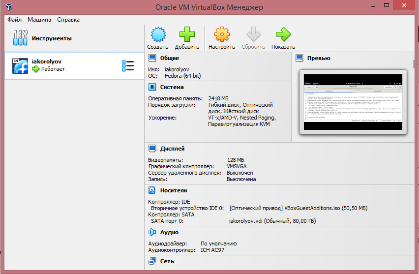{#fig:1 width=70%}

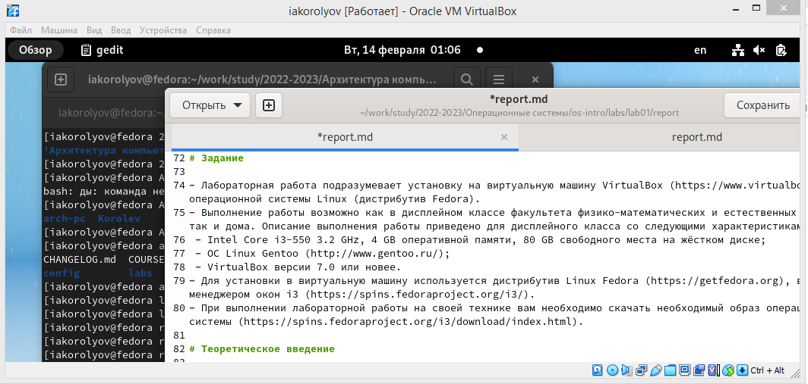{#fig:2 width=70%}

## Обновление пакетов

Обновляю все пакеты (dnf -y update)[-@fig:3]

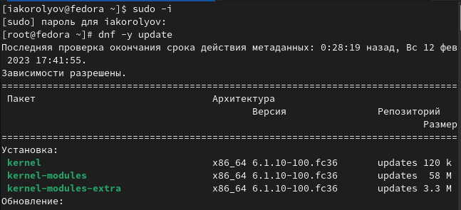{#fig:3 width=70%}

## Tmux для удобства работы в консоли

Скачиваю программу для удобства работы в консоли(tmux)[-@fig:4]

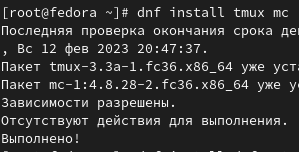{#fig:4 width=70%}

## Установка автоматического обновления

Aвтоматическое обновление. Установка программного обеспечения. Задаю необходимую конфигурацию в файле /etc/dnf/automatic.conf.
Запускаю таймер[-@fig:5],[-@fig:6]

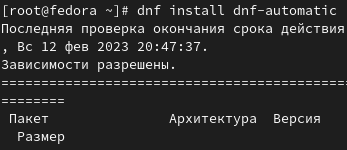{#fig:5 width=70%}

## Установка автоматического обновления

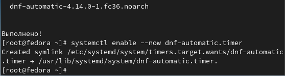{#fig:6 width=70%}

## Отключение SELinux

Отключение SELinux. В файле /etc/selinux/config заменяю значение.[-@fig:7]

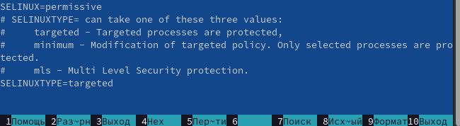{#fig:7 width=70%}

## Установка драйверов

Запускаю мультиплексор. Переключаюсь на роль супер-пользователя. Устанавливаю DKMS. Подключаю образ дополнений гостевой ОС. Подмонтирую диск. Устанавливаю драйвера. Перезагружаю систему. [-@fig:8],[-@fig:9]

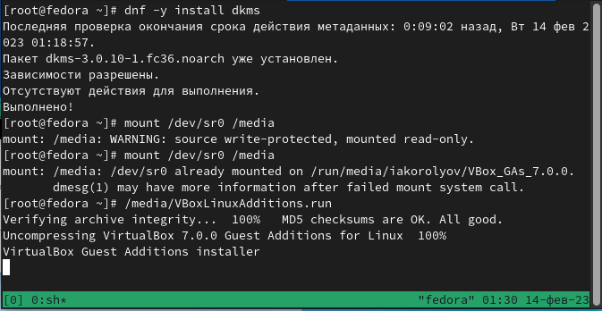{#fig:8 width=70%}

## Установка драйверов

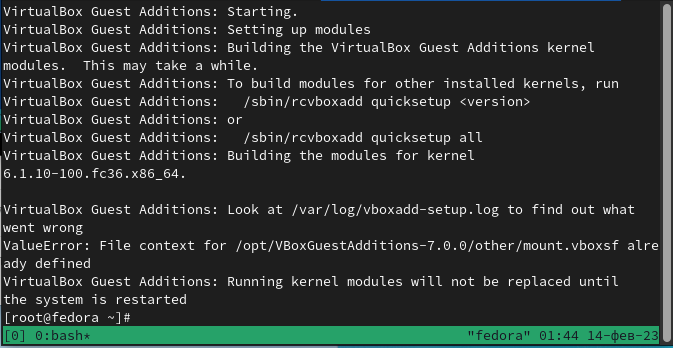{#fig:9 width=70%}

## Настройка раскладки клавиатуры

Запускаю мультиплексор. Переключаюсь на роль супер-пользователя. Отредактирую конфигурационный файл. Перезагрузка. [-@fig:10]

{#fig:10 width=70%}

## Имя пользователя и хоста.

Имя пользователя и название хоста. [-@fig:11]

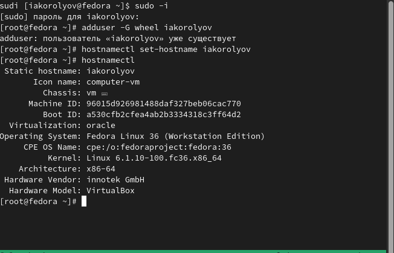{#fig:11 width=70%}

## Pandoc и TexLive

Установка pandoc и необходимые расширения для создания файлов.[-@fig:12],[-@fig:13]

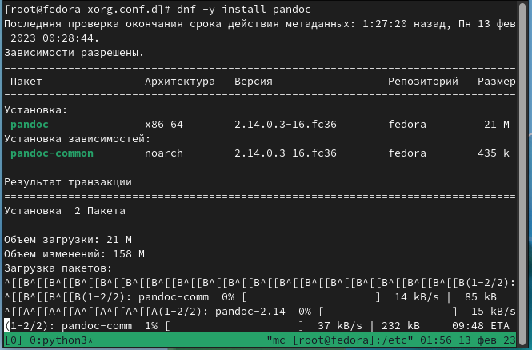{#fig:12 width=70%}

## Pandoc и TexLive

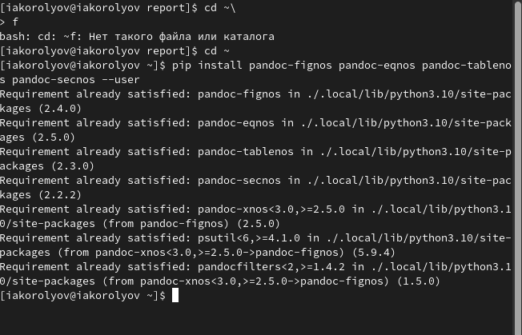{#fig:13 width=70%}

Установка TexLive.[-@fig:14]

## Pandoc и TexLive

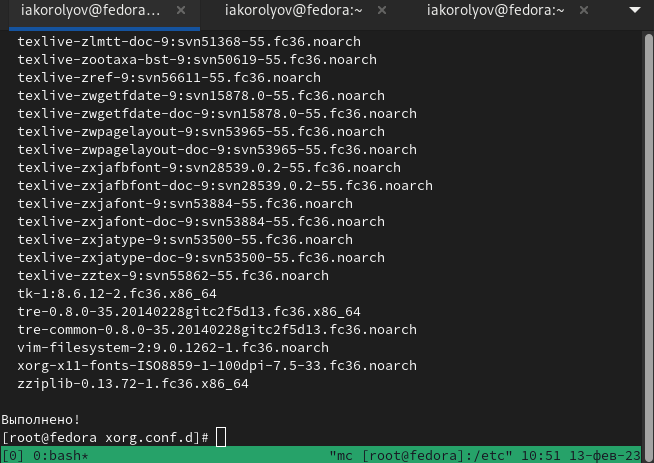{#fig:14 width=70%}

# Вывод

Я приобрёл практические навыки установки операционной системы на виртуальную машину, настройки минимально необходимых для дальнейшей работы сервисов.
