---
## Front matter
title: "Отчёт по лабораторной работе № 1"
author: "Королёв Иван"

## Generic otions
lang: ru-RU
toc-title: "Содержание"

## Bibliography
bibliography: bib/cite.bib
csl: pandoc/csl/gost-r-7-0-5-2008-numeric.csl

## Pdf output format
toc: true # Table of contents
toc-depth: 2
lof: true # List of figures
lot: true # List of tables
fontsize: 12pt
linestretch: 1.5
papersize: a4
documentclass: scrreprt
## I18n polyglossia
polyglossia-lang:
  name: russian
  options:
	- spelling=modern
	- babelshorthands=true
polyglossia-otherlangs:
  name: english
## I18n babel
babel-lang: russian
babel-otherlangs: english
## Fonts
mainfont: PT Serif
romanfont: PT Serif
sansfont: PT Sans
monofont: PT Mono
mainfontoptions: Ligatures=TeX
romanfontoptions: Ligatures=TeX
sansfontoptions: Ligatures=TeX,Scale=MatchLowercase
monofontoptions: Scale=MatchLowercase,Scale=0.9
## Biblatex
biblatex: true
biblio-style: "gost-numeric"
biblatexoptions:
  - parentracker=true
  - backend=biber
  - hyperref=auto
  - language=auto
  - autolang=other*
  - citestyle=gost-numeric
## Pandoc-crossref LaTeX customization
figureTitle: "Рис."
tableTitle: "Таблица"
listingTitle: "Листинг"
lofTitle: "Список иллюстраций"
lotTitle: "Список таблиц"
lolTitle: "Листинги"
## Misc options
indent: true
header-includes:
  - \usepackage{indentfirst}
  - \usepackage{float} # keep figures where there are in the text
  - \floatplacement{figure}{H} # keep figures where there are in the text
---

# Цель работы

Целью данной работы является приобретение практических навыков установки операционной системы на виртуальную машину, настройки минимально необходимых для дальнейшей работы сервисов.

# Задание

- Лабораторная работа подразумевает установку на виртуальную машину VirtualBox (https://www.virtualbox.org/) операционной системы Linux (дистрибутив Fedora).
- Выполнение работы возможно как в дисплейном классе факультета физико-математических и естественных наук РУДН, так и дома. Описание выполнения работы приведено для дисплейного класса со следующими характеристиками техники:
 - intelre i3-550 3.2 GHz, 4 GB оперативной памяти, 80 GB свободного места на жёстком диске;
 - ОС Linux Gentoo (http://www.gentoo.ru/);
 - VirtualBox версии 7.0 или новее.
- Для установки в виртуальную машину используется дистрибутив Linux Fedora (https://getfedora.org), вариант с менеджером окон i3 (https://spins.fedoraproject.org/i3/).
- При выполнении лабораторной работы на своей технике вам необходимо скачать необходимый образ операционной системы (https://spins.fedoraproject.org/i3/download/index.html).

# Теоретическое введение

Linux — семейство Unix-подобных операционных систем на базе ядра Linux, включающих тот или иной набор утилит и программ проекта GNU, и, возможно, другие компоненты. Как и ядро Linux, системы на его основе, как правило, создаются и распространяются в соответствии с моделью разработки свободного и открытого программного обеспечения. Linux-системы распространяются в основном бесплатно в виде различных дистрибутивов — в форме, готовой для установки и удобной для сопровождения и обновлений, — и имеющих свой набор системных и прикладных компонентов, как свободных, так и проприетарных.

# Выполнение лабораторной работы

## Создание виртуальной машины, установка ос.

- Я пропустил эти пункты, т.к. на данный момент у меня уже создана виртуальная машина и установлена Fedora
Демонстрирую это на рисунках.[-@fig:1],[-@fig:2]

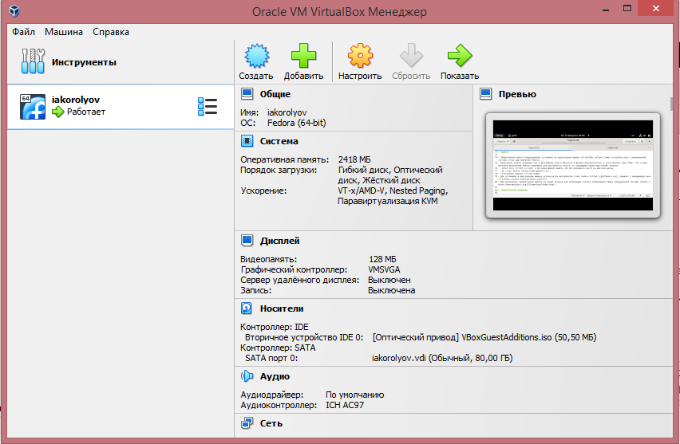{#fig:1 width=70%}

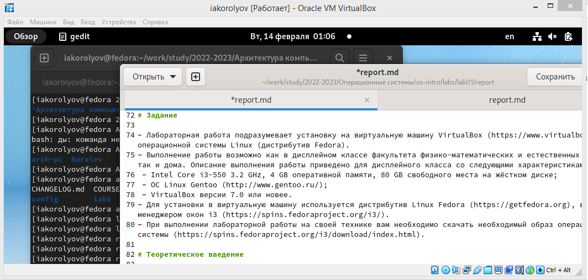{#fig:2 width=70%}

## После установки.

- Вхожу в ОС используя данные учетной записи. Открываю терминал, перехожу в режим супер-пользователя(sudo -i). Обновляю все пакеты (dnf -y update)[-@fig:3]

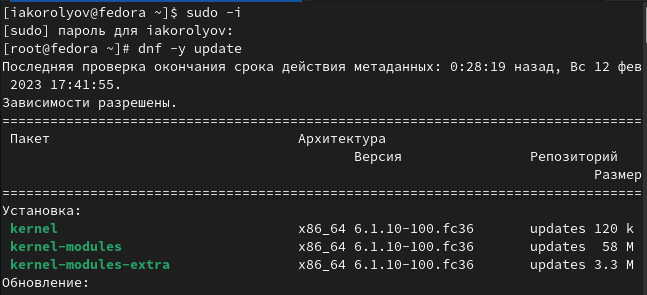{#fig:3 width=70%}

- Скачиваю программу для удобства работы в консоли(tmux)[-@fig:4]

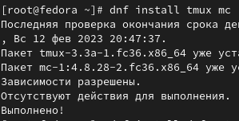{#fig:4 width=70%}

- Автоматическое обновление.(dnf install dnf-automatic) Установка программного обеспечения. Задаю необходимую конфигурацию в файле /etc/dnf/automatic.conf.
Запускаю таймер(systemctl enable --now dnf-automatic.timer)[-@fig:5],[-@fig:6]

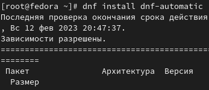{#fig:5 width=70%}

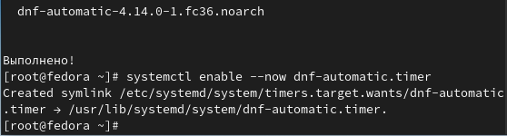{#fig:6 width=70%}

- Отключение SELinux. В файле /etc/selinux/config заменяю значение.[-@fig:7]

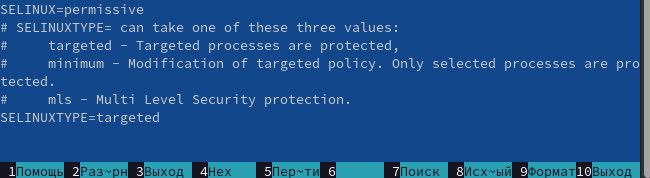{#fig:7 width=70%}

## Установка драйверов для VirtualBox.

- Запускаю мультиплексор. Переключаюсь на роль супер-пользователя. Устанавливаю DKMS.(dnf -y install dkms) Подключаю образ дополнений гостевой ОС. Подмонтирую диск. Устанавливаю драйвера.(/media/VBoxLinuxAdditions.run) Перезагружаю систему. [-@fig:8],[-@fig:9]

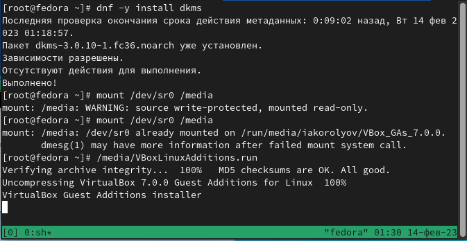{#fig:8 width=70%}

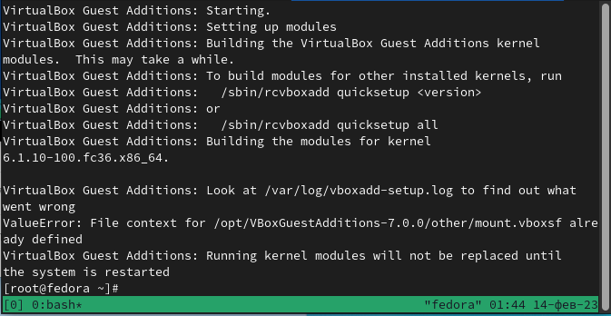{#fig:9 width=70%}

## Настройка раскладки клавиатуры.

- Запускаю мультиплексор. Переключаюсь на роль супер-пользователя. Отредактирую конфигурационный файл. Перезагрузка. [-@fig:10]

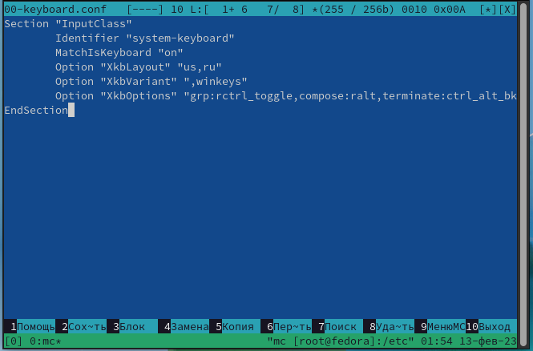{#fig:10 width=70%}

## Установка имени пользователя и названия хоста.

- Имя пользователя и название хоста.(hostnamectl set-hostname username) [-@fig:11]

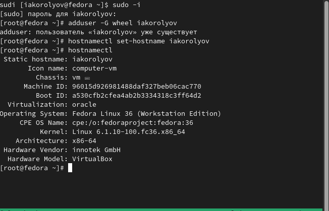{#fig:11 width=70%}

## Установка программного обеспечения для создания документации.

- Установка pandoc и необходимые расширения для создания файлов. (dnf -y install pandoc, pip install pandoc-fignos pandoc-eqnos pandoc-tablenos pandoc-secnos --user)[-@fig:12],[-@fig:13]

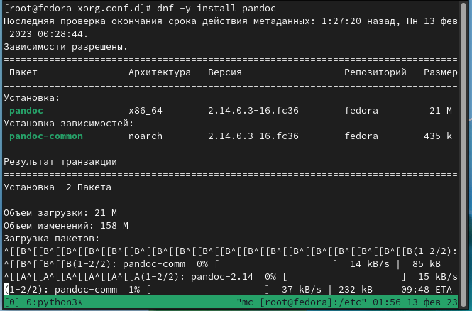{#fig:12 width=70%}

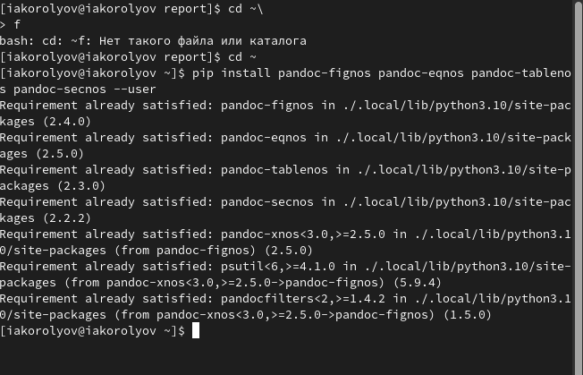{#fig:13 width=70%}

- Установка TexLive.(dnf -y install texlive texlive-\*)[-@fig:14]

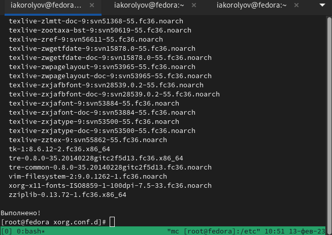{#fig:14 width=70%}

# Домашнее задание.

Дождитесь загрузки графического окружения и откройте терминал. В окне терминала проанализируйте последовательность загрузки системы, выполнив команду dmesg. Вывод команды.[-@fig:15]

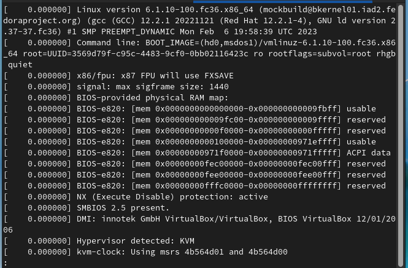{#fig:15 width=70%}

Можно использовать поиск с помощью grep.Найти следующее:

- Версия ядра Linux (Linux version).[-@fig:16]

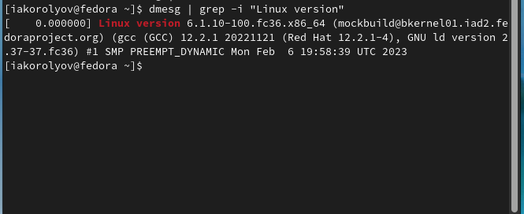{#fig:16 width=70%}

- Частота процессора (Detected Mhz processor).[-@fig:17]

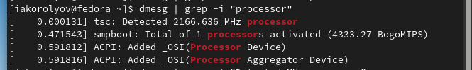{#fig:17 width=70%}

- Модель процессора (CPU0).[-@fig:18]

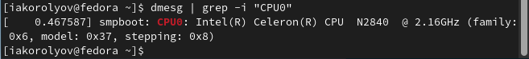{#fig:18 width=70%}

- Объём доступной оперативной памяти (Memory available). (CPU0).[-@fig:19]

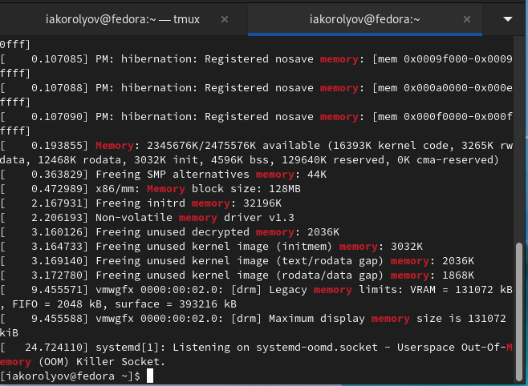{#fig:19 width=70%}

- Тип обнаруженного гипервизора (Hypervisor detected).[-@fig:20]

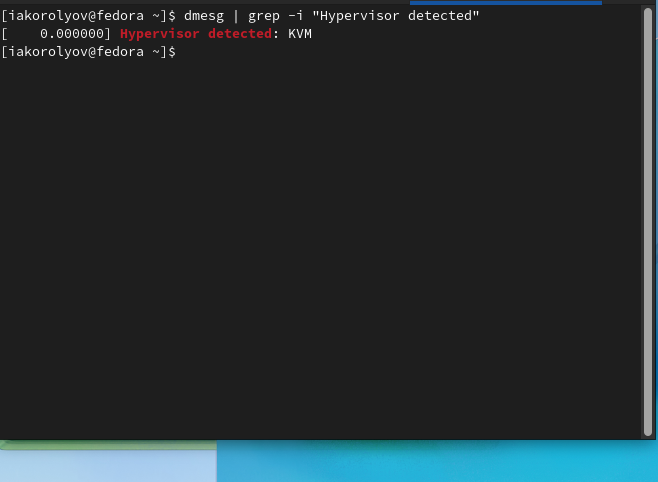{#fig:20 width=70%}

- Тип файловой системы корневого раздела.[-@fig:21],[-@fig:22],[-@fig:23]

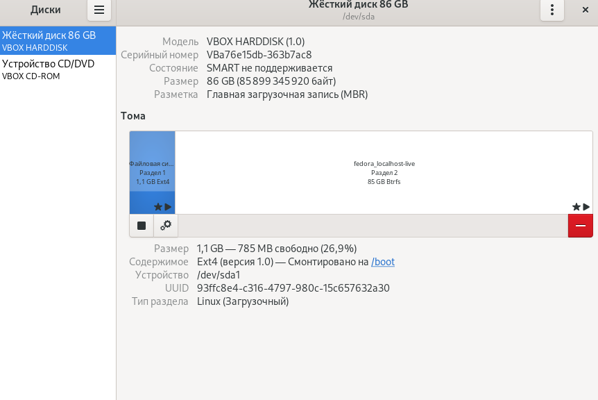{#fig:21 width=70%}

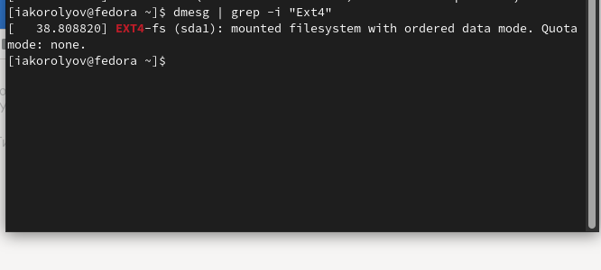{#fig:22 width=70%}

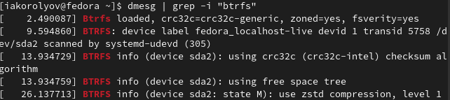{#fig:23 width=70%}

- Последовательность монтирования файловых систем.[-@fig:24]

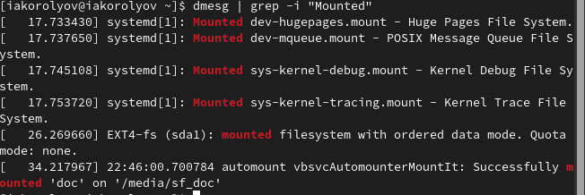{#fig:24 width=70%}

# Выводы

Я приобрёл практические навыки установки операционной системы на виртуальную машину, настройки минимально необходимых для дальнейшей работы сервисов.

