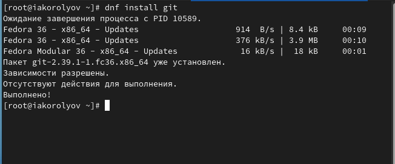
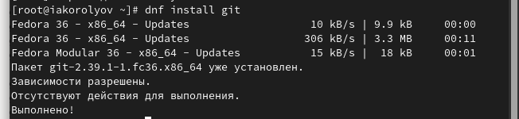
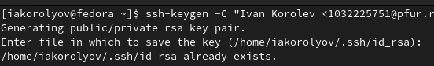
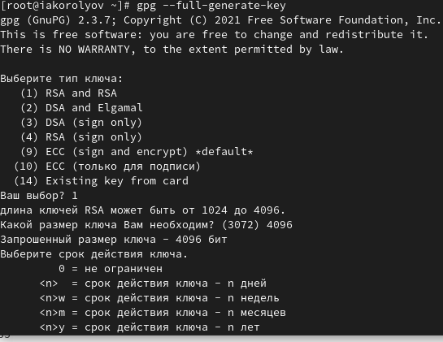
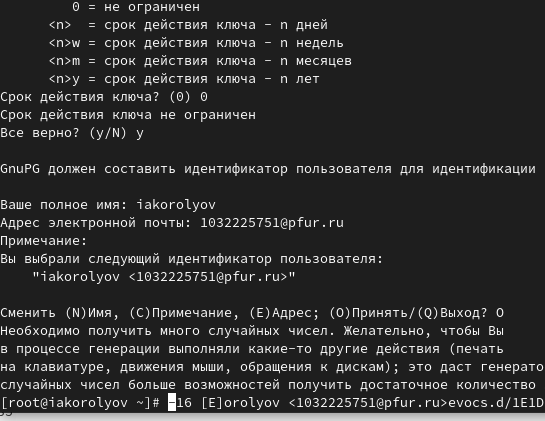
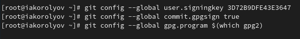
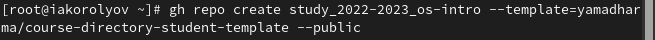

---
## Front matter
lang: ru-RU
title: Презентация по лабораторной работе № 2
author:
  - Королёв Иван Андреевич.
institute:
  - Российский университет дружбы народов, Москва, Россия

## i18n babel
babel-lang: russian
babel-otherlangs: english

## Formatting pdf
toc: false
toc-title: Содержание
slide_level: 2
aspectratio: 169
section-titles: true
theme: metropolis
header-includes:
 - \metroset{progressbar=frametitle,sectionpage=progressbar,numbering=fraction}
 - '\makeatletter'
 - '\beamer@ignorenonframefalse'
 - '\makeatother'
---

## Докладчик

:::::::::::::: {.columns align=center}
::: {.column width="70%"}

  * Королёв Иван АНдреевич
  * Студент
  * Российский университет дружбы народов
  * [1032225751@pfur.ru]

:::
::: {.column width="30%"}

:::
::::::::::::::

# Цель работы

- Изучить идеологию и применение средств контроля версий.
- Освоить умения по работе с git.

# Задание

- Создать базовую конфигурацию для работы с git.
- Создать ключ SSH.
- Создать ключ PGP.
- Настроить подписи git.
- Зарегистрироваться на Github.
- Создать локальный каталог для выполнения заданий по предмету.

# Процесс выполнения

## Установка git (рис. @fig:001).

{#fig:001 width=70%}

## Установка gh (рис. @fig:002).

{#fig:002 width=70%}

## Мы уже умеем создавать ssh из прошлого курса Архитектуры компьютеров. (рис. @fig:008).

{#fig:008 width=70%}

## Генерируем ключ (рис. @fig:009), (рис. @fig:0010)

{#fig:009 width=70%}

{#fig:0010 width=70%}

## У меня создан репозиторий. (рис. @fig:0011)

{#fig:0011 width=70%}

## Выводим список ключей и копируем отпечаток приватного ключа (рис. @fig:0012)

{#fig:0012 width=70%}

## Cкопируйте ваш сгенерированный PGP ключ в буфер обмена (рис. @fig:0013)

{#fig:0013 width=70%}

## Используя введёный email, укажите Git применять его при подписи коммитов (рис. @fig:0015)

{#fig:0015 width=70%}

## Создать шаблон рабочего пространства (рис. @fig:0017)

{#fig:0017 width=70%}

## Файлы на сервере (рис. @fig:0018) (рис. @fig:0019)

{#fig:0018 width=70%}

## Файлы на сервере (рис. @fig:0019)

{#fig:0019 width=70%}

# Выводы

Я освоил умения использования git.

