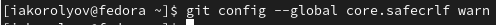
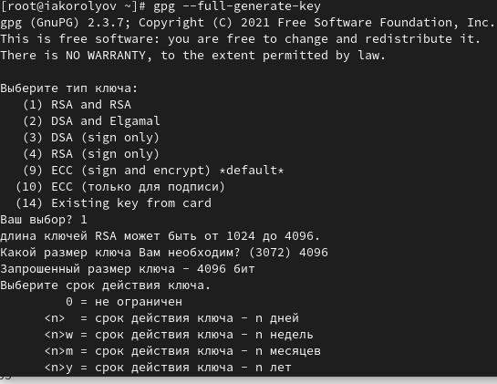
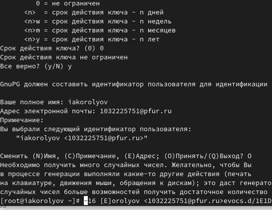

---
## Front matter
title: "Отчёт по лабораторной работе № 2"
author: "Королёв Иван Андреевич"

## Generic otions
lang: ru-RU
toc-title: "Содержание"

## Bibliography
bibliography: bib/cite.bib
csl: pandoc/csl/gost-r-7-0-5-2008-numeric.csl

## Pdf output format
toc: true # Table of contents
toc-depth: 2
lof: true # List of figures
lot: true # List of tables
fontsize: 12pt
linestretch: 1.5
papersize: a4
documentclass: scrreprt
## I18n polyglossia
polyglossia-lang:
  name: russian
  options:
	- spelling=modern
	- babelshorthands=true
polyglossia-otherlangs:
  name: english
## I18n babel
babel-lang: russian
babel-otherlangs: english
## Fonts
mainfont: PT Serif
romanfont: PT Serif
sansfont: PT Sans
monofont: PT Mono
mainfontoptions: Ligatures=TeX
romanfontoptions: Ligatures=TeX
sansfontoptions: Ligatures=TeX,Scale=MatchLowercase
monofontoptions: Scale=MatchLowercase,Scale=0.9
## Biblatex
biblatex: true
biblio-style: "gost-numeric"
biblatexoptions:
  - parentracker=true
  - backend=biber
  - hyperref=auto
  - language=auto
  - autolang=other*
  - citestyle=gost-numeric
## Pandoc-crossref LaTeX customization
figureTitle: "Рис."
tableTitle: "Таблица"
listingTitle: "Листинг"
lofTitle: "Список иллюстраций"
lotTitle: "Список таблиц"
lolTitle: "Листинги"
## Misc options
indent: true
header-includes:
  - \usepackage{indentfirst}
  - \usepackage{float} # keep figures where there are in the text
  - \floatplacement{figure}{H} # keep figures where there are in the text
---

# Цель работы

- Изучить идеологию и применение средств контроля версий.
- Освоить умения по работе с git.

# Задание

- Создать базовую конфигурацию для работы с git.
- Создать ключ SSH.
- Создать ключ PGP.
- Настроить подписи git.
- Зарегистрироваться на Github.
- Создать локальный каталог для выполнения заданий по предмету.

# Теоретическое введение

Системы контроля версий (Version Control System, VCS) применяются при работе нескольких человек над одним проектом. Обычно основное дерево проекта хранится в локальном или удалённом репозитории, к которому настроен доступ для участников проекта. При внесении изменений в содержание проекта система контроля версий позволяет их фиксировать, совмещать изменения, произведённые разными участниками проекта, производить откат к любой более ранней версии проекта, если это требуется.

В классических системах контроля версий используется централизованная модель, предполагающая наличие единого репозитория для хранения файлов. Выполнение большинства функций по управлению версиями осуществляется специальным сервером. Участник проекта (пользователь) перед началом работы посредством определённых команд получает нужную ему версию файлов. После внесения изменений, пользователь размещает новую версию в хранилище. При этом предыдущие версии не удаляются из центрального хранилища и к ним можно вернуться в любой момент. Сервер может сохранять не полную версию изменённых файлов, а производить так называемую дельта-компрессию — сохранять только изменения между последовательными версиями, что позволяет уменьшить объём хранимых данных.

Системы контроля версий поддерживают возможность отслеживания и разрешения конфликтов, которые могут возникнуть при работе нескольких человек над одним файлом. Можно объединить (слить) изменения, сделанные разными участниками (автоматически или вручную), вручную выбрать нужную версию, отменить изменения вовсе или заблокировать файлы для изменения. В зависимости от настроек блокировка не позволяет другим пользователям получить рабочую копию или препятствует изменению рабочей копии файла средствами файловой системы ОС, обеспечивая таким образом, привилегированный доступ только одному пользователю, работающему с файлом.

Системы контроля версий также могут обеспечивать дополнительные, более гибкие функциональные возможности. Например, они могут поддерживать работу с несколькими версиями одного файла, сохраняя общую историю изменений до точки ветвления версий и собственные истории изменений каждой ветви. Кроме того, обычно доступна информация о том, кто из участников, когда и какие изменения вносил. Обычно такого рода информация хранится в журнале изменений, доступ к которому можно ограничить.

В отличие от классических, в распределённых системах контроля версий центральный репозиторий не является обязательным.

Среди классических VCS наиболее известны CVS, Subversion, а среди распределённых — Git, Bazaar, Mercurial. Принципы их работы схожи, отличаются они в основном синтаксисом используемых в работе команд.

# Выполнение лабораторной работы

## Установка программного обеспечения

- Установка git (рис. @fig:001).

{#fig:001 width=70%}

- Установка gh (рис. @fig:002).

{#fig:002 width=70%}

## Базовая настройка git

- Зададим имя и email владельца репозитория (рис. @fig:003).

{#fig:003 width=70%}

- Настроим utf-8 в выводе сообщений git (рис. @fig:004).

{#fig:004 width=70%}

- Зададим имя начальной ветки (будем называть её master) (рис. @fig:005).

{#fig:005 width=70%}

- Параметр autocrlf (рис. @fig:006).

{#fig:006 width=70%}

- Параметр safecrlf (рис. @fig:007).

{#fig:007 width=70%}

## Создайте ключи ssh

- Мы уже умеем создавать ssh из прошлого курса Архитектуры компьютеров. (рис. @fig:008).

{#fig:008 width=70%}

## Создайте ключи pgp

- Генерируем ключ (рис. @fig:009), (рис. @fig:0010)

{#fig:009 width=70%}

{#fig:0010 width=70%}

## Настройка github

- У меня создан репозиторий. (рис. @fig:0011)

{#fig:0011 width=70%}

## Добавление PGP ключа в GitHub

- Выводим список ключей и копируем отпечаток приватного ключа (рис. @fig:0012)

{#fig:0012 width=70%}

- Cкопируйте ваш сгенерированный PGP ключ в буфер обмена (рис. @fig:0013)

{#fig:0013 width=70%}

- Перейдите в настройки GitHub (https://github.com/settings/keys), нажмите на кнопку New GPG key и вставьте полученный ключ в поле ввода (рис. @fig:0014)

{#fig:0014 width=70%}

## Настройка автоматических подписей коммитов git

Используя введёный email, укажите Git применять его при подписи коммитов (рис. @fig:0015)

{#fig:0015 width=70%}

## Настройка gh

- Авторизоваться в gh (рис. @fig:0016)

{#fig:0016 width=70%}

## Создание репозитория курса на основе шаблона

- Создать шаблон рабочего пространства (рис. @fig:0017)

{#fig:0017 width=70%}

- Репозиторий "Операционные системы" создан.

## Настройка каталога курса

- Файлы на сервере (рис. @fig:0018), (рис. @fig:0019)

{#fig:0018 width=70%}

{#fig:0019 width=70%}

# Выводы

Я освоил умения использования git.

