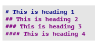
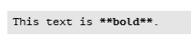
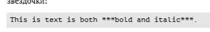
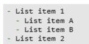
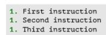
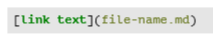

---
## Front matter
lang: ru-RU
title: Презентация по лабораторной работе № 3
author:
  - Королёв Иван Андреевич
institute:
  - Российский университет дружбы народов, Москва, Россия

## i18n babel
babel-lang: russian
babel-otherlangs: english

## Formatting pdf
toc: false
toc-title: Содержание
slide_level: 2
aspectratio: 169
section-titles: true
theme: metropolis
header-includes:
 - \metroset{progressbar=frametitle,sectionpage=progressbar,numbering=fraction}
 - '\makeatletter'
 - '\beamer@ignorenonframefalse'
 - '\makeatother'
---

## Докладчик

:::::::::::::: {.columns align=center}
::: {.column width="70%"}

  * Королёв Иван АНдреевич
  * Студент
  * Российский университет дружбы народов
  * [1032225751@pfur.ru]

:::
::: {.column width="30%"}

:::
::::::::::::::

# Цель работы

- Научиться оформлять отчёты с помощью легковесного языка разметки Markdown.

# Задание

- Сделайте отчёт по предыдущей лабораторной работе в формате Markdown. 

# Теоретическое введение

Markdown — язык текстовой разметки, созданный писателем и блогером Джоном Грубером. Он предназначен для создания красиво оформленных текстов в обычных файлах формата TXT. Вам не нужны громоздкие процессоры вроде Word или Pages, чтобы создавать документы с жирным или курсивным начертанием, цитатами, ссылками и даже таблицами. Достаточно запомнить простые правила Markdown, и можно писать хоть в «Блокноте».

# Базовые сведения о Markdown для лабораторной работы №3

##  Чтобы создать заголовок, используется знак ( # ) (рис. @fig:0020).

{#fig:0020 width=70%}

## Чтобы создать тексту полужирное начертание, использую двойные звездочки ( **...** ) (рис. @fig:0021).

{#fig:0021 width=70%}

## Чтобы задать тексту курсив, необходимо в одинарные звёздочки заключить ( *...* ) (рис. @fig:0022).

{#fig:0022 width=70%}

## Чтобы тексты был курсивом с полужирным начертанием необходимо заключить его в тройные звёздочки ( ***...*** ) (рис. @fig:0023).

{#fig:0023 width=70%}

## Можно создавать неупорядоченный список с помощью тире или звёздочек. Так же, чтобы один список вложить в другой, нужно от первого сделать отступ (рис. @fig:0025), (рис. @fig:0026)

{#fig:0025 width=70%}

## Можно создавать неупорядоченный список с помощью тире или звёздочек. Так же, чтобы один список вложить в другой, нужно от первого сделать отступ (рис. @fig:0025), (рис. @fig:0026)

{#fig:0026 width=70%}

# Упорядоченный список можно отформатировать с помощью соответствующих цифр (рис. @fig:0027).

{#fig:0027 width=70%}

## Синтаксис Markdownдля встроенной ссылки состоит из части [link text] ,представляющей текст гиперссылки, и части (file-name.md) – URL-адреса или имени файла, на который дается ссылка (рис. @fig:0028).

{#fig:0028 width=70%}

# Обработка файлов в формате Markdown

## Для обработки файлов используется pandoc. Преобразовать md файл можно вот так. Или же можно использовать Makefile, командой make (рис. @fig:0031).

{#fig:0031 width=90}

# Выводы

Я научился оформлять отчёты с помощью легковесного языка разметки Markdown.

