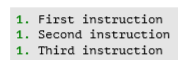
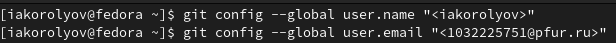
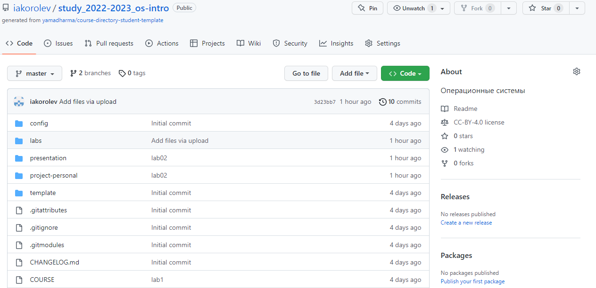

---
## Front matter
title: "Отчёт по лабораторной работе № 3"
author: "Королёв Иван Андреевич"

## Generic otions
lang: ru-RU
toc-title: "Содержание"

## Bibliography
bibliography: bib/cite.bib
csl: pandoc/csl/gost-r-7-0-5-2008-numeric.csl

## Pdf output format
toc: true # Table of contents
toc-depth: 2
lof: true # List of figures
lot: true # List of tables
fontsize: 12pt
linestretch: 1.5
papersize: a4
documentclass: scrreprt
## I18n polyglossia
polyglossia-lang:
  name: russian
  options:
	- spelling=modern
	- babelshorthands=true
polyglossia-otherlangs:
  name: english
## I18n babel
babel-lang: russian
babel-otherlangs: english
## Fonts
mainfont: PT Serif
romanfont: PT Serif
sansfont: PT Sans
monofont: PT Mono
mainfontoptions: Ligatures=TeX
romanfontoptions: Ligatures=TeX
sansfontoptions: Ligatures=TeX,Scale=MatchLowercase
monofontoptions: Scale=MatchLowercase,Scale=0.9
## Biblatex
biblatex: true
biblio-style: "gost-numeric"
biblatexoptions:
  - parentracker=true
  - backend=biber
  - hyperref=auto
  - language=auto
  - autolang=other*
  - citestyle=gost-numeric
## Pandoc-crossref LaTeX customization
figureTitle: "Рис."
tableTitle: "Таблица"
listingTitle: "Листинг"
lofTitle: "Список иллюстраций"
lotTitle: "Список таблиц"
lolTitle: "Листинги"
## Misc options
indent: true
header-includes:
  - \usepackage{indentfirst}
  - \usepackage{float} # keep figures where there are in the text
  - \floatplacement{figure}{H} # keep figures where there are in the text
---

# Цель работы

- Научиться оформлять отчёты с помощью легковесного языка разметки Markdown.

# Задание

- Сделайте отчёт по предыдущей лабораторной работе в формате Markdown. 

# Теоретическое введение

Markdown — язык текстовой разметки, созданный писателем и блогером Джоном Грубером. Он предназначен для создания красиво оформленных текстов в обычных файлах формата TXT. Вам не нужны громоздкие процессоры вроде Word или Pages, чтобы создавать документы с жирным или курсивным начертанием, цитатами, ссылками и даже таблицами. Достаточно запомнить простые правила Markdown, и можно писать хоть в «Блокноте».

# Базовые сведения о Markdown для лабораторной работы №3

- Чтобы создать заголовок, используется знак ( # ) (рис. @fig:0020).

{#fig:0020 width=70%}

- Чтобы создать тексту полужирное начертание, использую двойные звездочки ( **...** ) (рис. @fig:0021).

{#fig:0021 width=70%}

- Чтобы задать тексту курсив, необходимо в одинарные звёздочки заключить ( *...* ) (рис. @fig:0022).

{#fig:0022 width=70%}

- Чтобы тексты был курсивом с полужирным начертанием необходимо заключить его в тройные звёздочки ( ***...*** ) (рис. @fig:0023).

{#fig:0023 width=70%}

- Цитирование созздается с помощью символа ( > ) (рис. @fig:0024).

{#fig:0024 width=70%}

- Можно создавать неупорядоченный список с помощью тире или звёздочек. Так же, чтобы один список вложить в другой, нужно от первого сделать отступ (рис. @fig:0025), (рис. @fig:0026)

{#fig:0025 width=70%}

{#fig:0026 width=70%}

- Упорядоченный список можно отформатировать с помощью соответствующих цифр (рис. @fig:0027).

{#fig:0027 width=70%}

- Синтаксис Markdownдля встроенной ссылки состоитиз части [link text] ,представляющей текст гиперссылки, и части (file-name.md) – URL-адреса или имени файла, на который дается ссылка (рис. @fig:0028).

{#fig:0028 width=70%}

- Верхние и нижние индексы записываются вот так, как показано на скриншоте.(рис. @fig:0029).

{#fig:0029 width=90}

- Формулы записываются аналогично формулам LaTex

# Обработка файлов в формате Markdown

- Для обработки файлов используется pandoc. Преобразовать md файл можно вот так. Или же можно использовать Makefile, командой make (рис. @fig:0031).

{#fig:0031 width=90}

# Выполнение лабораторной работы № 2 и выполнение отчёта лабораторной работы №2 

## Установка программного обеспечения

- Установка git(dnf install git) (рис. @fig:001).

{#fig:001 width=70%}

- Установка gh(dnf install gh) (рис. @fig:002).

{#fig:002 width=70%}

## Базовая настройка git

- Зададим имя и email владельца репозитория (git config --global user.name "Name Surname", git config --global user.email "work@mail") (рис. @fig:003).

{#fig:003 width=70%}

- Настроим utf-8 в выводе сообщений git(git config --global core.quotepath false) (рис. @fig:004).

{#fig:004 width=70%}

- Зададим имя начальной ветки(git config --global init.defaultBranch master) (будем называть её master) (рис. @fig:005).

{#fig:005 width=70%}

- Параметр autocrlf(git config --global core.autocrlf input) (рис. @fig:006).

{#fig:006 width=70%}

- Параметр safecrlf(git config --global core.safecrlf warn) (рис. @fig:007).

{#fig:007 width=70%}

## Создайте ключи ssh

- Мы уже умеем создавать ssh из прошлого курса Архитектуры компьютеров. (рис. @fig:008).

{#fig:008 width=70%}

## Создайте ключи pgp

- Генерируем ключ(gpg --full-generate-key) (рис. @fig:009), (рис. @fig:0010)

{#fig:009 width=70%}

{#fig:0010 width=70%}

## Настройка github

- У меня создан репозиторий. (рис. @fig:0011)

{#fig:0011 width=70%}

## Добавление PGP ключа в GitHub

- Выводим список ключей и копируем отпечаток приватного ключа (gpg --list-secret-keys --keyid-format LONG) (рис. @fig:0012)

{#fig:0012 width=70%}

- Cкопируйте ваш сгенерированный PGP ключ в буфер обмена (gpg --armor --export <PGP Fingerprint> | xclip -sel clip) (рис. @fig:0013)

{#fig:0013 width=70%}

- Перейдите в настройки GitHub (https://github.com/settings/keys), нажмите на кнопку New GPG key и вставьте полученный ключ в поле ввода (рис. @fig:0014)

{#fig:0014 width=70%}

## Настройка автоматических подписей коммитов git

Используя введёный email, укажите Git применять его при подписи коммитов (git config --global user.signingkey <PGP Fingerprint>, git config --global commit.gpgsign true, git config --global gpg.program $(which gpg2)) (рис. @fig:0015)

{#fig:0015 width=70%}

## Настройка gh

- Авторизоваться в gh (gh auth login) (рис. @fig:0016)

{#fig:0016 width=70%}

## Создание репозитория курса на основе шаблона

- Создать шаблон рабочего пространства(gh repo create study_2022-2023_os-intro --template=yamadharma/course-directory-student-template --public) (рис. @fig:0017)

{#fig:0017 width=70%}

- Репозиторий "Операционные системы" создан.

## Настройка каталога курса

- Файлы на сервере (rm package.json) (рис. @fig:0018), (рис. @fig:0019)

{#fig:0018 width=70%}

{#fig:0019 width=70%}

# Выводы

Я научился оформлять отчёты с помощью легковесного языка разметки Markdown.

