---
## Front matter
lang: ru-RU
title: Лабораторная работа № 4
author:
  - Королёв И.А.
institute:
  - Российский университет дружбы народов, Москва, Россия

## i18n babel
babel-lang: russian
babel-otherlangs: english

## Formatting pdf
toc: false
toc-title: Содержание
slide_level: 2
aspectratio: 169
section-titles: true
theme: metropolis
header-includes:
 - \metroset{progressbar=frametitle,sectionpage=progressbar,numbering=fraction}
 - '\makeatletter'
 - '\beamer@ignorenonframefalse'
 - '\makeatother'
---

## Докладчик

:::::::::::::: {.columns align=center}
::: {.column width="70%"}

  * Королёв Иван АНдреевич
  * Студент
  * Российский университет дружбы народов
  * [1032225751@pfur.ru]

:::
::: {.column width="30%"}

:::
::::::::::::::

# Цель работы

- Приобретение практических навыков взаимодействия пользователя с системой посредством командной строки.

# Задание

1 Определите полное имя вашего домашнего каталога. Далее относительно этого каталога будут выполняться последующие упражнения. 
2. Выполните следующие действия: 
   1. Перейдите в каталог /tmp. 
   2. Выведите на экран содержимое каталога /tmp.Для этого используйте команду ls с различными опциями. Поясните разницу в выводимой на экран информации. 
   3. Определите, есть ли в каталоге /var/spool подкаталог с именем cron? 
   4. Перейдите в Ваш домашний каталог и выведите на экран его содержимое. Опре- делите, кто является владельцем файлов и подкаталогов? 
3. Выполните следующие действия: 
   1. В домашнем каталоге создайте новый каталог с именем newdir. 
   2. В каталоге ~/newdir создайте новый каталог с именем morefun. 
   3. В домашнем каталоге создайте одной командой три новых каталога с именами letters, memos, misk. Затем удалите эти каталоги одной командой. 
   4. Попробуйте удалить ранее созданный каталог ~/newdir командой rm. Проверьте, был ли каталог удалён. 
   5. Удалите каталог ~/newdir/morefun из домашнего каталога. Проверьте, был ли каталог удалён. 
   
# Задание

4. С помощью команды man определите, какую опцию команды ls нужно использо- вать для просмотра содержимое не только указанного каталога, но и подкаталогов, входящих в него. 
5. С помощью команды man определите набор опций команды ls,позволяющий отсорти- ровать по времени последнего изменения выводимый список содержимого каталога с развёрнутым описанием файлов. 
6. Используйте команду man для просмотра описания следующих команд: cd,pwd,mkdir, rmdir, rm. Поясните основные опции этих команд. 
7. Используя информацию, полученную при помощи команды history, выполните мо- дификацию и исполнение нескольких команд из буфера команд.

# Теоретическое введение

**Формат команды.** Командой в операционной системе называется записанный по специальным правилам текст (возможно с аргументами), представляющий собой ука- зание на выполнение какой-либо функций (или действий) в операционной системе. Обычно первым словом идёт имя команды, остальной текст — аргументы или опции, конкретизирующие действие. 
Общий формат команд можно представить следующим образом: <имя_команды><разделитель><аргументы>

**Команда man.** Команда man используется для просмотра (оперативная помощь) в диа- логовом режиме руководства (manual) по основным командам операционной системы типа Linux. Формат команды: man <команда>

# Теоретическое введение

**Команда cd.** Команда cd используется для перемещения по файловой системе опера- ционной системы типа Linux.

**Команда pwd.** Для определения абсолютного пути к текущему каталогу используется команда pwd (print working directory). 

**Команда ls.** Команда ls используется для просмотра содержимого каталога. 

**Команда mkdir.** Команда mkdir используется для создания каталогов. 
Формат команды: mkdir имя_каталога1 [имя_каталога2...]

**Команда rm.** Команда rm используется для удаления файлов и/или каталогов.

**Команда history.** Для вывода на экран списка ранее выполненных команд исполь- зуется команда history. Выводимые на экран команды в списке нумеруются. К любой команде из выведенного на экран списка можно обратиться по её номеру в списке, воспользовавшись конструкцией !<номер_команды>. 

# Выполнение лабораторной работы

## Домашний каталог

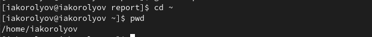{#fig:001 width=70%}

## Перейду в каталог /tmp

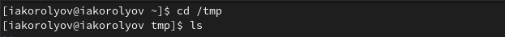{#fig:002 width=70%}

## Продеймострирую содержимое каталога с помощью ls. Обыкновенный ls. Выведем подробную информацию о содержимом с помощью ls -l. Выведем содержимое каталога вместе со скрытыми файлами ls -a . Чтобы получить информацию о типах файлов, необходима команда ls -F.

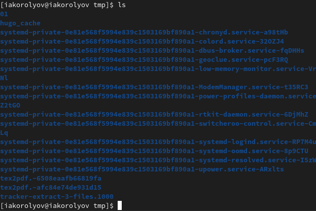{#fig:003 width=70%} 

## Определите, есть ли в каталоге /var/spool подкаталог с именем cron? 

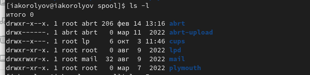{#fig:007 width=70%}

## В домашнем каталоге создаю каталог newdir .

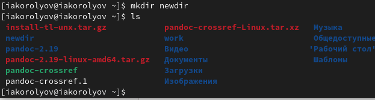{#fig:009 width=70%}

## В домашнем каталоге создаю три новых каталога letters, memos, misk одной командой. Потом так же одной командой пробую удалить (рис. @fig:0011), (рис. @fig:0012)

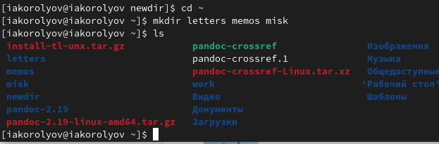{#fig:0011 width=70%}

## letters, memos, misk

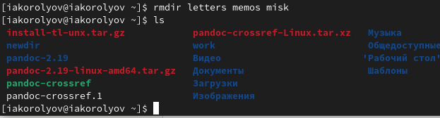{#fig:0012 width=70%}

## cd (рис. @fig:0018)

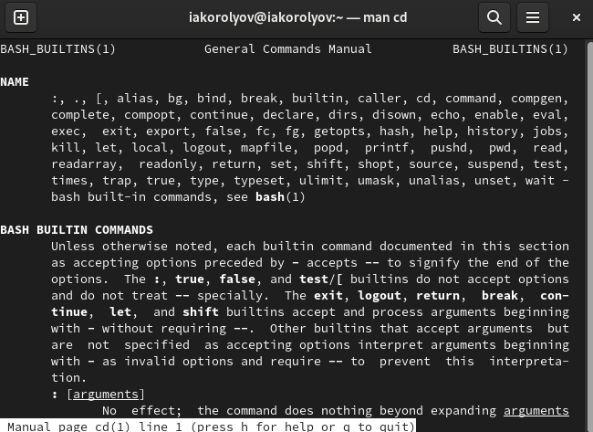{#fig:0018 width=70%}

## pwd (рис. @fig:0019)

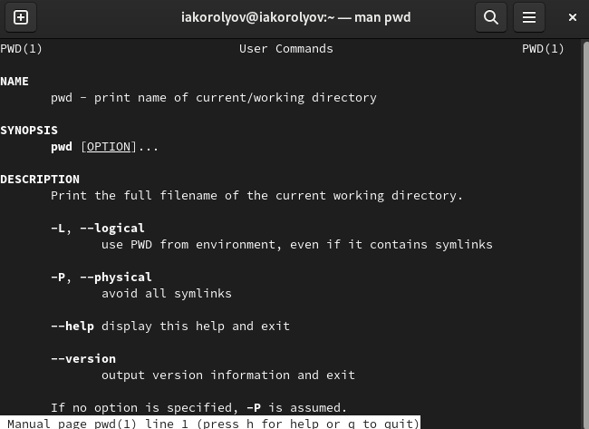{#fig:0019 width=70%}

## mkdir (рис. @fig:0020)

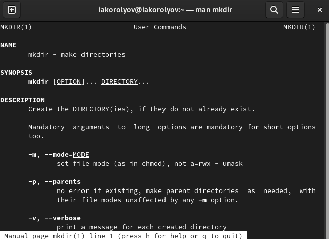{#fig:0020 width=70%}

## rmdir (рис. @fig:0021)

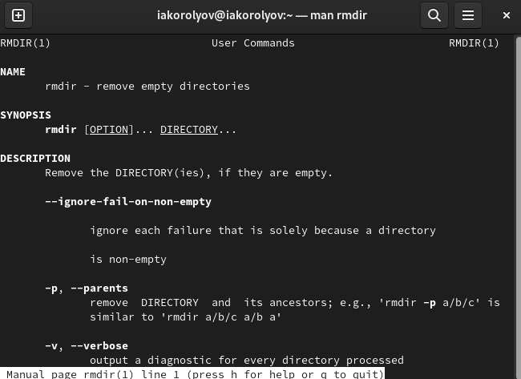{#fig:0021 width=70%}

## rm (рис. @fig:0022)

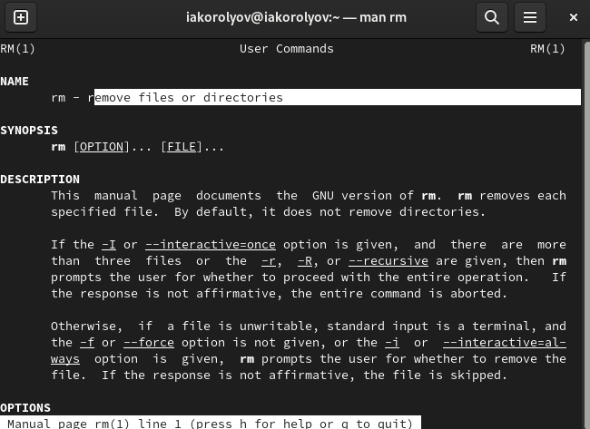{#fig:0022 width=70%}

## Используя информацию, полученную при помощи команды history, выполню модификацию и исполнение команды из буфера команд.

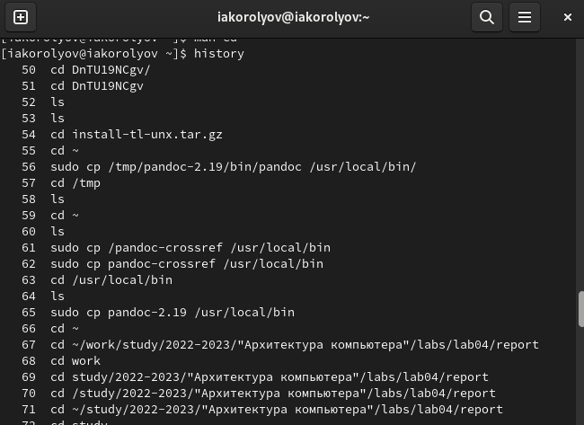{#fig:0023 width=70%}

## Используя информацию, полученную при помощи команды history, выполню модификацию и исполнение команды из буфера команд.

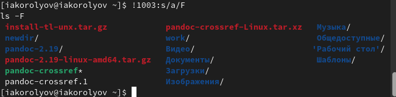{#fig:0025 width=70%}

# Выводы

Приобретел практические навыки взаимодействия пользователя с системой посредством командной строки.

