---
## Front matter
title: "Отчёт по лабораторной работе № 4"
author: "Королёв Иван Андреевич"

## Generic otions
lang: ru-RU
toc-title: "Содержание"

## Bibliography
bibliography: bib/cite.bib
csl: pandoc/csl/gost-r-7-0-5-2008-numeric.csl

## Pdf output format
toc: true # Table of contents
toc-depth: 2
lof: true # List of figures
lot: true # List of tables
fontsize: 12pt
linestretch: 1.5
papersize: a4
documentclass: scrreprt
## I18n polyglossia
polyglossia-lang:
  name: russian
  options:
	- spelling=modern
	- babelshorthands=true
polyglossia-otherlangs:
  name: english
## I18n babel
babel-lang: russian
babel-otherlangs: english
## Fonts
mainfont: PT Serif
romanfont: PT Serif
sansfont: PT Sans
monofont: PT Mono
mainfontoptions: Ligatures=TeX
romanfontoptions: Ligatures=TeX
sansfontoptions: Ligatures=TeX,Scale=MatchLowercase
monofontoptions: Scale=MatchLowercase,Scale=0.9
## Biblatex
biblatex: true
biblio-style: "gost-numeric"
biblatexoptions:
  - parentracker=true
  - backend=biber
  - hyperref=auto
  - language=auto
  - autolang=other*
  - citestyle=gost-numeric
## Pandoc-crossref LaTeX customization
figureTitle: "Рис."
tableTitle: "Таблица"
listingTitle: "Листинг"
lofTitle: "Список иллюстраций"
lotTitle: "Список таблиц"
lolTitle: "Листинги"
## Misc options
indent: true
header-includes:
  - \usepackage{indentfirst}
  - \usepackage{float} # keep figures where there are in the text
  - \floatplacement{figure}{H} # keep figures where there are in the text
---

# Цель работы

Приобретение практических навыков взаимодействия пользователя с системой посредством командной строки.

# Задание

1. Определите полное имя вашего домашнего каталога. Далее относительно этого каталога будут выполняться последующие упражнения. 
2. Выполните следующие действия: 
   1. Перейдите в каталог /tmp. 
   2. Выведите на экран содержимое каталога /tmp.Для этого используйте команду ls с различными опциями. Поясните разницу в выводимой на экран информации. 
   3. Определите, есть ли в каталоге /var/spool подкаталог с именем cron? 
   4. Перейдите в Ваш домашний каталог и выведите на экран его содержимое. Опре- делите, кто является владельцем файлов и подкаталогов? 
3. Выполните следующие действия: 
   1. В домашнем каталоге создайте новый каталог с именем newdir. 
   2. В каталоге ~/newdir создайте новый каталог с именем morefun. 
   3. В домашнем каталоге создайте одной командой три новых каталога с именами letters, memos, misk. Затем удалите эти каталоги одной командой. 
   4. Попробуйте удалить ранее созданный каталог ~/newdir командой rm. Проверьте, был ли каталог удалён. 
   5. Удалите каталог ~/newdir/morefun из домашнего каталога. Проверьте, был ли каталог удалён. 
4. С помощью команды man определите, какую опцию команды ls нужно использо- вать для просмотра содержимое не только указанного каталога, но и подкаталогов, входящих в него. 
5. С помощью команды man определите набор опций команды ls,позволяющий отсорти- ровать по времени последнего изменения выводимый список содержимого каталога с развёрнутым описанием файлов. 
6. Используйте команду man для просмотра описания следующих команд: cd,pwd,mkdir, rmdir, rm. Поясните основные опции этих команд. 
7. Используя информацию, полученную при помощи команды history, выполните мо- дификацию и исполнение нескольких команд из буфера команд.

# Теоретическое введение

**Формат команды.** Командой в операционной системе называется записанный по специальным правилам текст (возможно с аргументами), представляющий собой ука- зание на выполнение какой-либо функций (или действий) в операционной системе. Обычно первым словом идёт имя команды, остальной текст — аргументы или опции, конкретизирующие действие. 
Общий формат команд можно представить следующим образом: <имя_команды><разделитель><аргументы>

**Команда man.** Команда man используется для просмотра (оперативная помощь) в диа- логовом режиме руководства (manual) по основным командам операционной системы типа Linux. Формат команды: man <команда>

**Команда cd.** Команда cd используется для перемещения по файловой системе опера- ционной системы типа Linux.

**Команда pwd.** Для определения абсолютного пути к текущему каталогу используется команда pwd (print working directory). 

**Команда ls.** Команда ls используется для просмотра содержимого каталога. 

**Команда mkdir.** Команда mkdir используется для создания каталогов. 
Формат команды: mkdir имя_каталога1 [имя_каталога2...]

**Команда rm.** Команда rm используется для удаления файлов и/или каталогов.

**Команда history.** Для вывода на экран списка ранее выполненных команд исполь- зуется команда history. Выводимые на экран команды в списке нумеруются. К любой команде из выведенного на экран списка можно обратиться по её номеру в списке, воспользовавшись конструкцией !<номер_команды>. 

# Выполнение лабораторной работы

## Домашний каталог

1. Определим полное домашнего каталога.Перейдем в домашний каталог с помощью cd ~ . Далее pwd(рис. @fig:001).

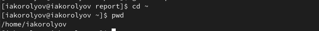{#fig:001 width=70%}

## Выполните следующие действия:

1. Перейду в каталог /tmp(рис. @fig:002).

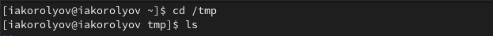{#fig:002 width=70%}

2. Продеймострирую содержимое каталога с помощью ls. Обыкновенный ls (рис. @fig:003). Выведем подробную информацию о содержимом с помощью ls -l(рис. @fig:004).
Выведем содержимое каталога вместе со скрытыми файлами ls -a (рис. @fig:005). Чтобы получить информацию о типах файлов, необходима команда ls -F(рис. @fig:006).

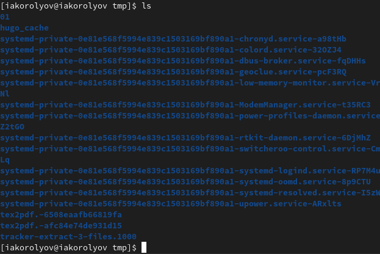{#fig:003 width=70%}

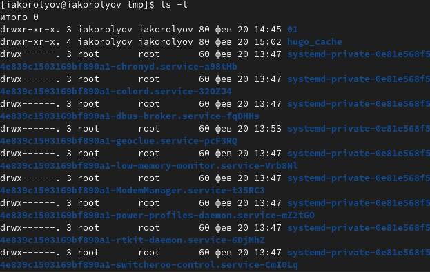{#fig:004 width=70%}

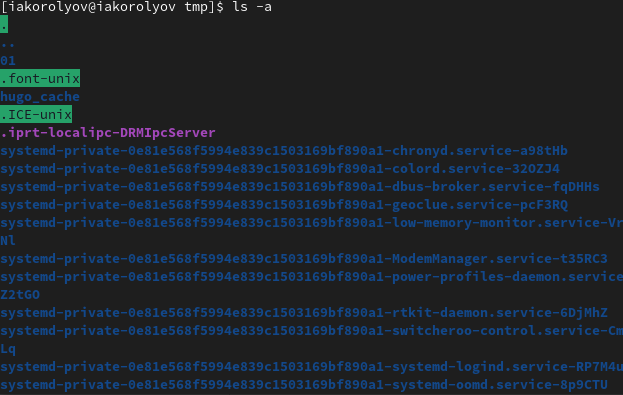{#fig:005 width=70%}

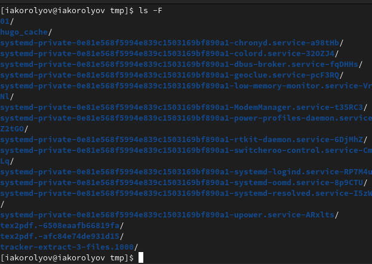{#fig:006 width=70%}

3. Определите, есть ли в каталоге /var/spool подкаталог с именем cron? **Ответ: Нет, нету подкаталога с именем cron.**(рис. @fig:007).

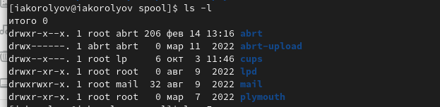{#fig:007 width=70%}

4. Перехожу в домашний каталог и вывожу содержимое, cd ~, ls -l (видим владельца каталога, iakorolyov)(рис. @fig:008).

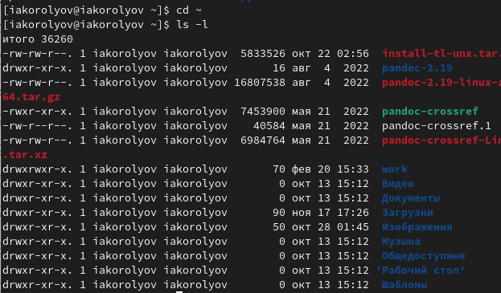{#fig:008 width=70%}

## Выполните следующие действия:

1. В домашнем каталоге создаю каталог newdir (рис. @fig:009).

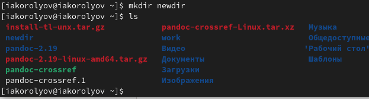{#fig:009 width=70%}

2. В каталоге newdir создаю новый каталог morefun (рис. @fig:0010).

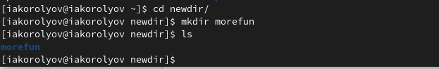{#fig:0010 width=70%}

3. В домашнем каталоге создаю три новых каталога letters, memos, misk одной командой. Потом так же одной командой пробую удалить (рис. @fig:0011), (рис. @fig:0012)

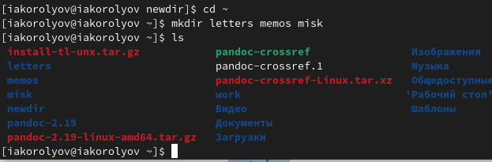{#fig:0011 width=70%}

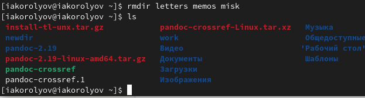{#fig:0012 width=70%}

4. Пробую удалить в домашнем каталоге newdir с пощью команды rm. Ответ: Нельзя (рис. @fig:0013)

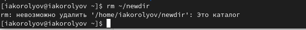{#fig:0013 width=70%}

5. Удаляю из домашнего каталога, каталог morefun (рис. @fig:0014)

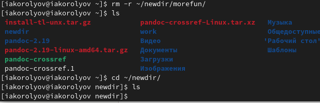{#fig:0014 width=70%}

## Необходимо с помощью команды man узнать опцию для ls, с помощью которой можно не только содержимое каталога вывести, но и подкаталогов

1. Необходимо использовать ls -R (рис. @fig:0015), (рис. @fig:0016)

{#fig:0015 width=70%}

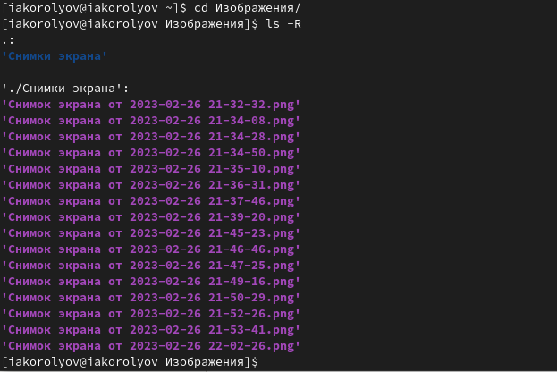{#fig:0016 width=70%}

## Необходимо с помощью команды man узнать опцию для ls, с помощью которой можно отсортировать файлы по времени изменения

1. Необходимо использовать ls -t или ls -lt (рис. @fig:0017)

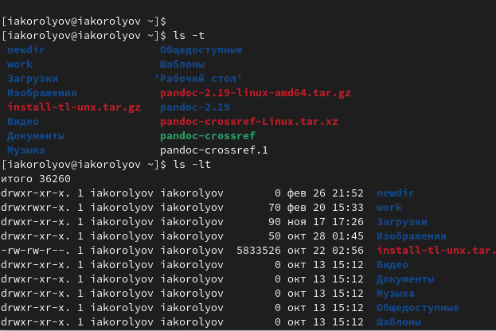{#fig:0017 width=70%}

## C помощью команды man узнать основные опции команд:  cd,pwd,mkdir, rmdir, rm. 

1. cd (рис. @fig:0018)

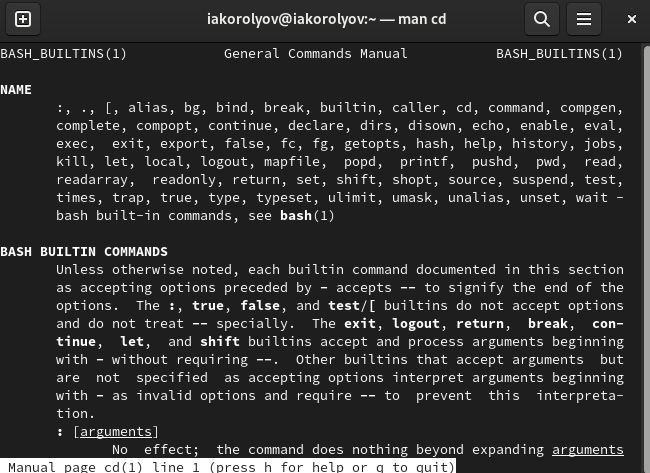{#fig:0018 width=70%}

2. pwd (рис. @fig:0019)

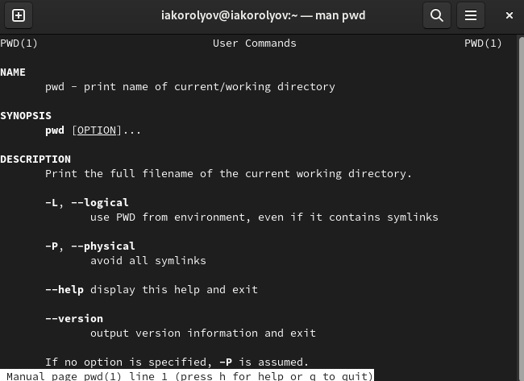{#fig:0019 width=70%}

3. mkdir (рис. @fig:0020)

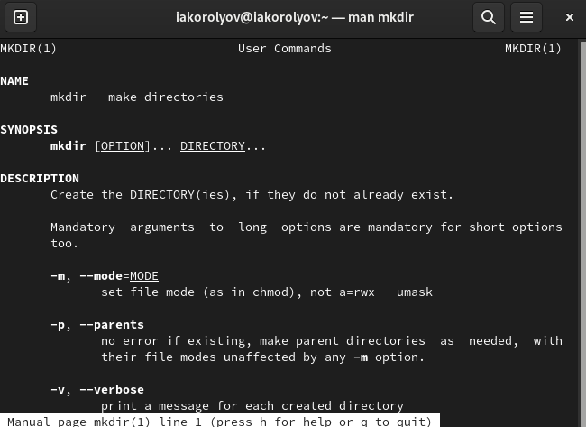{#fig:0020 width=70%}

4. rmdir (рис. @fig:0021)

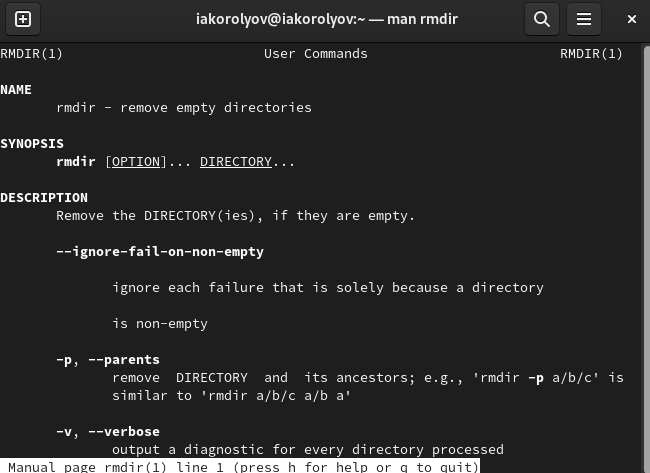{#fig:0021 width=70%}

5. rm (рис. @fig:0022)

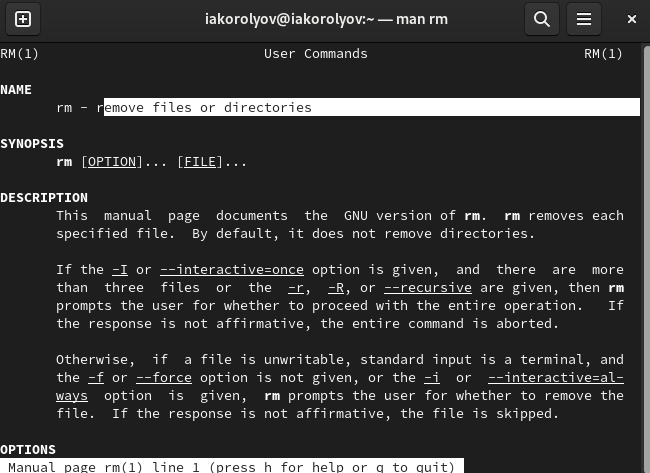{#fig:0022 width=70%}

## Используя информацию, полученную при помощи команды history, выполню модификацию и исполнение команды из буфера команд.

1. С помощью команды history(рис. @fig:0023) выполню команду !1003 (ls -a), (рис. @fig:0024). Далее модифицирую её (рис. @fig:0025)

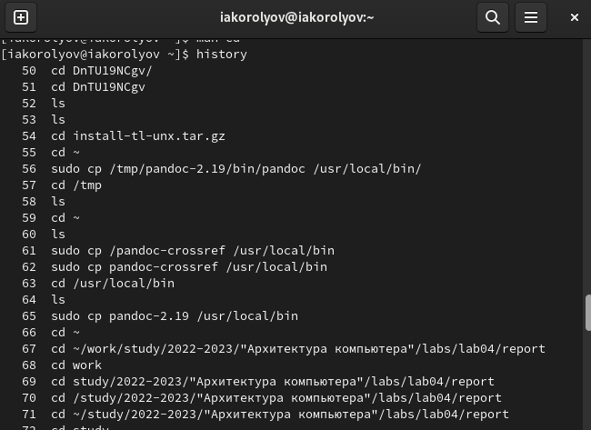{#fig:0023 width=70%}

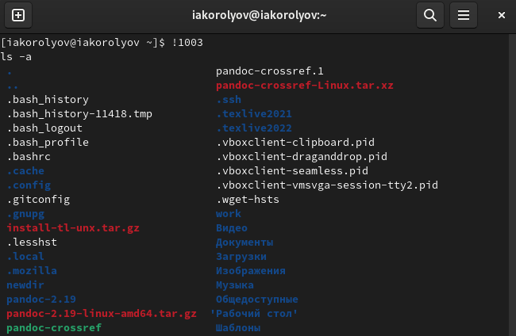{#fig:0024 width=70%}

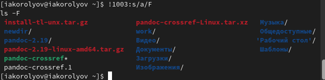{#fig:0025 width=70%}

# Выводы

Приобретел практические навыки взаимодействия пользователя с системой посредством командной строки.

# Ответы на контрольные вопросы

1. **Ответ: Терминал Линукс (Linux Terminal) — это программа, которая используется для взаимодействия с командной оболочкой. Ее второе название — командная строка Линукс. Терминал предназначен для администрирования ОС: установки и удаления программ, работы с файловой системой и др**

2. **Ответ:  Для определения абсолютного пути к текущему каталогу используется команда pwd (print working directory).**
**Пример. Вводим команду, получаем: /afs/dk.sci.pfu.edu.ru/home/d/h/dharma**

3. **Ответ: При помощи команды ls -l**

4. **Ответ: Необходимо использовать команду ls -a**

5. **Ответ: Команда rm используется для удаления файлов и/или каталогов. Чтобы удалитькаталог,содержащий файлы,нужно использоватьопцию r. Если каталог пуст, то можно воспользоваться командой rmdir.**
**Пример. Можно например во так удалить несколько каталогов, если пустые rmdir catalog1 catalog2 .. и  тд**

6. **Ответ: С помощью команды history**

7. **Ответ: Можно модифицировать команду из выведенного на экран списка при помощи следу- ющей конструкции: !3:s/a/F**

8. **Ответ: Если требуется выполнить последовательно несколько команд, записанный в одной строке,то для этого используется символ точка с запятой. Пример: cd; ls**

9. **Ответ: Если в заданном контексте встречаются специальные символы (типа «.», «/», «*» и т.д.), надо перед ними поставить символ экранирования \(обратный слэш).**

10. **Ответ: Использую команду ls -l мы выводим подробную информацию о файлах и каталогах. Такую, как: тип файлов, владелец, размер и тд.**

11. **Ответ: Абсолютный (он же полный) путь — это когда мы указываем все диски и папки, в которые нужно зайти, чтобы добраться до нужного файла.Относительный путь — это путь к файлу относительно текущего каталога. Текущий каталог — это тот, в котором запускается скрипт, программа или открывается страница в браузере.**

12. **Ответ: С помощью команды man**

13. **Ответ: Клавиша TAB.**

