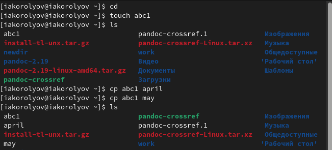
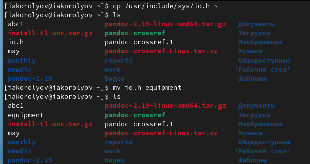
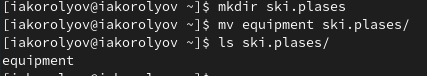
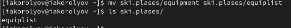
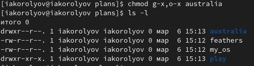
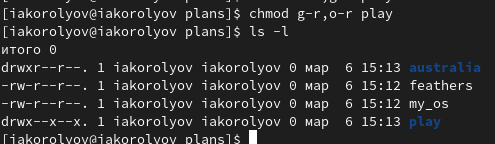
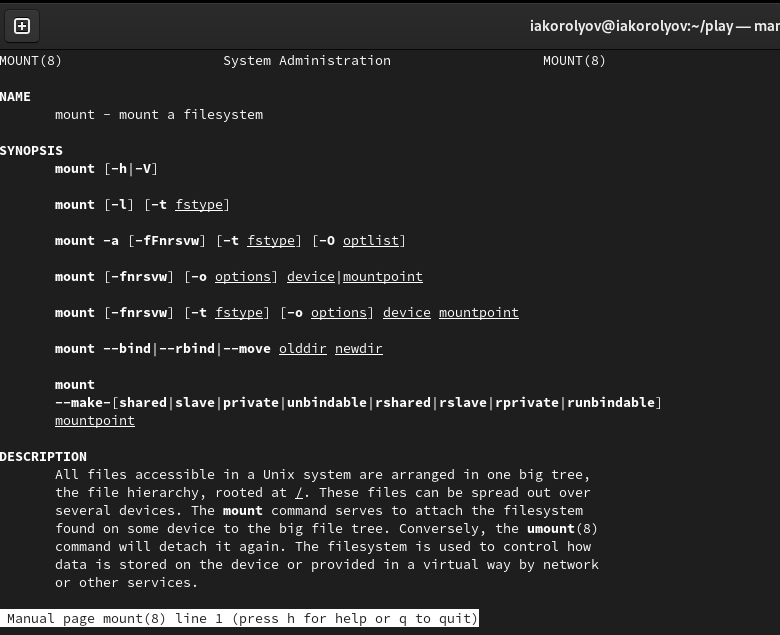
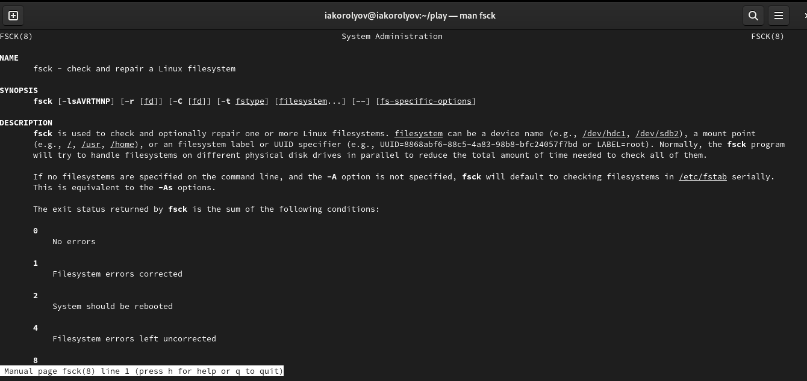

---
## Front matter
lang: ru-RU
title: Презентация по лабораторной работа № 5
author:
  - Королёв Иван Андреевич
institute:
  - Российский университет дружбы народов, Москва, Россия

## i18n babel
babel-lang: russian
babel-otherlangs: english

## Formatting pdf
toc: false
toc-title: Содержание
slide_level: 2
aspectratio: 169
section-titles: true
theme: metropolis
header-includes:
 - \metroset{progressbar=frametitle,sectionpage=progressbar,numbering=fraction}
 - '\makeatletter'
 - '\beamer@ignorenonframefalse'
 - '\makeatother'
---

# Информация

## Докладчик

:::::::::::::: {.columns align=center}
::: {.column width="70%"}

  * Королёв Иван Андреевич
  * студент, НКАбд-05-22
  * Российский университет дружбы народов

:::
::::::::::::::

# Цель работы

Ознакомление с файловой системой Linux, её структурой, именами и содержанием каталогов. Приобретение практических навыков по применению команд для работы с файлами и каталогами, по управлению процессами (и работами), по проверке использования диска и обслуживанию файловой системы.

# Задание

1. Выполните все примеры,приведённыев первойчасти описаниялабораторной работы. 
2. Выполните следующие действия, зафиксировав в отчёте по лабораторной работе используемые при этом команды и результаты их выполнения: 
  1. Скопируйте файл /usr/include/sys/io.h в домашний каталог и назовите его equipment. Если файла io.h нет,то используйте любой другой файл в каталоге /usr/include/sys/ вместо него. 
  2. В домашнем каталоге создайте директорию ~/ski.plases. 
  3. Переместите файл equipment в каталог ~/ski.plases. 
  4. Переименуйте файл ~/ski.plases/equipment в ~/ski.plases/equiplist. 
  5. Создайте в домашнем каталоге файл abc1 и скопируйте его в каталог ~/ski.plases, назовите его equiplist2. 
  6. Создайте каталог с именем equipment в каталоге ~/ski.plases. 
  7. Переместите файлы ~/ski.plases/equiplist и equiplist2 в каталог ~/ski.plases/equipment. 
  8. Создайте и переместите каталог ~/newdir в каталог ~/ski.plases и назовите его plans.
  
# Задание

3. Определите опции команды chmod, необходимые для того, чтобы присвоить перечис- ленным ниже файлам выделенные права доступа, считая, что в начале таких прав нет: 
  1. drwxr--r-- ... australia 
  2. drwx--x--x ... play 
  3. -r-xr--r-- ... my_os 
  4. -rw-rw-r-- ... feathers При необходимости создайте нужные файлы. 
4. Проделайте приведённые ниже упражнения, записывая в отчёт по лабораторной работе используемые при этом команды: 
  1. Просмотрите содержимое файла /etc/password. 
  2. Скопируйте файл ~/feathers в файл ~/file.old. 
  3. Переместите файл ~/file.old в каталог ~/play. 
  4. Скопируйте каталог ~/play в каталог ~/fun. 
  5. Переместите каталог ~/fun в каталог ~/play и назовите его games. 
  6. Лишите владельца файла ~/feathers права на чтение. 
  7. Что произойдёт, если вы попытаетесь просмотреть файл ~/feathers командой cat? 
  8. Что произойдёт, если вы попытаетесь скопировать файл ~/feathers? 
  9. Дайте владельцу файла ~/feathers право на чтение. 
  10. Лишите владельца каталога ~/play права на выполнение. 
  11. Перейдите в каталог ~/play. Что произошло? 
  12. Дайте владельцу каталога ~/play право на выполнение. 
5. Прочитайте man по командам mount, fsck, mkfs, kill и кратко их охарактеризуйте, приведя примеры.

# Теоретическое введение

Для создания текстового файла можно использовать команду touch. Формат команды: touch имя-файла
Для просмотра файлов небольшого размера можно использовать команду cat. Формат команды: cat имя-файла
Для просмотра файлов постранично удобнее использовать команду less. Формат команды: less имя-файла
Следующие клавиши используются для управления процессом просмотра: – Space — переход к следующей странице, – ENTER — сдвиг вперёд на одну строку, – b — возврат на предыдущую страницу, – h — обращение за подсказкой, – q — выход из режима просмотра файла. Команда head выводит по умолчанию первые 10 строк файла. Формат команды: head [-n] имя-файла,
где n — количество выводимых строк. Команда tail выводит умолчанию 10 последних строк файла. Формат команды: tail [-n] имя-файла,
где n — количество выводимых строк.

Режим (в формате команды) имеет следующие компоненты структуры и способ записи: = установить право - лишить права + дать право r чтение w запись
x выполнение u (user) владелец файла g (group) группа, к которой принадлежит владелец файла o (others) все остальные

# Выполнение лабораторной работы

## Выполните все примеры,приведённыев первой части описания лабораторной работы. 

{#fig:001 width=70%}

## Скопирую файл /usr/include/sys/io.h в домашний каталог и назову его equipment.(рис. @fig:0014).

{#fig:0014 width=70%}

## В домашнем каталоге создайте директорию ~/ski.plases. Переместите файл equipment в каталог ~/ski.plases.(рис. @fig:0015).

{#fig:0015 width=70%}

## Переименуйте файл ~/ski.plases/equipment в ~/ski.plases/equiplist.  (рис. @fig:0016).

{#fig:0016 width=70%}

## drwxr--r-- ... australia  (рис. @fig:0021).

{#fig:0021 width=70%}

## drwx--x--x ... play (рис. @fig:0022).

{#fig:0022 width=70%}

## mount (рис. @fig:0036).

{#fig:0036 width=70%}

## fsck (рис. @fig:0037).

{#fig:0037 width=70%}

# Выводы

Я ознакомился с файловой системой Linux, её структурой, именами и содержанием каталогов. Приобрёл практические навыки по применению команд для работы с файлами и каталогами, по управлению процессами (и работами), по проверке использования диска и обслуживанию файловой системы.
