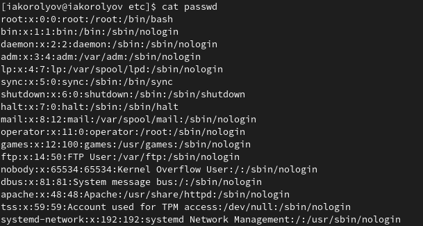

---
## Front matter
title: "Отчёт по лабораторной работе № 5"
author: "Королёв Иван Андреевич"

## Generic otions
lang: ru-RU
toc-title: "Содержание"

## Bibliography
bibliography: bib/cite.bib
csl: pandoc/csl/gost-r-7-0-5-2008-numeric.csl

## Pdf output format
toc: true # Table of contents
toc-depth: 2
lof: true # List of figures
lot: true # List of tables
fontsize: 12pt
linestretch: 1.5
papersize: a4
documentclass: scrreprt
## I18n polyglossia
polyglossia-lang:
  name: russian
  options:
	- spelling=modern
	- babelshorthands=true
polyglossia-otherlangs:
  name: english
## I18n babel
babel-lang: russian
babel-otherlangs: english
## Fonts
mainfont: PT Serif
romanfont: PT Serif
sansfont: PT Sans
monofont: PT Mono
mainfontoptions: Ligatures=TeX
romanfontoptions: Ligatures=TeX
sansfontoptions: Ligatures=TeX,Scale=MatchLowercase
monofontoptions: Scale=MatchLowercase,Scale=0.9
## Biblatex
biblatex: true
biblio-style: "gost-numeric"
biblatexoptions:
  - parentracker=true
  - backend=biber
  - hyperref=auto
  - language=auto
  - autolang=other*
  - citestyle=gost-numeric
## Pandoc-crossref LaTeX customization
figureTitle: "Рис."
tableTitle: "Таблица"
listingTitle: "Листинг"
lofTitle: "Список иллюстраций"
lotTitle: "Список таблиц"
lolTitle: "Листинги"
## Misc options
indent: true
header-includes:
  - \usepackage{indentfirst}
  - \usepackage{float} # keep figures where there are in the text
  - \floatplacement{figure}{H} # keep figures where there are in the text
---

# Цель работы

Ознакомление с файловой системой Linux, её структурой, именами и содержанием каталогов. Приобретение практических навыков по применению команд для работы с файлами и каталогами, по управлению процессами (и работами), по проверке использования диска и обслуживанию файловой системы.

# Задание

1. Выполните все примеры,приведённыев первойчасти описаниялабораторной работы. 
2. Выполните следующие действия, зафиксировав в отчёте по лабораторной работе используемые при этом команды и результаты их выполнения: 
  1. Скопируйте файл /usr/include/sys/io.h в домашний каталог и назовите его equipment. Если файла io.h нет,то используйте любой другой файл в каталоге /usr/include/sys/ вместо него. 
  2. В домашнем каталоге создайте директорию ~/ski.plases. 
  3. Переместите файл equipment в каталог ~/ski.plases. 
  4. Переименуйте файл ~/ski.plases/equipment в ~/ski.plases/equiplist. 
  5. Создайте в домашнем каталоге файл abc1 и скопируйте его в каталог ~/ski.plases, назовите его equiplist2. 
  6. Создайте каталог с именем equipment в каталоге ~/ski.plases. 
  7. Переместите файлы ~/ski.plases/equiplist и equiplist2 в каталог ~/ski.plases/equipment. 
  8. Создайте и переместите каталог ~/newdir в каталог ~/ski.plases и назовите его plans.
3. Определите опции команды chmod, необходимые для того, чтобы присвоить перечис- ленным ниже файлам выделенные права доступа, считая, что в начале таких прав нет: 
  1. drwxr--r-- ... australia 
  2. drwx--x--x ... play 
  3. -r-xr--r-- ... my_os 
  4. -rw-rw-r-- ... feathers При необходимости создайте нужные файлы. 
4. Проделайте приведённые ниже упражнения, записывая в отчёт по лабораторной работе используемые при этом команды: 
  1. Просмотрите содержимое файла /etc/password. 
  2. Скопируйте файл ~/feathers в файл ~/file.old. 
  3. Переместите файл ~/file.old в каталог ~/play. 
  4. Скопируйте каталог ~/play в каталог ~/fun. 
  5. Переместите каталог ~/fun в каталог ~/play и назовите его games. 
  6. Лишите владельца файла ~/feathers права на чтение. 
  7. Что произойдёт, если вы попытаетесь просмотреть файл ~/feathers командой cat? 
  8. Что произойдёт, если вы попытаетесь скопировать файл ~/feathers? 
  9. Дайте владельцу файла ~/feathers право на чтение. 
  10. Лишите владельца каталога ~/play права на выполнение. 
  11. Перейдите в каталог ~/play. Что произошло? 
  12. Дайте владельцу каталога ~/play право на выполнение. 
5. Прочитайте man по командам mount, fsck, mkfs, kill и кратко их охарактеризуйте, приведя примеры.

# Теоретическое введение

Для создания текстового файла можно использовать команду touch. Формат команды: touch имя-файла
Для просмотра файлов небольшого размера можно использовать команду cat. Формат команды: cat имя-файла
Для просмотра файлов постранично удобнее использовать команду less. Формат команды: less имя-файла
Следующие клавиши используются для управления процессом просмотра: – Space — переход к следующей странице, – ENTER — сдвиг вперёд на одну строку, – b — возврат на предыдущую страницу, – h — обращение за подсказкой, – q — выход из режима просмотра файла. Команда head выводит по умолчанию первые 10 строк файла. Формат команды: head [-n] имя-файла,
где n — количество выводимых строк. Команда tail выводит умолчанию 10 последних строк файла. Формат команды: tail [-n] имя-файла,
где n — количество выводимых строк.

Режим (в формате команды) имеет следующие компоненты структуры и способ записи: = установить право - лишить права + дать право r чтение w запись
x выполнение u (user) владелец файла g (group) группа, к которой принадлежит владелец файла o (others) все остальные

# Выполнение лабораторной работы

## Выполните все примеры,приведённыев первойчасти описаниялабораторной работы. 

1. Копирование файла в текущем каталоге. Скопировать файл ~/abc1 в файл april и в файл may(рис. @fig:001).

{#fig:001 width=70%}

2. Копирование нескольких файлов в каталог. Скопировать файлы april и may в каталог monthly(рис. @fig:002).

{#fig:002 width=70%}

3. Копирование файлов в произвольном каталоге.Скопировать файл monthly/may в файл с именем june (рис. @fig:003).

{#fig:003 width=70%}

4. Копирование каталогов в текущем каталоге. Скопировать каталог monthly в каталог monthly.00 (рис. @fig:004).

{#fig:004 width=70%}

5.  Копирование каталогов в произвольном каталоге. Скопировать каталог monthly.00 в каталог /tmp (рис. @fig:005).

{#fig:005 width=70%}

6. Переименование файлов в текущем каталоге. Изменить название файла april на july в домашнем каталоге (рис. @fig:006).

{#fig:006 width=70%}

7. Перемещение файлов в другой каталог.Переместить файл july в каталог monthly.00 (рис. @fig:007).

{#fig:007 width=70%}

8. Переименование каталогов в текущем каталоге. Переименовать каталог monthly.00 в monthly.01 (рис. @fig:008).

{#fig:008 width=70%}

9. Перемещение каталога в другой каталог. Переместить каталог monthly.01в каталог reports (рис. @fig:009).

{#fig:009 width=70%}

10. Переименование каталога, не являющегося текущим. Переименовать каталог reports/monthly.01 в reports/monthly (рис. @fig:0010).

{#fig:0010 width=70%}

11. Требуется создать файл ~/may с правом выполнения для владельца (рис. @fig:0011).

{#fig:0011 width=70%}

12. Требуется лишить владельца файла ~/may права на выполнение (рис. @fig:0012).

{#fig:0012 width=70%}

13. Требуется создать файл ~/abc1 с правом записи для членов группы (рис. @fig:0013).

{#fig:0013 width=70%}

##  Выполните следующие действия, зафиксировав в отчёте по лабораторной работе используемые при этом команды и результаты их выполнения: 

1. Скопирую файл /usr/include/sys/io.h в домашний каталог и назову его equipment.(рис. @fig:0014).

{#fig:0014 width=70%}

2. В домашнем каталоге создайте директорию ~/ski.plases. Переместите файл equipment в каталог ~/ski.plases.(рис. @fig:0015).

{#fig:0015 width=70%}

3. Переименуйте файл ~/ski.plases/equipment в ~/ski.plases/equiplist.  (рис. @fig:0016).

{#fig:0016 width=70%}

4. Создайте в домашнем каталоге файл abc1 и скопируйте его в каталог ~/ski.plases, назовите его equiplist2.  (рис. @fig:0017).

{#fig:0017 width=70%}

5. Создайте каталог с именем equipment в каталоге ~/ski.plases.  (рис. @fig:0018).

{#fig:0018 width=70%}

6. Переместите файлы ~/ski.plases/equiplist и equiplist2 в каталог ~/ski.plases/equipment.  (рис. @fig:0019).

{#fig:0019 width=70%}

7. Создайте и переместите каталог ~/newdir в каталог ~/ski.plases и назовите его plans. (рис. @fig:0020).

{#fig:0020 width=70%}

## Определите опции команды chmod, необходимые для того, чтобы присвоить перечис- ленным ниже файлам выделенные права доступа

1. drwxr--r-- ... australia  (рис. @fig:0021).

{#fig:0021 width=70%}

2. drwx--x--x ... play (рис. @fig:0022).

{#fig:0022 width=70%}

3. -r-xr--r-- ... my_os  (рис. @fig:0023).

{#fig:0023 width=70%}

4. -rw-rw-r-- ... feathers  (рис. @fig:0024).

{#fig:0024 width=70%}

##  Проделайте приведённые ниже упражнения, записывая в отчёт по лабораторной работе используемые при этом команды

1. Просмотрите содержимое файла /etc/password.  (рис. @fig:0025).

{#fig:0025 width=70%}

2. Скопируйте файл ~/feathers в файл ~/file.old. (рис. @fig:0026).

{#fig:0026 width=70%}

3. Скопируйте каталог ~/play в каталог ~/fun.  (рис. @fig:0027).

{#fig:0027 width=70%}

4. Переместите каталог ~/fun в каталог ~/play и назовите его games. (рис. @fig:0028).

{#fig:0028 width=70%}

5. Лишите владельца файла ~/feathers права на чтение. (рис. @fig:0029).

{#fig:0029 width=70%}

6. Что произойдёт, если вы попытаетесь просмотреть файл ~/feathers командой cat?  **Ответ:отказано в доступе** (рис. @fig:0030).

{#fig:0030 width=70%}

7. Что произойдёт, если вы попытаетесь скопировать файл ~/feathers? c (рис. @fig:0031).

{#fig:0031 width=70%}

8. Дайте владельцу файла ~/feathers право на чтение.  (рис. @fig:0032).

{#fig:0032 width=70%}

9. Лишите владельца каталога ~/play права на выполнение.  (рис. @fig:0033).

{#fig:0033 width=70%}

10. Перейдите в каталог ~/play. Что произошло? **Ответ:отказано в доступе** (рис. @fig:0034).

{#fig:0034 width=70%}

11. Дайте владельцу каталога ~/play право на выполнение. (рис. @fig:0035).

{#fig:0035 width=70%}

## Прочитайте man по командам mount, fsck, mkfs, kill

1. mount (рис. @fig:0036).

{#fig:0036 width=70%}

2. fsck (рис. @fig:0037).

{#fig:0037 width=70%}

3. mkfs (рис. @fig:0038).

{#fig:0038 width=70%}

4. kill (рис. @fig:0039).

{#fig:0039 width=70%}

# Выводы

Я ознакомился с файловой системой Linux, её структурой, именами и содержанием каталогов. Приобрёл практические навыки по применению команд для работы с файлами и каталогами, по управлению процессами (и работами), по проверке использования диска и обслуживанию файловой системы.

# Ответы на контрольные вопросы

1. Дайте характеристику каждой файловой системе, существующей на жёстком диске компьютера, на котором вы выполняли лабораторную работу.
Ext2, Ext3, Ext4 или Extended Filesystem - это стандартная файловая система для Linux. Она была разработана еще для Minix. Она самая стабильная из всех существующих, кодовая база изменяется очень редко и эта файловая система содержит больше всего функций. Версия ext2 была разработана уже именно для Linux и получила много улучшений. В 2001 году вышла ext3, которая добавила еще больше стабильности благодаря использованию журналирования. В 2006 была выпущена версия ext4, которая используется во всех дистрибутивах Linux до сегодняшнего дня. В ней было внесено много улучшений, в том числе увеличен максимальный размер раздела до одного экзабайта.
Btrfs или B-Tree File System - это совершенно новая файловая система, которая сосредоточена на отказоустойчивости, легкости администрирования и восстановления данных. Файловая система объединяет в себе очень много новых интересных возможностей, таких как размещение на нескольких разделах, поддержка подтомов, изменение размера не лету, создание мгновенных снимков, а также высокая производительность. Но многими пользователями файловая система Btrfs считается нестабильной. Тем не менее, она уже используется как файловая система по умолчанию в OpenSUSE и SUSE Linux.

2. /media — точка монтирования внешних носителей. Например, когда вы вставляете диск в дисковод, он будет автоматически смонтирован в директорию /media/cdrom;
/mnt — точка временного монтирования. Файловые системы подключаемых устройств обычно монтируются в этот каталог для временного использования;
/opt — тут расположены дополнительные (необязательные) приложения. Такие программы обычно не подчиняются принятой иерархии и хранят свои файлы в одном подкаталоге (бинарные, библиотеки, конфигурации);
/proc — содержит файлы, хранящие информацию о запущенных процессах и о состоянии ядра ОС;
/root — директория, которая содержит файлы и личные настройки суперпользователя;
/run — содержит файлы состояния приложений. Например, PID-файлы или UNIX-сокеты;
/sbin — аналогично /bin содержит бинарные файлы. Утилиты нужны для настройки и администрирования системы суперпользователем;
/srv — содержит файлы сервисов, предоставляемых сервером (прим. FTP или Apache HTTP);
/sys — содержит данные непосредственно о системе. Тут можно узнать информацию о ядре, драйверах и устройствах;
/tmp — содержит временные файлы. Данные файлы доступны всем пользователям на чтение и запись. Стоит отметить, что данный каталог очищается при перезагрузке;
/usr — содержит пользовательские приложения и утилиты второго уровня, используемые пользователями, а не системой.

3. Монтирование тома

4. Отсутствие синхронизации между образом файловой системы в памяти и ее данными на диске в случае аварийного останова может привести к появлению следующих ошибок:
 1. Один блок адресуется несколькими mode (принадлежит нескольким файлам).
 2. Блок помечен как свободный, но в то же время занят (на него ссылается onode).
 3. Блок помечен как занятый, но в то же время свободен (ни один inode на него не ссылается).
 4. Неправильное число ссылок в inode (недостаток или избыток ссылающихся записей в каталогах).
 5. Несовпадение между размером файла и суммарным размером адресуемых inode блоков.
 6. Недопустимые адресуемые блоки (например, расположенные за пределами файловой системы).
 7. "Потерянные" файлы (правильные inode, на которые не ссылаются записи каталогов).
 8. Недопустимые или неразмещенные номера inode в записях каталогов.
 
5. mkfs - позволяет создать файловую систему Linux.

6. Cat - выводит содержимое файла на стандартное устройство вывода

7. Cp – копирует или перемещает директорию, файлы.

8. Mv - переименовать или переместить файл или директорию

9. Права доступа к файлу или каталогу можно изменить, воспользовавшись командой chmod. Сделать это может владелец файла (или каталога) или пользователь с правами администратора.
