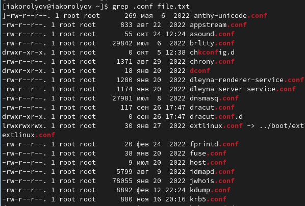
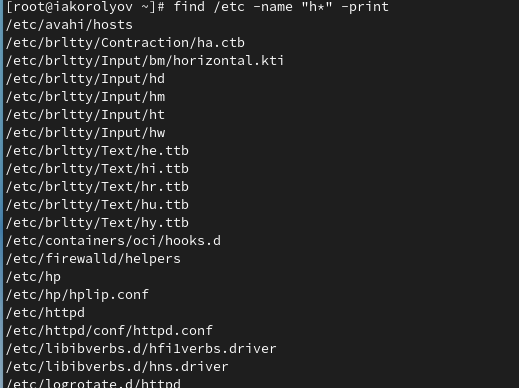
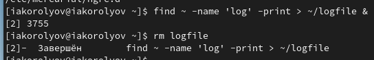
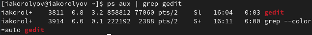
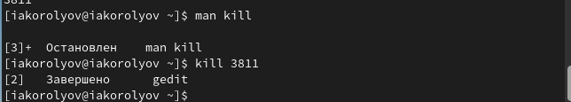
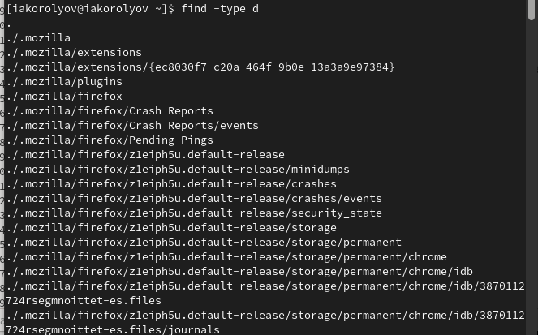

---
## Front matter
lang: ru-RU
title: Лабораторная работа № 6. Презентация
author:
  - Королёв И.А.
institute:
  - Российский университет дружбы народов, Москва, Россия

## i18n babel
babel-lang: russian
babel-otherlangs: english

## Formatting pdf
toc: false
toc-title: Содержание
slide_level: 2
aspectratio: 169
section-titles: true
theme: metropolis
header-includes:
 - \metroset{progressbar=frametitle,sectionpage=progressbar,numbering=fraction}
 - '\makeatletter'
 - '\beamer@ignorenonframefalse'
 - '\makeatother'
---

# Информация

## Докладчик

:::::::::::::: {.columns align=center}
::: {.column width="70%"}

  * Королёв Иван Андреевич
  * студент, НКАбд-05-22
  * Российский университет дружбы народов

:::
::::::::::::::

# Цель работы

Ознакомление с инструментами поиска файлов и фильтрации текстовых данных. Приобретение практических навыков: по управлению процессами (и заданиями), по проверке использования диска и обслуживанию файловых систем.

# Задание

1. Осуществите вход в систему, используя соответствующее имя пользователя. 
2. Запишите в файл file.txt названия файлов, содержащихся в каталоге /etc. Допи- шите в этот же файл названия файлов, содержащихся в вашем домашнем каталоге. 
3. Выведите имена всех файлов из file.txt, имеющих расширение .conf, после чего запишите их в новый текстовой файл conf.txt.
4. Определите, какие файлы в вашем домашнем каталоге имеют имена, начинавшиеся с символа c? Предложите несколько вариантов, как это сделать. 
5. Выведите на экран (по странично) имена файлов из каталога /etc, начинающиеся с символа h. 
6. Запустите в фоновом режиме процесс, который будет записывать в файл ~/logfile файлы, имена которых начинаются с log. 
 
# Задание

7. Удалите файл ~/logfile. 
8. Запустите из консоли в фоновом режиме редактор gedit. 
9. Определитеидентификаторпроцессаgedit,используякомандуps,конвейерифильтр grep. Как ещё можно определить идентификатор процесса? 
10. Прочтите справку (man) команды kill, после чего используйте её для завершения процесса gedit. 
11. Выполните команды df и du, предварительно получив более подробную информацию об этих командах, с помощью команды man. 
12. Воспользовавшись справкой команды find, выведите имена всех директорий, имею- щихся в вашем домашнем каталоге.

# Теоретическое введение

В системе по умолчанию открыто три специальных потока: – stdin—стандартный поток ввода (по умолчанию: клавиатура),файловыйдескриптор 0; – stdout — стандартный поток вывода (по умолчанию: консоль), файловый дескриптор 1; – stderr — стандартный поток вывод сообщений об ошибках (по умолчанию: консоль), файловый дескриптор 2. Большинство используемых в консоли команд и программ записывают результаты своей работы в стандартный поток вывода stdout.Например,команда ls выводитв стан- дартный поток вывода (консоль) список файлов в текущей директории. Потоки вывода и
ввода можно перенаправлять на другие файлы или устройства.Проще всего это делается с помощью символов >, >>, <, <<. 

Конвейер (pipe) служит для объединения простых команд или утилит в цепочки, в ко- торых результат работы предыдущей команды передаётся последующей. Синтаксис следующий:
команда 1 | команда 2

# Выполнение лабораторной работы

## Запишите в файл file.txt названия файлов, содержащихся в каталоге /etc. Допишите в этот же файл названия файлов, содержащихся в вашем домашнем каталоге. 

{#fig:001 width=70%}

## Выведите имена всех файлов из file.txt, имеющих расширение .conf, после чего запишите их в новый текстовой файл conf.txt.

{#fig:004 width=70%}

## Выведите на экран (по странично) имена файлов из каталога /etc, начинающиеся с символа h.

{#fig:008 width=70%}

## Запустите в фоновом режиме процесс, который будет записывать в файл ~/logfile файлы, имена которых начинаются с log. Удалите файл ~/logfile.

{#fig:009 width=70%}

## Запустите из консоли в фоновом режиме редактор gedit.

{#fig:0010 width=70%}

## С помощью kill завершаем процесс gedit

{#fig:0014 width=70%}

## Воспользовавшись справкой команды find, выведите имена всех директорий, имеющихся в вашем домашнем каталоге.

{#fig:0019 width=70%}

# Выводы

Я ознакомился с инструментами поиска файлов и фильтрации текстовых данных. Приобрел практически навыки: по управлению процессами (и заданиями), по проверке использования диска и обслуживанию файловых систем.
