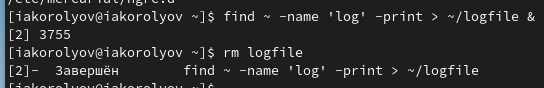

---
## Front matter
title: "Отчёт по лабораторной работе № 6"
author: "Королёв Иван Андреевич"

## Generic otions
lang: ru-RU
toc-title: "Содержание"

## Bibliography
bibliography: bib/cite.bib
csl: pandoc/csl/gost-r-7-0-5-2008-numeric.csl

## Pdf output format
toc: true # Table of contents
toc-depth: 2
lof: true # List of figures
lot: true # List of tables
fontsize: 12pt
linestretch: 1.5
papersize: a4
documentclass: scrreprt
## I18n polyglossia
polyglossia-lang:
  name: russian
  options:
	- spelling=modern
	- babelshorthands=true
polyglossia-otherlangs:
  name: english
## I18n babel
babel-lang: russian
babel-otherlangs: english
## Fonts
mainfont: PT Serif
romanfont: PT Serif
sansfont: PT Sans
monofont: PT Mono
mainfontoptions: Ligatures=TeX
romanfontoptions: Ligatures=TeX
sansfontoptions: Ligatures=TeX,Scale=MatchLowercase
monofontoptions: Scale=MatchLowercase,Scale=0.9
## Biblatex
biblatex: true
biblio-style: "gost-numeric"
biblatexoptions:
  - parentracker=true
  - backend=biber
  - hyperref=auto
  - language=auto
  - autolang=other*
  - citestyle=gost-numeric
## Pandoc-crossref LaTeX customization
figureTitle: "Рис."
tableTitle: "Таблица"
listingTitle: "Листинг"
lofTitle: "Список иллюстраций"
lotTitle: "Список таблиц"
lolTitle: "Листинги"
## Misc options
indent: true
header-includes:
  - \usepackage{indentfirst}
  - \usepackage{float} # keep figures where there are in the text
  - \floatplacement{figure}{H} # keep figures where there are in the text
---

# Цель работы

Ознакомление с инструментами поиска файлов и фильтрации текстовых данных. Приобретение практических навыков: по управлению процессами (и заданиями), по проверке использования диска и обслуживанию файловых систем.

# Задание

1. Осуществите вход в систему, используя соответствующее имя пользователя. 
2. Запишите в файл file.txt названия файлов, содержащихся в каталоге /etc. Допи- шите в этот же файл названия файлов, содержащихся в вашем домашнем каталоге. 
3. Выведите имена всех файлов из file.txt, имеющих расширение .conf, после чего запишите их в новый текстовой файл conf.txt.
4. Определите, какие файлы в вашем домашнем каталоге имеют имена, начинавшиеся с символа c? Предложите несколько вариантов, как это сделать. 
5. Выведите на экран (по странично) имена файлов из каталога /etc, начинающиеся с символа h. 
6. Запустите в фоновом режиме процесс, который будет записывать в файл ~/logfile файлы, имена которых начинаются с log. 
7. Удалите файл ~/logfile. 
8. Запустите из консоли в фоновом режиме редактор gedit. 
9. Определитеидентификаторпроцессаgedit,используякомандуps,конвейерифильтр grep. Как ещё можно определить идентификатор процесса? 
10. Прочтите справку (man) команды kill, после чего используйте её для завершения процесса gedit. 
11. Выполните команды df и du, предварительно получив более подробную информацию об этих командах, с помощью команды man. 
12. Воспользовавшись справкой команды find, выведите имена всех директорий, имею- щихся в вашем домашнем каталоге.

# Теоретическое введение

В системе по умолчанию открыто три специальных потока: – stdin—стандартный поток ввода (по умолчанию: клавиатура),файловыйдескриптор 0; – stdout — стандартный поток вывода (по умолчанию: консоль), файловый дескриптор 1; – stderr — стандартный поток вывод сообщений об ошибках (по умолчанию: консоль), файловый дескриптор 2. Большинство используемых в консоли команд и программ записывают результаты своей работы в стандартный поток вывода stdout.Например,команда ls выводитв стан- дартный поток вывода (консоль) список файлов в текущей директории. Потоки вывода и
ввода можно перенаправлять на другие файлы или устройства.Проще всего это делается с помощью символов >, >>, <, <<. 

Конвейер (pipe) служит для объединения простых команд или утилит в цепочки, в ко- торых результат работы предыдущей команды передаётся последующей. Синтаксис следующий:
команда 1 | команда 2

# Выполнение лабораторной работы

## File.txt

1. Запишите в файл file.txt названия файлов, содержащихся в каталоге /etc. Допишите в этот же файл названия файлов, содержащихся в вашем домашнем каталоге. (рис. @fig:001), (рис. @fig:002), (рис. @fig:003).

{#fig:001 width=70%}

{#fig:002 width=70%}

{#fig:003 width=70%}

## File.txt in conf.txt

2. Выведите имена всех файлов из file.txt, имеющих расширение .conf, после чего запишите их в новый текстовой файл conf.txt.(рис. @fig:004), 
(рис. @fig:005).

{#fig:004 width=70%}

{#fig:005 width=70%}

## Файлы начинающиеся с символа "c"

3. Определите, какие файлы в вашем домашнем каталоге имеют имена, начинавшиеся с символа c? Предложите несколько вариантов, как это сделать. 
(рис. @fig:006), (рис. @fig:007).

{#fig:006 width=70%}

{#fig:007 width=70%} 

## Имена файлов начинающиеся с символа "h"

4. Выведите на экран (по странично) имена файлов из каталога /etc, начинающиеся с символа h.(рис. @fig:008).

{#fig:008 width=70%}

## Запуск в фоновом режиме ~/logfile. Удаление

5. Запустите в фоновом режиме процесс, который будет записывать в файл ~/logfile файлы, имена которых начинаются с log. Удалите файл ~/logfile.
(рис. @fig:009).

{#fig:009 width=70%}

## Gedit в фоновом режиме

6. Запустите из консоли в фоновом режиме редактор gedit.(рис. @fig:0010).

{#fig:0010 width=70%}

## Определение идентификатора процесса gedit

7. Определите идентификатор процесса gedit,используя команду ps,конвейер и фильтр grep. (рис. @fig:0011), (рис. @fig:0012).

{#fig:0011 width=70%}

{#fig:0012 width=70%} 

## Man command kill

8. Прочтите справку (man) команды kill, после чего используйте её для завершения процесса gedit. (рис. @fig:0013), (рис. @fig:0014).

{#fig:0013 width=70%}

{#fig:0014 width=70%}

## Выполнение команды df и du

9. Выполните команды df и du, предварительно получив более подробную информацию об этих командах, с помощью команды man. (рис. @fig:0015), 
(рис. @fig:0016), (рис. @fig:0017), (рис. @fig:0018).

{#fig:0015 width=70%}

{#fig:0016 width=70%}

{#fig:0017 width=70%}

{#fig:0018 width=70%}

## Find -type d

10. Воспользовавшись справкой команды find, выведите имена всех директорий, имеющихся в вашем домашнем каталоге.(рис. @fig:0019).

{#fig:0019 width=70%}

# Выводы

Я ознакомился с инструментами поиска файлов и фильтрации текстовых данных. Приобрел практически навыки: по управлению процессами (и заданиями), по проверке использования диска и обслуживанию файловых систем.

# Ответы на контрольные вопросы 

1. - stdin — стандартный поток ввода (по умолчанию: клавиатура),файловыйдескриптор 0; 
   – stdout — стандартный поток вывода (по умолчанию: консоль), файловый дескриптор 1; 
   – stderr — стандартный поток вывод сообщений об ошибках (по умолчанию: консоль), файловый дескриптор 2.

2. > - Перенаправление (какого-то) в файл (file.txt). 
   >> - Перенаправление (какого-то) в файл (file.txt). Файл открывается в режиме добавления. 
   
3. Конвейер (pipe) служит для объединения простых команд или утилит в цепочки, в ко- торых результат работы предыдущей команды передаётся последующей.

4. Между процессом и программой существует отношение многие-к-одному, что означает, что одна программа может вызывать несколько процессов или, другими словами, несколько процессов могут быть частью одной и той же программы. Сравнительная таблица. Основа для сравнения. программа. Процесс. основной. Программа представляет собой набор инструкций.

5. Если два процесса находятся в одном пространстве имен, тогда ID-вне-ns интерпретируется как UID (GID) в родительском user namespace идентификатора (PID) процесса.

6. Запущенныефономпрограммыназываютсязадачами(jobs).Ими можно управлять с помощью команды jobs, которая выводит список запущенных в данный
момент задач.

7. Команда htop похожа на команду top по выполняемой функции: они обе по-
казывают информацию о процессах в реальном времени, выводят данные о по-
треблении системных ресурсов и позволяют искать, останавливать и управлять
процессами.
У обеих команд есть свои преимущества. Например, в программе htop реали-
зован очень удобный поиск по процессам, а также их фильтрация. В команде top
это не так удобно — нужно знать кнопку для вывода функции поиска.
Зато в top можно разделять область окна и выводить информацию о процессах
в соответствии с разными настройками. В целом top намного более гибкая в
настройке отображения процессов.

8. Команда find - это одна из наиболее важных и часто используемых утилит си-
стемы Linux.Это команда для поиска файлов и каталогов на основе специальных
условий. Ее можно использовать в различных обстоятельствах, например,для
поиска файлов по разрешениям, владельцам, группам,типу, размеру и другим
подобным критериям.
Утилита find предустановлена по умолчанию во всех Linux дистрибутивах,
поэтому вам не нужно будет устанавливать никаких дополнительных пакетов.
Это очень важная находка для тех, кто хочет использовать командную строку
наиболее эффективно.
Командаfindимееттакойсинтаксис:find[папка][параметры]критерийшаблон
[действие] Пример: find /etc -name “p*” -print

9. find / -type f -exec grep -H ‘текстДляПоиска’ {} ;

10. С помощью команды df -h.

11. С помощью команды du -s.

12. С помощью команды kill% номер задачи.

