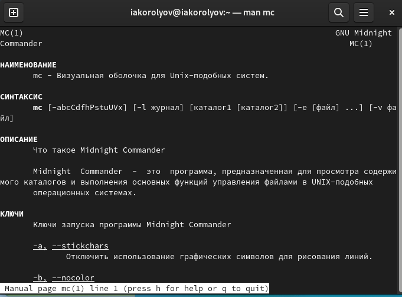
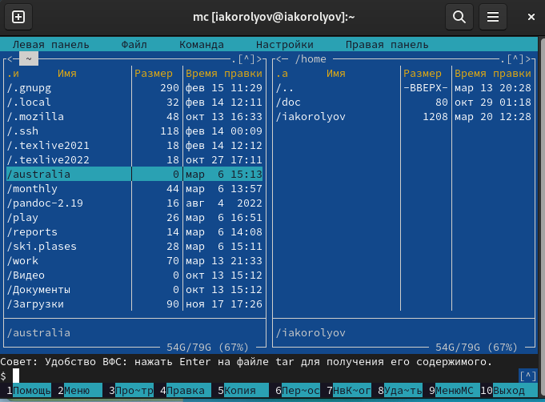
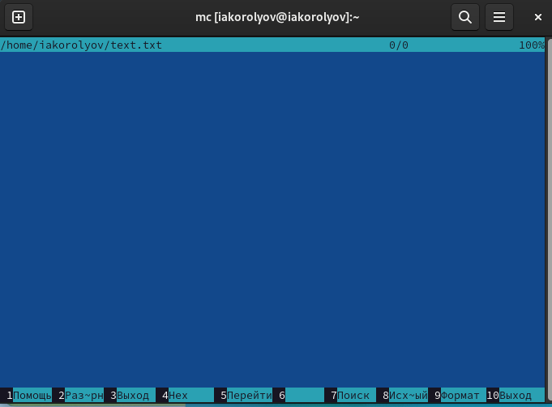
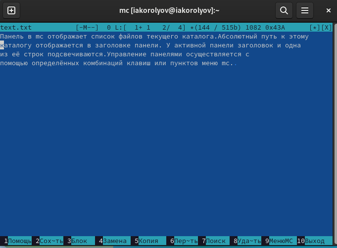
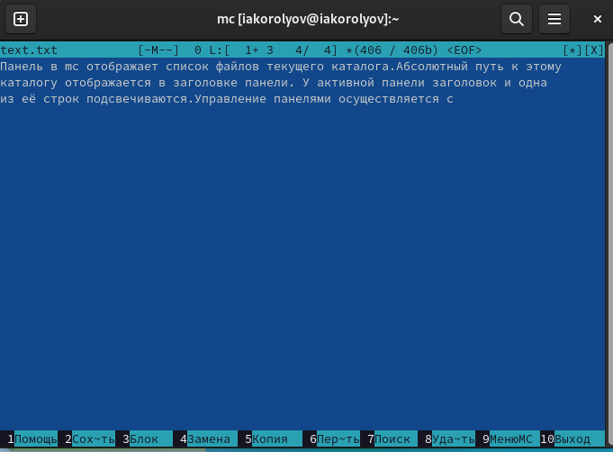
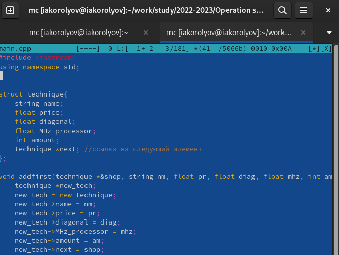
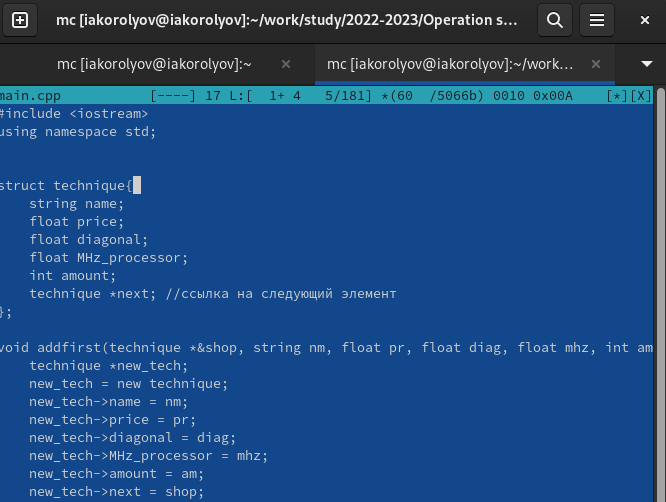

---
## Front matter
lang: ru-RU
title: Презентация по лабораторной работе № 7
author:
  - Королёв Иван Андреевич
institute:
  - Российский университет дружбы народов, Москва, Россия

## i18n babel
babel-lang: russian
babel-otherlangs: english

## Formatting pdf
toc: false
toc-title: Содержание
slide_level: 2
aspectratio: 169
section-titles: true
theme: metropolis
header-includes:
 - \metroset{progressbar=frametitle,sectionpage=progressbar,numbering=fraction}
 - '\makeatletter'
 - '\beamer@ignorenonframefalse'
 - '\makeatother'
---

# Информация

## Докладчик

:::::::::::::: {.columns align=center}
::: {.column width="70%"}

  * Королёв Иван Андреевич
  * Студент, НКАбд-05-22
  * Российский университет дружбы народов

:::
::::::::::::::

# Цель работы

Освоение основных возможностей командной оболочки Midnight Commander. Приобретение навыков практической работы по просмотру каталогов и файлов; манипуляций с ними.

# Задание

1. Создайте текстовой файл text.txt. 
2. Откройте этот файл с помощью встроенного в mc редактора. 
3. Вставьте в открытый файл небольшой фрагмент текста, скопированный из любого другого файла или Интернета. 
4. Проделайте с текстом следующие манипуляции, используя горячие клавиши: 
  1. Удалите строку текста. 
  2. Выделите фрагменттекста и скопируйте его на новую строку.
  3. Выделите фрагменттекста и перенесите его на новую строку. 
  4. Сохраните файл. 4.5. Отмените последнее действие. 
  6. Перейдите в конец файла (нажав комбинацию клавиш) и напишите некоторый текст. 
  7. Перейдите в начало файла (нажав комбинацию клавиш) и напишите некоторый текст. 
  8. Сохраните и закройте файл. 
5. Откройте файл с исходным текстом на некотором языке программирования (например C или Java) 
6. Используя меню редактора, включите подсветку синтаксиса, если она не включена, или выключите, если она включена.
  
# Теоретическое введение

Командная оболочка — интерфейс взаимодействия пользователя с операционной систе- мой и программным обеспечением посредством команд. Midnight Commander (или mc)—псевдографическая командная оболочкадля UNIX/Linux систем. Для запуска mc необходимо в командной строке набрать mc.Рабочее пространство mc имеет две панели, отображающие по умолчанию списки файлов двух каталогов 
Панель в mc отображает список файлов текущего каталога.Абсолютный путь к этому каталогу отображается в заголовке панели. У активной панели заголовок и одна из её строк подсвечиваются.Управление панелями осуществляется с помощью определённых комбинаций клавиш или пунктов меню mc

# Выполнение лабораторной работы

# Задание по mc

## Man mc

{#fig:001 width=60%}

## Cтруктура mc

{#fig:002 width=60%}

# Задание по встроенному редактору mc

## File text.txt

{#fig:0014 width=60%}

## Mc

{#fig:0015 width=60%}

## Text

{#fig:0016 width=60%}

## Проделайте с текстом следующие манипуляции, используя горячие клавиши: 

{#fig:0017 width=60%}

## Откройте файл с исходным текстом на некотором языке программирования (напри- мер C или Java)

{#fig:0025 width=60%}

## Используя меню редактора, включите подсветку синтаксиса, если она не включена, или выключите, если она включена.

{#fig:0027 width=60%}

# Выводы

Я освоил основные возможности командной оболочки Midnight Commander. Приобрел навыки практической работы по просмотру каталогов и файлов; манипуляций с ними.

:::

