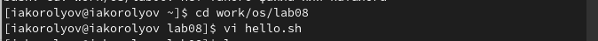
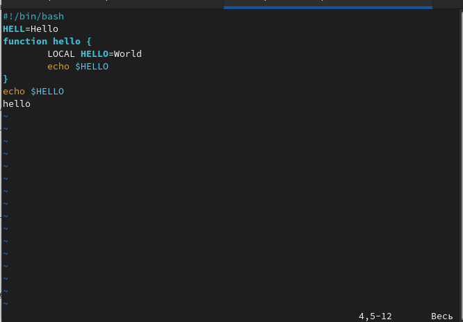
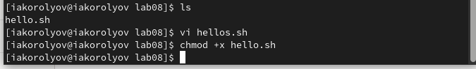
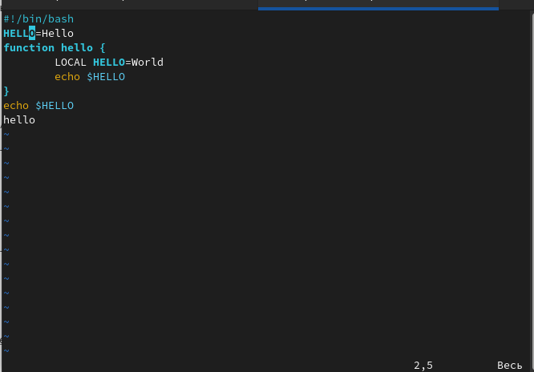
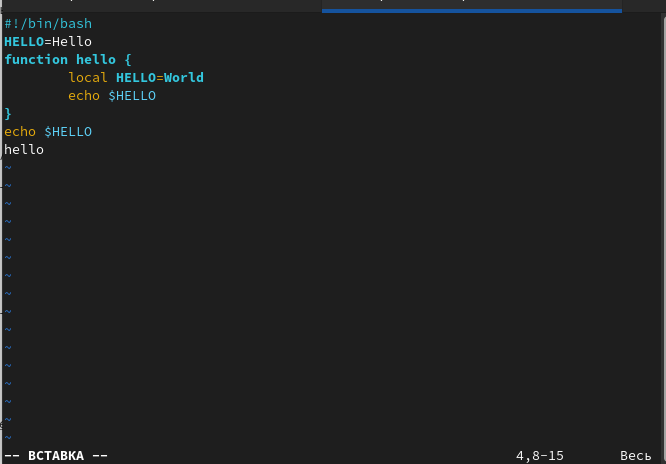
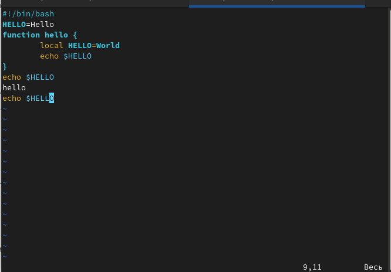
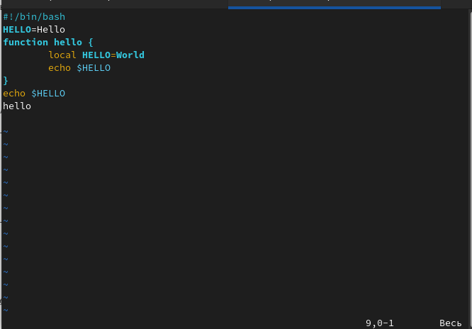
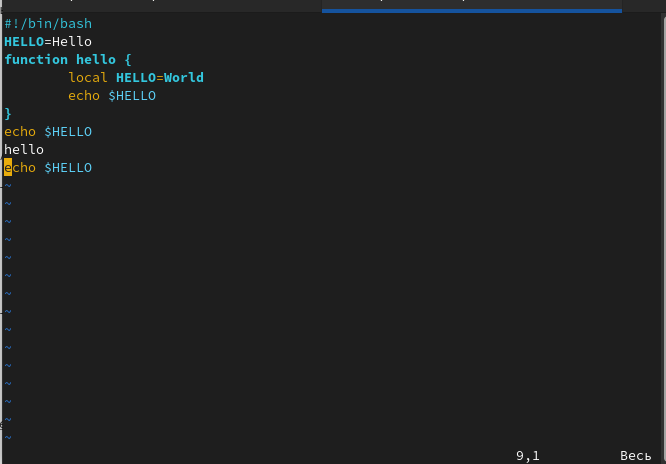

---
## Front matter
lang: ru-RU
title: Презентация по лабораторной работе № 8
author:
  - Королёв И.А.
institute:
  - Российский университет дружбы народов, Москва, Россия

## i18n babel
babel-lang: russian
babel-otherlangs: english

## Formatting pdf
toc: false
toc-title: Содержание
slide_level: 2
aspectratio: 169
section-titles: true
theme: metropolis
header-includes:
 - \metroset{progressbar=frametitle,sectionpage=progressbar,numbering=fraction}
 - '\makeatletter'
 - '\beamer@ignorenonframefalse'
 - '\makeatother'
---

# Информация

## Докладчик

:::::::::::::: {.columns align=center}
::: {.column width="70%"}

  * Королёв Иван Андреевич
  * студент,НКАбд - 05 - 22
  * Российский университет дружбы народов

:::
::::::::::::::

# Цель работы

Познакомиться с операционной системой Linux. Получить практические навыки работы с редактором vi, установленным по умолчанию практически во всех дистрибутивах.

# Задание

## Задание 1

1. Создайте каталог с именем ~/work/os/lab06. 

2. Перейдите во вновь созданный каталог. 

3. Вызовите vi и создайте файл hello.sh

4. Нажмите клавишу i и вводите следующий текст.

5. Нажмите клавишу Esc для перехода в командный режим после завершения ввода текста. 

## Задание 1

6. Нажмите : для перехода в режим последней строки и внизу вашего экрана появится приглашение в виде двоеточия. 

7. Нажмите w (записать) и q (выйти),а затем нажмите клавишу Enter для сохранения вашего текста и завершения работы. 

8. Сделайте файл исполняемым

## Задание 2

1. Вызовите vi на редактирование файла

2. Установите курсор в конец слова HELL второй строки. 

3. Перейдите в режим вставки и замените на HELLO.Нажмите Esc для возврата в команд- ный режим. 

4. Установите курсор на четвертую строку и сотрите слово LOCAL. 

5. Перейдите в режим вставки и наберите следующий текст: local, нажмите Esc для возврата в командный режим. 

## Задание 2

6. Установите курсор на последней строке файла.Вставьте после неё строку,содержащую следующий текст: echo $HELLO. 

7. Нажмите Esc для перехода в командный режим. 

8. Удалите последнюю строку. 

9. Введите команду отмены изменений u для отмены последней команды. 

10. Введите символ : для перехода в режим оследней строки.Запишите произведённые изменения и выйдите из vi.

# Теоретическое введение

В большинстве дистрибутивов Linux в качестве текстового редактора по умолчанию устанавливается интерактивный экранный редактор vi (Visual display editor). Редактор vi имееттри режима работы: – командный режим — предназначен для ввода команд редактирования и навигации по редактируемому файлу; – режим вставки — предназначен для ввода содержания редактируемого файла; – режим последней (или командной) строки —используется для записи изменений в файл и выхода из редактора. Для вызова редактора vi необходимо указать команду vi и имя редактируемого файла: vi <имя_файла> При этом в случае отсутствия файла с указанным именем будет создан такой файл. Переход в командный режим осуществляется нажатием клавиши Esc . Для выхода из редактора vi необходимо перейти в режим последней строки: находясь в командном режиме, нажать Shift-; (по сути символ : —двоеточие), затем: – набрать символы wq, если перед выходом из редактора требуется записать изменения в файл; – набрать символ q (или q!), если требуется выйти из редактора без сохранения.
Замечание. Следует помнить,что vi различает прописные и строчные буквы при наборе (восприятии) команд.

# Выполнение лабораторной работы

## lab08

Создаю каталог с именем ~/work/os/lab08, перехожу в него и вызываю vi hello.sh. 

{#fig:001 width=60%}

## Текст

Нажимаю клавишу i и ввожу текст. Далее нажимаю клавишу Esc для перехода в командный режим. Нажимаю : и прописываю команду wq для записи и завершения работы 

{#fig:002 width=60%}

## chmod +x hello.sh

Сделаю файл исполняемым с помощью команды chmod +x hello.sh 

{#fig:003 width=60%}

## hello.sh

Установливаю курсор в конец слова HELL второй строки. Перехожу в режим вставки и заменяю на HELLO.Нажмимаю Esc для возврата в командный режим. 

{#fig:005 width=60%}

##hello.sh

Перехожу в режим вставки и ввожу следующий текст: local, нажимаю Esc для возврата в командный режим. 

{#fig:007 width=60%}

## hello.sh

Устанавливаю курсор на последней строке файла. Вставляю после неё строку,содержащую следующий текст: echo $HELLO.

{#fig:008 width=60%}

## hello.sh

Удалите последнюю строку. 

{#fig:009 width=60%}

## hello.sh

Введите команду отмены изменений u для отмены последней команды. Далее ввожу : записыва (w) и завершаю работу (q). 

{#fig:0010 width=55%}

# Вывод

Я познакомился с операционной системой Linux. Получил практические навыки работы с редактором vi, установленным по умолчанию практически во всех дистрибутивах.

:::

