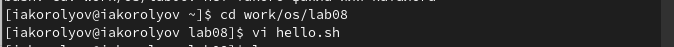
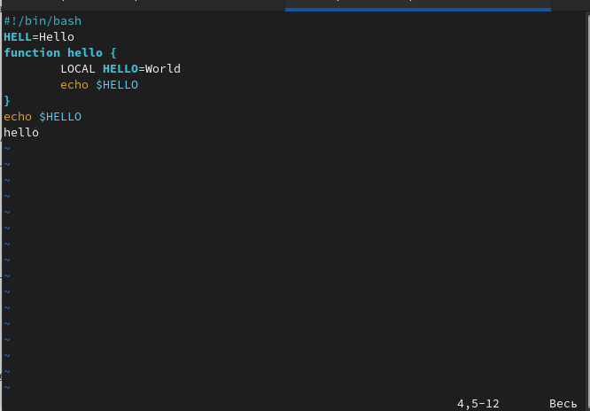
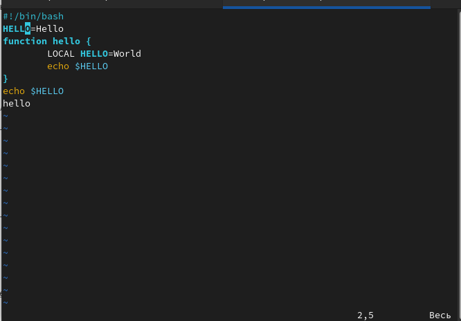
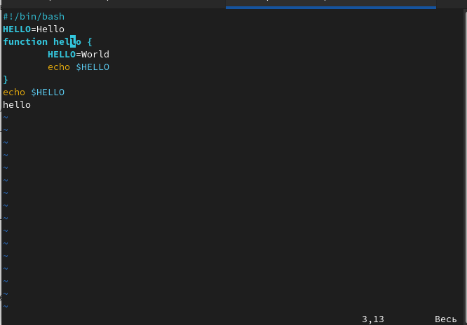
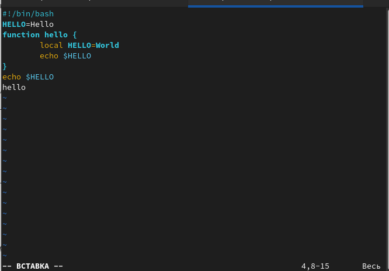
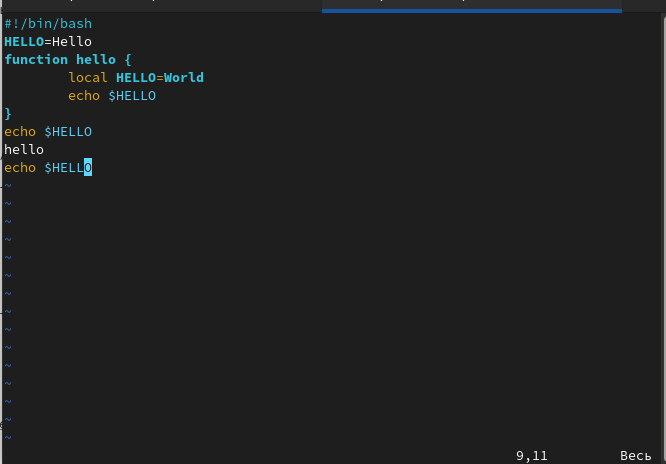
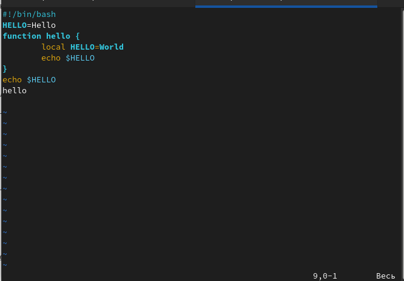
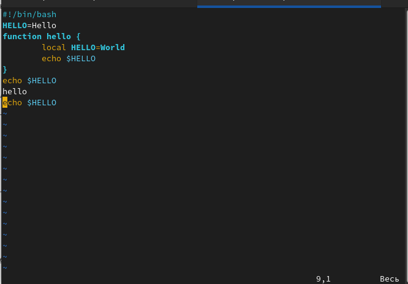

---
## Front matter
title: "Лабораторная работа № 8"
author: "Королёв Иван Андреевич"

## Generic otions
lang: ru-RU
toc-title: "Содержание"

## Bibliography
bibliography: bib/cite.bib
csl: pandoc/csl/gost-r-7-0-5-2008-numeric.csl

## Pdf output format
toc: true # Table of contents
toc-depth: 2
lof: true # List of figures
lot: true # List of tables
fontsize: 12pt
linestretch: 1.5
papersize: a4
documentclass: scrreprt
## I18n polyglossia
polyglossia-lang:
  name: russian
  options:
	- spelling=modern
	- babelshorthands=true
polyglossia-otherlangs:
  name: english
## I18n babel
babel-lang: russian
babel-otherlangs: english
## Fonts
mainfont: PT Serif
romanfont: PT Serif
sansfont: PT Sans
monofont: PT Mono
mainfontoptions: Ligatures=TeX
romanfontoptions: Ligatures=TeX
sansfontoptions: Ligatures=TeX,Scale=MatchLowercase
monofontoptions: Scale=MatchLowercase,Scale=0.9
## Biblatex
biblatex: true
biblio-style: "gost-numeric"
biblatexoptions:
  - parentracker=true
  - backend=biber
  - hyperref=auto
  - language=auto
  - autolang=other*
  - citestyle=gost-numeric
## Pandoc-crossref LaTeX customization
figureTitle: "Рис."
tableTitle: "Таблица"
listingTitle: "Листинг"
lofTitle: "Список иллюстраций"
lotTitle: "Список таблиц"
lolTitle: "Листинги"
## Misc options
indent: true
header-includes:
  - \usepackage{indentfirst}
  - \usepackage{float} # keep figures where there are in the text
  - \floatplacement{figure}{H} # keep figures where there are in the text
---

# Цель работы

Познакомиться с операционной системой Linux. Получить практические навыки работы с редактором vi, установленным по умолчанию практически во всех дистрибутивах.

# Задание

## Задание 1

1. Создайте каталог с именем ~/work/os/lab06. 

2. Перейдите во вновь созданный каталог. 

3. Вызовите vi и создайте файл hello.sh

4. Нажмите клавишу i и вводите следующий текст.

5. Нажмите клавишу Esc для перехода в командный режим после завершения ввода текста. 

6. Нажмите : для перехода в режим последней строки и внизу вашего экрана появится приглашение в виде двоеточия. 

7. Нажмите w (записать) и q (выйти),а затем нажмите клавишу Enter для сохранения вашего текста и завершения работы. 

8. Сделайте файл исполняемым

## Задание 2

1. Вызовите vi на редактирование файла

2. Установите курсор в конец слова HELL второй строки. 

3. Перейдите в режим вставки и замените на HELLO.Нажмите Esc для возврата в команд- ный режим. 

4. Установите курсор на четвертую строку и сотрите слово LOCAL. 

5. Перейдите в режим вставки и наберите следующий текст: local, нажмите Esc для возврата в командный режим. 

6. Установите курсор на последней строке файла.Вставьте после неё строку,содержащую следующий текст: echo $HELLO. 

7. Нажмите Esc для перехода в командный режим. 

8. Удалите последнюю строку. 

9. Введите команду отмены изменений u для отмены последней команды. 

10. Введите символ : для перехода в режим оследней строки.Запишите произведённые изменения и выйдите из vi.

# Теоретическое введение

В большинстве дистрибутивов Linux в качестве текстового редактора по умолчанию устанавливается интерактивный экранный редактор vi (Visual display editor). Редактор vi имееттри режима работы: – командный режим — предназначен для ввода команд редактирования и навигации по редактируемому файлу; – режим вставки — предназначен для ввода содержания редактируемого файла; – режим последней (или командной) строки —используется для записи изменений в файл и выхода из редактора. Для вызова редактора vi необходимо указать команду vi и имя редактируемого файла: vi <имя_файла> При этом в случае отсутствия файла с указанным именем будет создан такой файл. Переход в командный режим осуществляется нажатием клавиши Esc . Для выхода из редактора vi необходимо перейти в режим последней строки: находясь в командном режиме, нажать Shift-; (по сути символ : —двоеточие), затем: – набрать символы wq, если перед выходом из редактора требуется записать изменения в файл; – набрать символ q (или q!), если требуется выйти из редактора без сохранения.
Замечание. Следует помнить,что vi различает прописные и строчные буквы при наборе (восприятии) команд.

# Выполнение лабораторной работы

## Задание 1

### lab08

Создаю каталог с именем ~/work/os/lab08, перехожу в него и вызываю vi hello.sh. (рис. @fig:001).

{#fig:001 width=85%}

### Текст

Нажимаю клавишу i и ввожу текст. Далее нажимаю клавишу Esc для перехода в командный режим. Нажимаю : и прописываю команду wq для записи и завершения работы 
(рис. @fig:002).

{#fig:002 width=70%}

### chmod +x hello.sh

Сделаю файл исполняемым с помощью команды chmod +x hello.sh (рис. @fig:003).

{#fig:003 width=70%}

## Задание 2

### hello.sh

Вызываю vi на редактирование файла. (рис. @fig:004).

{#fig:004 width=70%}

### hello.sh

Установливаю курсор в конец слова HELL второй строки. Перехожу в режим вставки и заменяю на HELLO.Нажмимаю Esc для возврата в командный режим.  (рис. @fig:005).

{#fig:005 width=70%}

### hello.sh

Установливаю курсор на четвертую строку и стриаю слово LOCAL. (рис. @fig:006).

{#fig:006 width=70%}

### hello.sh

Перехожу в режим вставки и ввожу следующий текст: local, нажимаю Esc для возврата в командный режим.  (рис. @fig:007).

{#fig:007 width=70%}

### hello.sh

Устанавливаю курсор на последней строке файла.Вставляю после неё строку,содержащую следующий текст: echo $HELLO.  (рис. @fig:008).

{#fig:008 width=70%}

### hello.sh

Удалите последнюю строку. (рис. @fig:009).

{#fig:009 width=70%}

### hello.sh

Введите команду отмены изменений u для отмены последней команды. Далее ввожу : записыва (w) и завершаю работу (q). (рис. @fig:0010).

{#fig:0010 width=70%}

# Вывод

Я познакомился с операционной системой Linux. Получил практические навыки работы с редактором vi, установленным по умолчанию практически во всех дистрибутивах.

# Контрольные вопросы

1. Редактор vi имееттри режима работы: 
  – командный режим — предназначен для ввода команд редактирования и навигации по редактируемому файлу; 
  – режим вставки — предназначен для ввода содержания редактируемого файла; 
  – режим последней (или командной) строки — используется для записи изменений в файл и выхода из редактора. 
  
2. С помощью :q

3. – 0 (ноль) — переход в начало строки; 
   – $ — переход в конец строки; 
   – G — переход в конец файла; 
   
4. Редактор vi предполагает, что слово - это строка символов, которая может включать в себя буквы, цифры и символы подчеркивания.

5.  0 (ноль) — переход в начало строки; 
    С помощью G — переход в конец файла
    
6. 
- Вставка текста – а — вставить текст после курсора; – А — вставить текст в конец строки; – i — вставить текст перед курсором; – n i — вставить текст n раз; – I — вставить текст в начало строки.
- Вставка строки – о — вставить строку под курсором; – О — вставить строку над курсором.
- Удаление текста – x — удалить один символ в буфер; – d w — удалить одно слово в буфер; – d $ — удалить в буфер текст от курсора до конца строки; – d 0 — удалить в буфер текст от начала строки до позиции курсора; – d d — удалить в буфер одну строку; – n d d — удалить в буфер n строк.
- Отмена и повтор произведённых изменений – u — отменить последнее изменение; – . — повторить последнее изменение.
- Копирование текста в буфер – Y — скопировать строку в буфер; – n Y — скопировать n строк в буфер; – y w — скопировать слово в буфер.
- Вставка текста из буфера – p — вставить текст из буфера после курсора; – P — вставить текст из буфера перед курсором.
- Замена текста – c w — заменить слово; – n c w — заменить n слов; – c $ — заменить текст от курсора до конца строки; – r — заменить слово; – R — заменить текст.
- Поиск текста – / текст — произвести поиск вперёд по тексту указанной строки символов текст; – ? текст — произвести поиск назад по тексту указанной строки символов текст.

7. Перейти в режим вставки.

8. С помощью u — отменить последнее изменение

9. Режим последней строки — используется для записи изменений в файл и выхода из редактора.

10. $ — переход в конец строки

11. Опции редактора vi позволяют настроить рабочую среду. Для задания опций используется команда set (в режиме последней строки): – : set all — вывести полный список опций; – : set nu — вывести номера строк; – : set list — вывести невидимые символы; – : set ic — не учитывать при поиске, является ли символ прописным или строчным.

12. В редакторе vi есть два основных режима: командный режим и режим вставки. По умолчанию работа начинается в командном режиме. В режиме вставки клавиатура используется для набора текста. Для выхода в командный режим используется клавиша Esc или комбинация Ctrl + c .
