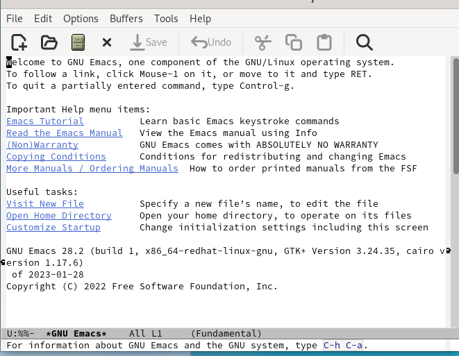
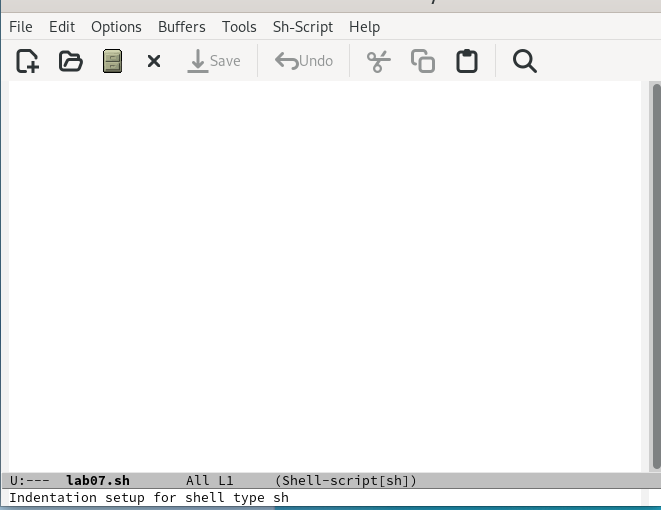
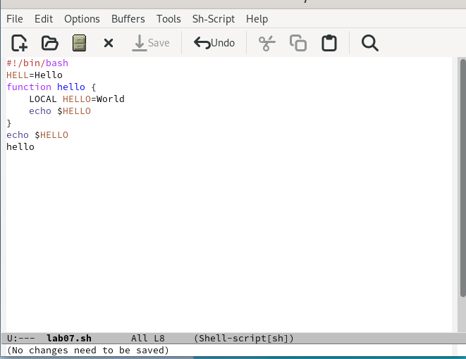
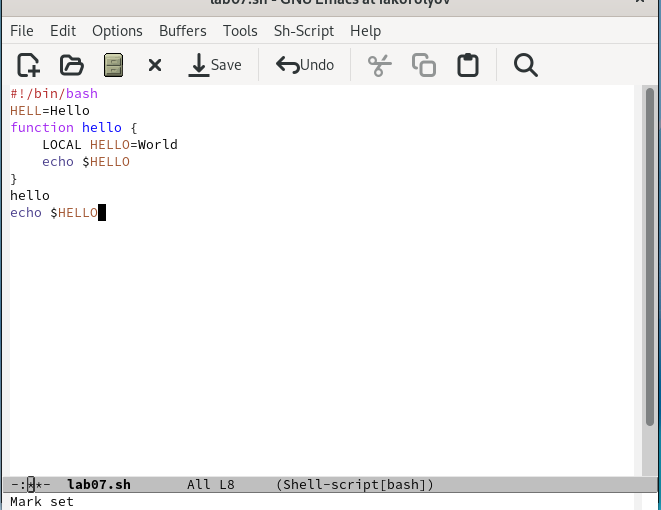
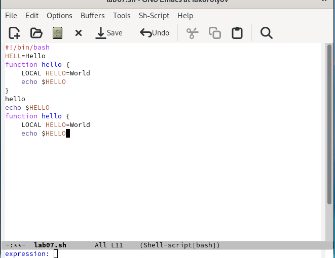
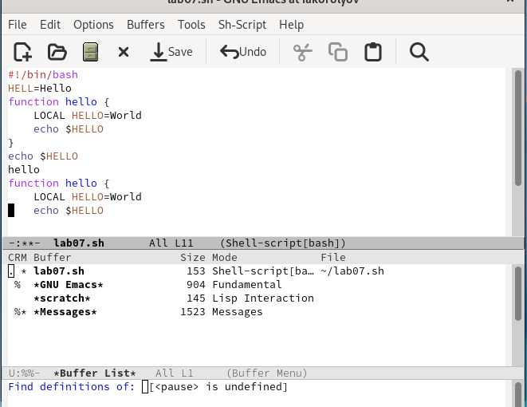
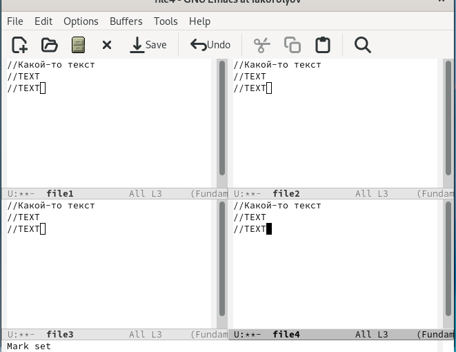
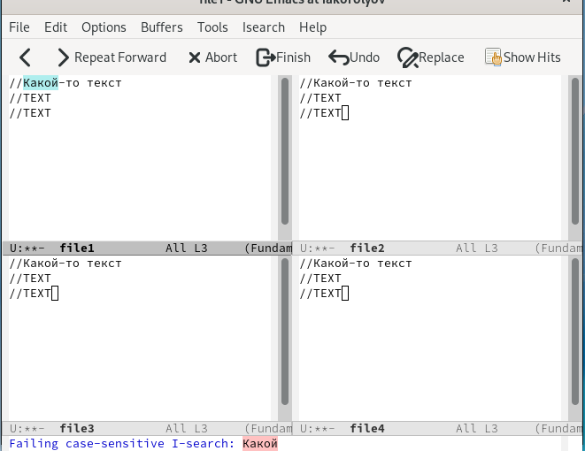

---
## Front matter
lang: ru-RU
title: Презентация по лабораторной работе № 9
author:
  - Королёв И.А.
institute:
  - Российский университет дружбы народов, Москва, Россия
  
## i18n babel
babel-lang: russian
babel-otherlangs: english

## Formatting pdf
toc: false
toc-title: Содержание
slide_level: 2
aspectratio: 169
section-titles: true
theme: metropolis
header-includes:
 - \metroset{progressbar=frametitle,sectionpage=progressbar,numbering=fraction}
 - '\makeatletter'
 - '\beamer@ignorenonframefalse'
 - '\makeatother'
---

# Информация

## Докладчик

:::::::::::::: {.columns align=center}
::: {.column width="70%"}

  * Королёв Иван Андреевич
  * студент, НКАбд-05-22
  * Российский университет дружбы народов

:::
::::::::::::::

# Цель работы

Познакомиться с операционной системой Linux. Получить практические навыки рабо- ты с редактором Emacs.

# Задание

1. Открыть emacs. 
2. Создать файл lab07.sh с помощью комбинации Ctrl-x Ctrl-f (C-x C-f). 
3. Наберите текст
4. Сохранить файл с помощью комбинации Ctrl-x Ctrl-s (C-x C-s). 

# Задание

5. Проделать с текстом стандартные процедуры редактирования, каждое действие долж- но осуществляться комбинацией клавиш. 
  1. Вырезать одной командой целую строку (С-k). 
  2. Вставить эту строку в конец файла (C-y). 
  3. Выделить область текста (C-space). 
  4. Скопировать область в буфер обмена (M-w). 
  5. Вставить область в конец файла. 
  6. Вновь выделить эту область и на этот раз вырезать её (C-w). 
  7. Отмените последнее действие (C-/). 
  
# Задание
  
6. Научитесь использовать команды по перемещению курсора. 
  1. Переместите курсор в начало строки (C-a). 
  2. Переместите курсор в конец строки (C-e). 
  3. Переместите курсор в начало буфера (M-<). 
  4. Переместите курсор в конец буфера (M->). 
  
# Задание
  
7. Управление буферами. 
  1. Вывести список активных буферов на экран (C-x C-b).
  2. Переместитесь во вновь открытое окно (C-x) o со списком открытых буферов и переключитесь на другой буфер. 
  3. Закройте это окно (C-x 0). 
  4. Теперь вновь переключайтесь между буферами, но уже без вывода их списка на экран (C-x b). 

# Задание

8. Управление окнами. 
  1. Поделите фрейм на 4 части: разделите фрейм на два окна по вертикали (C-x 3), а затем каждое из этих окон на две части по горизонтали (C-x 2) (см. рис. 9.1).
  2. В каждом из четырёх созданных окон откройте новый буфер (файл) и введите несколько строк текста. 

# Задание

9. Режим поиска 
  1. Переключитесь в режим поиска (C-s) и найдите несколько слов,присутствующих в тексте. 
  2. Переключайтесь между результатами поиска, нажимая C-s. 
  3. Выйдите из режима поиска, нажав C-g. 
  4. Перейдите в режим поиска и замены (M-%), введите текст, который следует найти и заменить, нажмите Enter , затем введите текстдля замены. После того как будут подсвечены результаты поиска, нажмите ! для подтверждения замены. 
  5. Испробуйте другой режим поиска, нажав M-s o. Объясните, чем он отличается от обычного режима?

# Теоретическое введение

Определение 1. Буфер — объект, представляющий какой-либо текст.
Буфер может содержать что угодно, например, результаты компиляции программы или встроенные подсказки. Практически всё взаимодействие с пользователем, в том числе интерактивное, происходит посредством буферов.
Определение 2. Фрейм соответствует окну в обычном понимании этого слова. Каждый фрейм содержит область вывода и одно или несколько окон Emacs.
Определение 3. Окно — прямоугольная область фрейма, отображающая один из буфе- ров.
Каждое окно имеет свою строку состояния, в которой выводится следующая информа- ция: название буфера,его основной режим,изменялся ли текст буфера и как далеко вниз по буферу расположен курсор. Каждый буфер находится только в одном из возможных основных режимов. Существующие основные режимы включают режим Fundamental (наименее специализированный), режим Text, режим Lisp, режим С, режим Texinfo и другие. Под второстепенными режимами понимается список режимов, которые вклю- чены в данный момент в буфере выбранного окна.
Определение 4. Область вывода — одна или несколько строк внизу фрейма, в которой Emacs выводит различные сообщения, а также запрашивает подтверждения и дополни- тельную информацию от пользователя.
Определение 5. Минибуфер используетсядля вводадополнительной информации и все- гда отображается в области вывода.
Определение 6. Точка вставки — место вставки (удаления) данных в буфере.

# Выполнение лабораторной работы

## Emacs

{#fig:001 width=70%}

## Lab07.sh

{#fig:002 width=70%}

## Lab07.sh

{#fig:003 width=70%}

## Вырезать одной командой целую строку (С-k). 

{#fig:004 width=70%}

## Вставить эту строку в конец файла (C-y).

{#fig:005 width=70%}

## Научитесь использовать команды по перемещению курсора. 

{#fig:0010 width=70%}

## Управление буферами. 

{#fig:0011 width=70%}

## Поделите фрейм на 4 части

{#fig:0014 width=70%}

## Режим поиска

{#fig:0016 width=70%}

# Выводы

Я познакомиться с операционной системой Linux. Получил практические навыки работы с редактором Emacs.

