---
## Front matter
title: "Отчёт по лабораторной работе № 9"
author: "Королёв Иван Андреевич"

## Generic otions
lang: ru-RU
toc-title: "Содержание"

## Bibliography
bibliography: bib/cite.bib
csl: pandoc/csl/gost-r-7-0-5-2008-numeric.csl

## Pdf output format
toc: true # Table of contents
toc-depth: 2
lof: true # List of figures
lot: true # List of tables
fontsize: 12pt
linestretch: 1.5
papersize: a4
documentclass: scrreprt
## I18n polyglossia
polyglossia-lang:
  name: russian
  options:
	- spelling=modern
	- babelshorthands=true
polyglossia-otherlangs:
  name: english
## I18n babel
babel-lang: russian
babel-otherlangs: english
## Fonts
mainfont: PT Serif
romanfont: PT Serif
sansfont: PT Sans
monofont: PT Mono
mainfontoptions: Ligatures=TeX
romanfontoptions: Ligatures=TeX
sansfontoptions: Ligatures=TeX,Scale=MatchLowercase
monofontoptions: Scale=MatchLowercase,Scale=0.9
## Biblatex
biblatex: true
biblio-style: "gost-numeric"
biblatexoptions:
  - parentracker=true
  - backend=biber
  - hyperref=auto
  - language=auto
  - autolang=other*
  - citestyle=gost-numeric
## Pandoc-crossref LaTeX customization
figureTitle: "Рис."
tableTitle: "Таблица"
listingTitle: "Листинг"
lofTitle: "Список иллюстраций"
lotTitle: "Список таблиц"
lolTitle: "Листинги"
## Misc options
indent: true
header-includes:
  - \usepackage{indentfirst}
  - \usepackage{float} # keep figures where there are in the text
  - \floatplacement{figure}{H} # keep figures where there are in the text
---

# Цель работы

Познакомиться с операционной системой Linux. Получить практические навыки рабо- ты с редактором Emacs.

# Задание

1. Открыть emacs. 
2. Создать файл lab07.sh с помощью комбинации Ctrl-x Ctrl-f (C-x C-f). 
3. Наберите текст
4. Сохранить файл с помощью комбинации Ctrl-x Ctrl-s (C-x C-s). 
5. Проделать с текстом стандартные процедуры редактирования, каждое действие долж- но осуществляться комбинацией клавиш. 
  1. Вырезать одной командой целую строку (С-k). 
  2. Вставить эту строку в конец файла (C-y). 
  3. Выделить область текста (C-space). 
  4. Скопировать область в буфер обмена (M-w). 
  5. Вставить область в конец файла. 
  6. Вновь выделить эту область и на этот раз вырезать её (C-w). 
  7. Отмените последнее действие (C-/). 
6. Научитесь использовать команды по перемещению курсора. 
  1. Переместите курсор в начало строки (C-a). 
  2. Переместите курсор в конец строки (C-e). 
  3. Переместите курсор в начало буфера (M-<). 
  4. Переместите курсор в конец буфера (M->). 
7. Управление буферами. 
  1. Вывести список активных буферов на экран (C-x C-b).
  2. Переместитесь во вновь открытое окно (C-x) o со списком открытых буферов и переключитесь на другой буфер. 
  3. Закройте это окно (C-x 0). 
  4. Теперь вновь переключайтесь между буферами, но уже без вывода их списка на экран (C-x b). 
8. Управление окнами. 
  1. Поделите фрейм на 4 части: разделите фрейм на два окна по вертикали (C-x 3), а затем каждое из этих окон на две части по горизонтали (C-x 2) (см. рис. 9.1).
  2. В каждом из четырёх созданных окон откройте новый буфер (файл) и введите несколько строк текста. 
9. Режим поиска 
  1. Переключитесь в режим поиска (C-s) и найдите несколько слов,присутствующих в тексте. 
  2. Переключайтесь между результатами поиска, нажимая C-s. 
  3. Выйдите из режима поиска, нажав C-g. 
  4. Перейдите в режим поиска и замены (M-%), введите текст, который следует найти и заменить, нажмите Enter , затем введите текстдля замены. После того как будут подсвечены результаты поиска, нажмите ! для подтверждения замены. 
  5. Испробуйте другой режим поиска, нажав M-s o. Объясните, чем он отличается от обычного режима?

# Теоретическое введение

Определение 1. Буфер — объект, представляющий какой-либо текст.
Буфер может содержать что угодно, например, результаты компиляции программы или встроенные подсказки. Практически всё взаимодействие с пользователем, в том числе интерактивное, происходит посредством буферов.
Определение 2. Фрейм соответствует окну в обычном понимании этого слова. Каждый фрейм содержит область вывода и одно или несколько окон Emacs.
Определение 3. Окно — прямоугольная область фрейма, отображающая один из буфе- ров.
Каждое окно имеет свою строку состояния, в которой выводится следующая информа- ция: название буфера,его основной режим,изменялся ли текст буфера и как далеко вниз по буферу расположен курсор. Каждый буфер находится только в одном из возможных основных режимов. Существующие основные режимы включают режим Fundamental (наименее специализированный), режим Text, режим Lisp, режим С, режим Texinfo и другие. Под второстепенными режимами понимается список режимов, которые вклю- чены в данный момент в буфере выбранного окна.
Определение 4. Область вывода — одна или несколько строк внизу фрейма, в которой Emacs выводит различные сообщения, а также запрашивает подтверждения и дополни- тельную информацию от пользователя.
Определение 5. Минибуфер используетсядля вводадополнительной информации и все- гда отображается в области вывода.
Определение 6. Точка вставки — место вставки (удаления) данных в буфере.

# Выполнение лабораторной работы

## Emacs

Открыть emacs (рис. @fig:001).

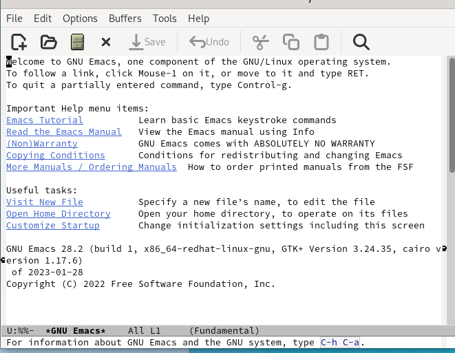{#fig:001 width=70%}

## Lab07.sh

Создать файл lab07.sh с помощью комбинации Ctrl-x Ctrl-f (C-x C-f). (рис. @fig:002).

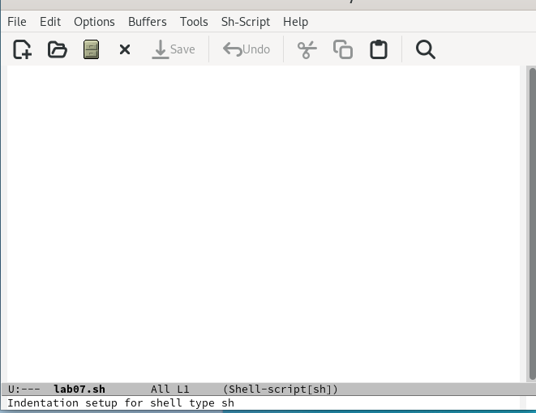{#fig:002 width=70%}

## Lab07.sh

Наберите текст и сохраняю с помощью комбинации Ctrl-x Ctrl-s (C-x C-s). (рис. @fig:003).

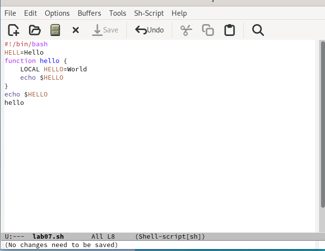{#fig:003 width=70%}

## Проделать с текстом стандартные процедуры редактирования, каждое действие долж- но осуществляться комбинацией клавиш. 

1. Вырезать одной командой целую строку (С-k). (рис. @fig:004).

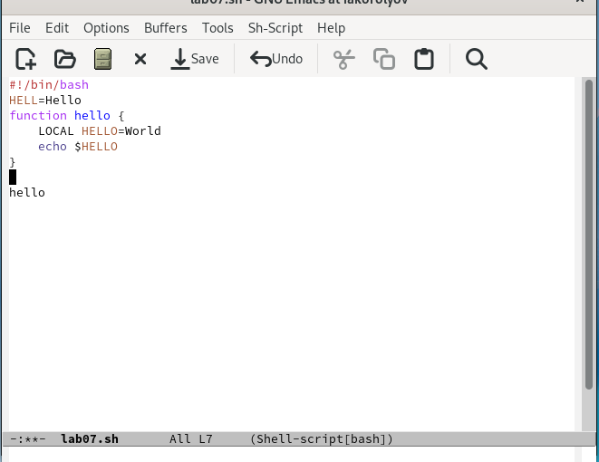{#fig:004 width=70%}

2. Вставить эту строку в конец файла (C-y).(рис. @fig:005).

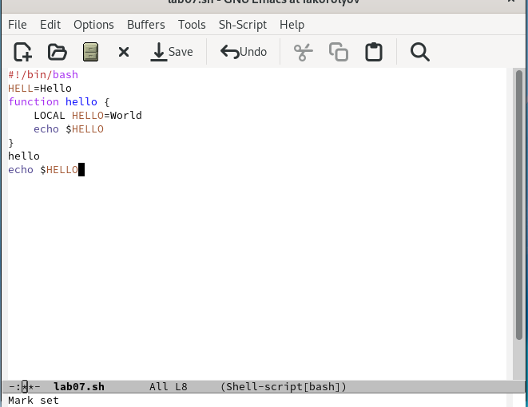{#fig:005 width=70%}

3. Выделить область текста (C-space), скопировать область в буфер обмена (M-w) и вставить область в конец файла.  (рис. @fig:006).

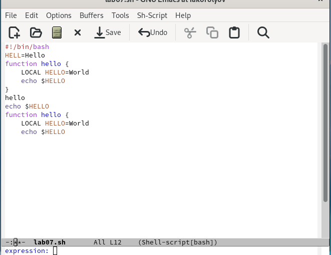{#fig:006 width=70%}

4. Вновь выделить эту область и на этот раз вырезать её (C-w).  (рис. @fig:007).

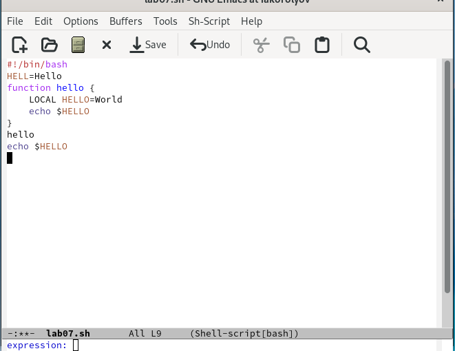{#fig:007 width=70%}

5. Отмените последнее действие (C-/).  (рис. @fig:008).

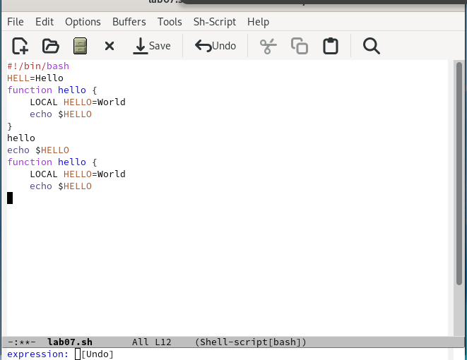{#fig:008 width=70%}

## Научитесь использовать команды по перемещению курсора. 

Переместите курсор в начало строки (C-a), переместите курсор в конец строки (C-e), переместите курсор в начало буфера (M-<), переместите курсор в конец буфера (M->). (рис. @fig:009), (рис. @fig:0010)

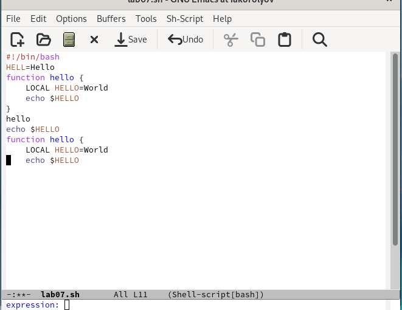{#fig:009 width=70%}

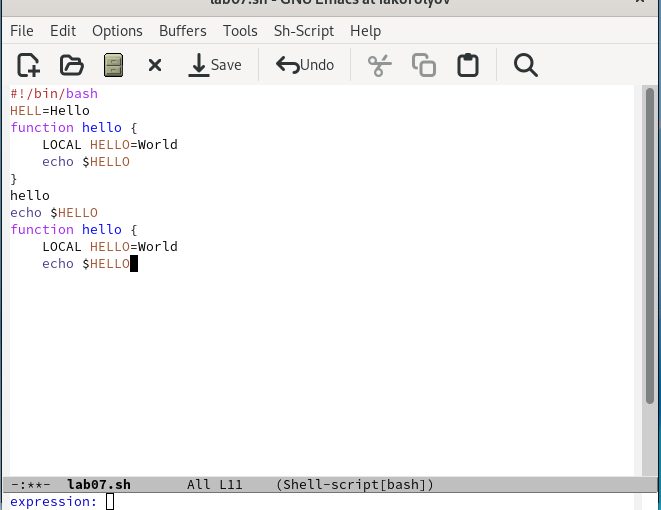{#fig:0010 width=70%}

## Управление буферами. 

1. Вывести список активных буферов на экран (C-x C-b).(рис. @fig:0011).

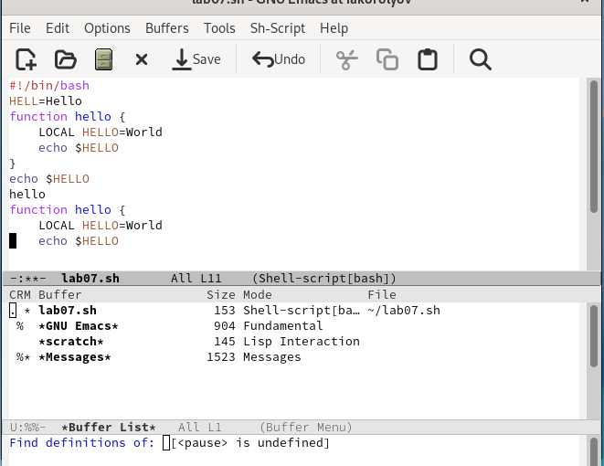{#fig:0011 width=70%}

2. Переместитесь во вновь открытое окно (C-x) o со списком открытых буферов и переключитесь на другой буфер. (рис. @fig:0012).

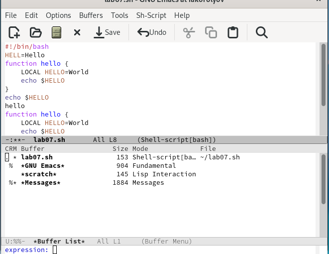{#fig:0012 width=70%}

3. Переместитесь во вновь открытое окно (C-x) o со списком открытых буферов и переключитесь на другой буфер. (рис. @fig:0013).

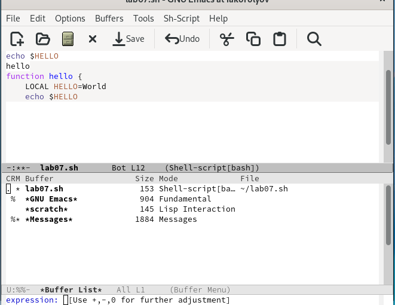{#fig:0013 width=70%}

## Управление окнами. 

1. Поделите фрейм на 4 части: разделите фрейм на два окна по вертикали (C-x 3), а затем каждое из этих окон на две части по горизонтали (C-x 2) (рис. @fig:0014).

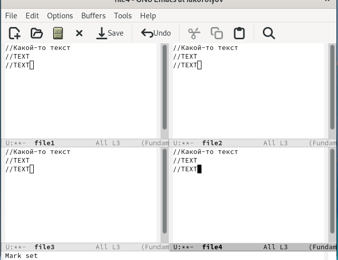{#fig:0014 width=70%}

2. В каждом из четырёх созданных окон откройте новый буфер (файл) и введите несколько строк текста.  (рис. @fig:0015).

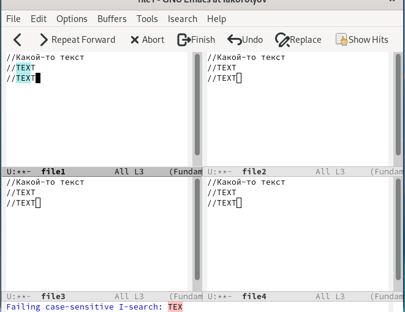{#fig:0015 width=70%}

## Режим поиска

1. Переключитесь в режим поиска (C-s) и найдите несколько слов,присутствующих в тексте. Переключайтесь между результатами поиска, нажимая C-s. Выйдите из режима поиска, нажав C-g.  (рис. @fig:0016).

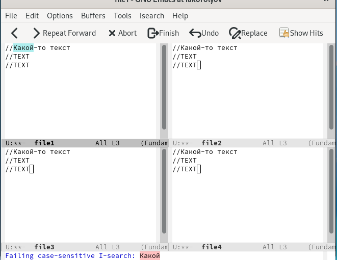{#fig:0016 width=70%}

2. Перейдите в режим поиска и замены (M-%), введите текст, который следует найти и заменить, нажмите Enter , затем введите текстдля замены. После того как будут подсвечены результаты поиска, нажмите ! для подтверждения замены.  (рис. @fig:0017).

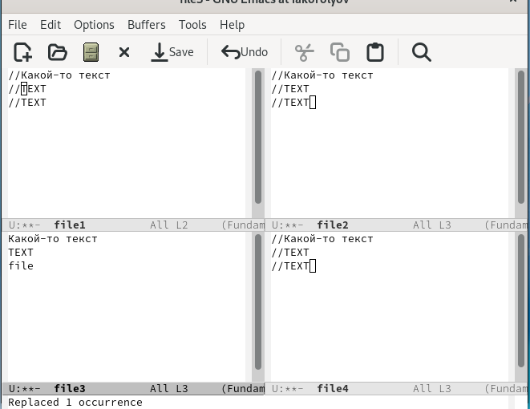{#fig:0017 width=70%}

3. Испробуйте другой режим поиска, нажав M-s o. Объясните, чем он отличается от обычного режима?  (рис. @fig:0018).

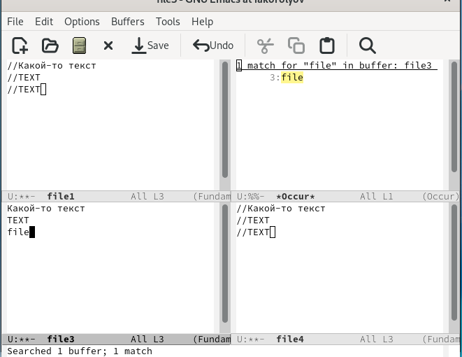{#fig:0018 width=70%}

# Выводы

Я познакомиться с операционной системой Linux. Получил практические навыки работы с редактором Emacs.

# Ответы на контрольные вопросы

1. Emacs — один из наиболее мощных и широко распространённых редакторов, используемых в мире UNIX. Написан на языке высокого уровня Lisp.

2. Большое разнообразие сложных комбинаций клавиш, которые необходимы для редактирования файла и в принципе для работа с Emacs.

3. Буфер - это объект в виде текста. Окно - это прямоугольная область, в которой отображен буфер.

4. Да, можно.

5. Emacs использует буферы с именами, начинающимися с пробела, для внутренних целей. Отчасти он обращается с буферами с такими именами особенным образом -- например, по умолчанию в них не записывается информация для отмены изменений.

6. Ctrl + c, а потом | и Ctrl + c Ctrl + |

7. С помощью команды Ctrl + x 3 (по вертикали) и Ctrl + x 2 (по горизонтали).

8. Настройки emacs хранятся в файле . emacs, который хранится в домашней дирректории пользователя. Кроме этого файла есть ещё папка . emacs.

9. Выполняет фугкцию стереть, думаю можно переназначить.

10. Для меня удобнее был редактор Emacs, так как у него есть командая оболочка. А vi открывается в терминале, и выглядит своеобразно.
