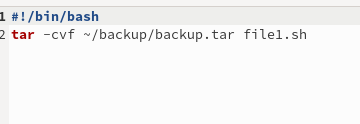
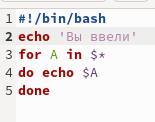
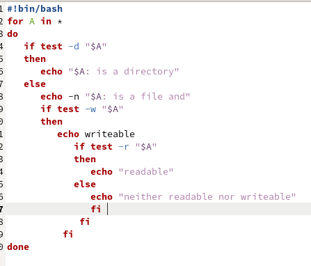
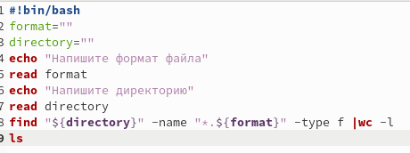

---
## Front matter
lang: ru-RU
title: Презентация по лабораторной работе № 10
author:
  - Королёв Иван Андреевич
institute:
  - Российский университет дружбы народов, Москва, Россия

## i18n babel
babel-lang: russian
babel-otherlangs: english

## Formatting pdf
toc: false
toc-title: Содержание
slide_level: 2
aspectratio: 169
section-titles: true
theme: metropolis
header-includes:
 - \metroset{progressbar=frametitle,sectionpage=progressbar,numbering=fraction}
 - '\makeatletter'
 - '\beamer@ignorenonframefalse'
 - '\makeatother'
---

# Информация

## Докладчик

:::::::::::::: {.columns align=center}
::: {.column width="70%"}

  * Королёв Иван Андреевич
  * студент, учебная группа НКАбд - 05 - 22
  * Российский университет дружбы народов

:::
::::::::::::::

# Цель работы

Изучить основы программирования в оболочке ОС UNIX/Linux. Научиться писать небольшие командные файлы.

# Задание

1. Написать скрипт, который при запуске будет делать резервную копию самого себя (то есть файла, в котором содержится его исходный код) в другую директорию backup в вашем домашнем каталоге. При этом файл должен архивироваться одним из ар- хиваторов на выбор zip, bzip2 или tar. Способ использования команд архивации необходимо узнать, изучив справку. 

2. Написать пример командного файла, обрабатывающего любое произвольное число аргументов командной строки, в том числе превышающее десять. Например, скрипт может последовательно распечатывать значения всех переданных аргументов. 

3. Написать командный файл — аналог команды ls (без использования самой этой ко- манды и команды dir). Требуется,чтобы он выдавал информацию о нужном каталоге и выводил информацию о возможностях доступа к файлам этого каталога. 

4. Написатькомандный файл,которыйполучаетв качестве аргумента команднойстроки формат файла (.txt, .doc, .jpg, .pdf и т.д.) и вычисляет количество таких файлов в указанной директории. Путь к директории также передаётся в виде аргумента командной строки.

# Теоретическое введение

Командный процессор (командная оболочка, интерпретатор команд shell) — это программа, позволяющая пользователю взаимодействовать с операционной системой компьютера. В операционных системах типа UNIX/Linux наиболее часто используются следующие реализации командных оболочек: – оболочка Борна (Bourne shell или sh) — стандартная командная оболочка UNIX/Linux, содержащая базовый, но при этом полный набор функций; – С-оболочка (или csh) — надстройка на оболочкой Борна, использующая С-подобный синтаксис команд с возможностью сохранения истории выполнения команд; – оболочка Корна (или ksh)—напоминает оболочку С,но операторы управления програм- мой совместимы с операторами оболочки Борна; – BASH — сокращение от Bourne Again Shell (опять оболочка Борна), в основе своей сов- мещает свойства оболочек С и Корна (разработка компании Free Software Foundation). POSIX (Portable Operating System Interface for Computer Environments) — набор стандартов описания интерфейсов взаимодействия операционной системы и прикладных программ. Стандарты POSIX разработаны комитетом IEEE (Institute of Electrical and Electronics Engineers) для обеспечения совместимости различных UNIX/Linux-подобных опера- ционных систем и переносимости прикладных программ на уровне исходного кода. POSIX-совместимые оболочки разработаны на базе оболочки Корна. Рассмотрим основные элементы программирования в оболочке bash. В других оболоч- ках большинство команд будет совпадать с описанными ниже.

# Выполнение лабораторной работы

## Написать скрипт, который при запуске будет делать резервную копию самого себя 

{#fig:005 width=70%}

## Написать пример командного файла, обрабатывающего любое произвольное число аргументов командной строки

{#fig:007 width=70%}

## Написать командный файл — аналог команды ls

{#fig:008 width=70%}

## Написать командный файл,который вычисляет количество файлов 

{#fig:0011 width=70%}

# Выводы

Изучил основы программирования в оболочке ОС UNIX/Linux. Научился писать небольшие командные файлы.

