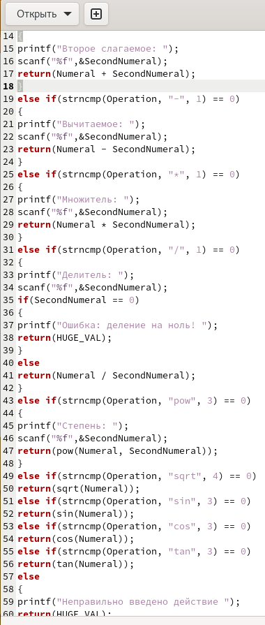
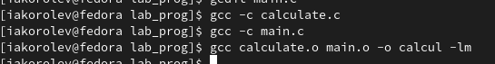
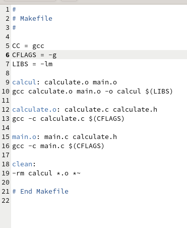
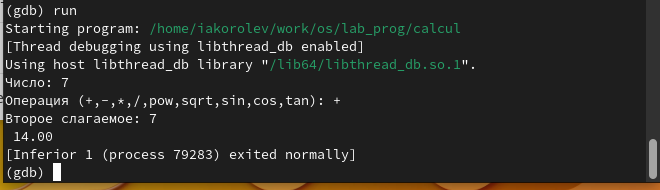
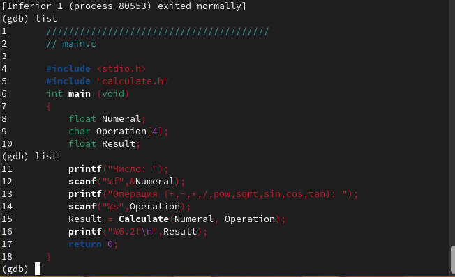
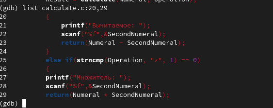
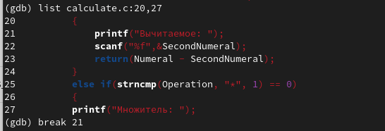
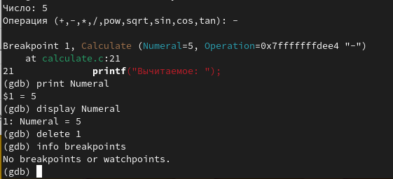
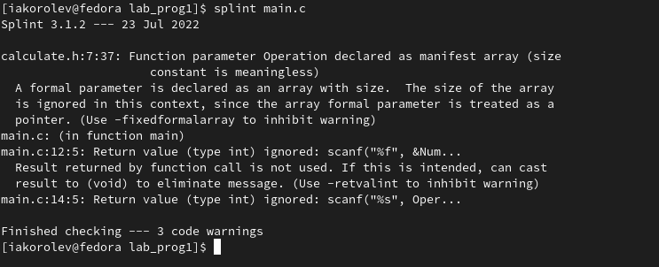

---
## Front matter
lang: ru-RU
title: Презентация по лабораторной работе № 13
author:
  - Королёв И.А
institute:
  - Российский университет дружбы народов, Москва, Россия

## i18n babel
babel-lang: russian
babel-otherlangs: english

## Formatting pdf
toc: false
toc-title: Содержание
slide_level: 2
aspectratio: 169
section-titles: true
theme: metropolis
header-includes:
 - \metroset{progressbar=frametitle,sectionpage=progressbar,numbering=fraction}
 - '\makeatletter'
 - '\beamer@ignorenonframefalse'
 - '\makeatother'
---

# Информация

## Докладчик

:::::::::::::: {.columns align=center}
::: {.column width="70%"}

  * Королёв Иван Андреевич
  * студент, НКАбд - 05 - 22
  * Российский университет дружбы народов

:::
::::::::::::::

# Цель работы

Приобрести простейшие навыки разработки, анализа, тестирования и отладки приложений в ОС типа UNIX/Linux на примере создания на языке программирования
С калькулятора с простейшими функциями.

# Задание

В домашнем каталоге создайте подкаталог ~/work/os/lab_prog.
Создайте в нём файлы: calculate.h, calculate.c, main.c.
Это будет примитивнейший калькулятор, способный складывать, вычитать, умножать
и делить, возводить число в степень, брать квадратный корень, вычислять sin, cos, tan.
При запуске он будет запрашивать первое число, операцию, второе число. После этого
программа выведет результат и остановится.

# Теоретическое введение

Процесс разработки программного обеспечения обычно разделяется на следующие этапы:

- планирование, включающее сбор и анализ требований к функционалу и другим характеристикам разрабатываемого приложения;

- проектирование, включающее в себя разработку базовых алгоритмов и спецификаций, определение языка программирования;

- непосредственная разработка приложения:

- кодирование — по сути создание исходного текста программы (возможно в нескольких вариантах);

- анализ разработанного кода;

- сборка, компиляция и разработка исполняемого модуля;

- тестирование и отладка, сохранение произведённых изменений;

- документирование.

Для создания исходного текста программы разработчик может воспользоваться любым удобным для него редактором текста: vi, vim, mceditor, emacs, geany и др. После завершения написания исходного кода программы (возможно состоящей из нескольких файлов), необходимо её скомпилировать и получить исполняемый модуль.

# Выполнение лабораторной работы

## Подготовка файлов для создания примитивного калькулятора

{#fig:001 width=70%}

## Выполните компиляцию

{#fig:004 width=70%}

## Создайте Makefile 

{#fig:005 width=70%}

## Для запуска программы внутри отладчика введите команду run (рис. @fig:007).

{#fig:007 width=70%}

## Для постраничного (по 9 строк) просмотра исходного код используйте команду list (рис. @fig:008).

{#fig:008 width=70%}

## Для просмотра определённых строк не основного файла используйте list с параметрами (рис. @fig:0010).

{#fig:0010 width=70%}

## Установите точку остановки в файле calculate.c на строке номер 21 (рис. @fig:0011).

{#fig:0011 width=70%}

## Запустите программу внутри отладчика и убедитесь, что программа остановится в момент прохождения точки остановки.

{#fig:0013 width=70%}

## С помощью утилиты splint анализирую кода файла main.c (рис. @fig:0015).

{#fig:0015 width=70%}
 
# Выводы

Приобрел простейшие навыки разработки, анализа, тестирования и отладки приложений в ОС типа UNIX/Linux на примере создания на языке программирования С калькулятора с простейшими функциями.

