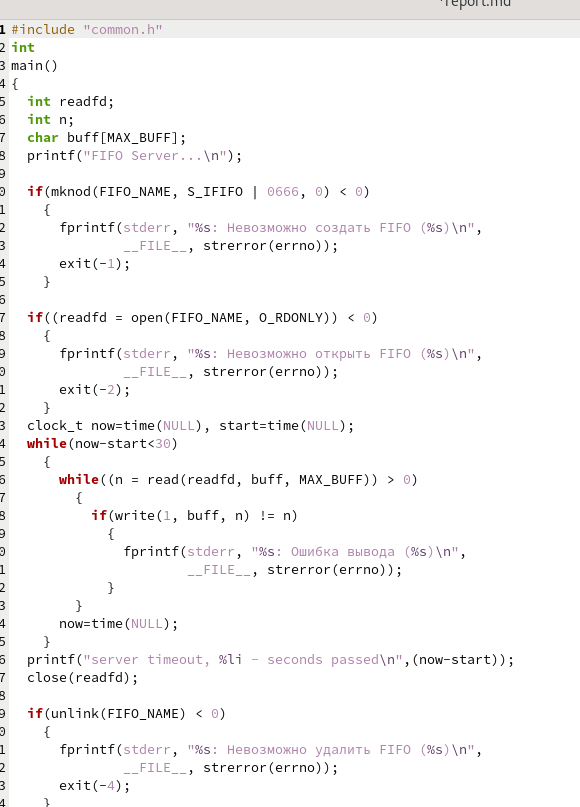
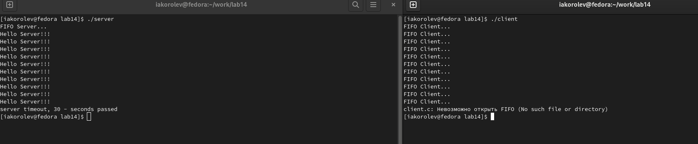

---
## Front matter
lang: ru-RU
title: Презентация по лабораторной работе № 14
author:
  - Королёв И.А.
institute:
  - Российский университет дружбы народов, Москва, Россия
## i18n babel
babel-lang: russian
babel-otherlangs: english

## Formatting pdf
toc: false
toc-title: Содержание
slide_level: 2
aspectratio: 169
section-titles: true
theme: metropolis
header-includes:
 - \metroset{progressbar=frametitle,sectionpage=progressbar,numbering=fraction}
 - '\makeatletter'
 - '\beamer@ignorenonframefalse'
 - '\makeatother'
---

# Информация

## Докладчик

:::::::::::::: {.columns align=center}
::: {.column width="70%"}

  * Королёв Иван Андреевич
  * студент, НКАбд - 05 - 22
  * Российский университет дружбы народов
  
:::
::::::::::::::

# Цель работы

Приобретение практических навыков работы с именованными каналами

# Задание

Изучите приведённые в тексте программы server.c и client.c. Взяв данные примеры за образец, напишите аналогичные программы, внеся следующие изменения:

1. Работает не 1 клиент, а несколько (например, два).

2. Клиенты передают текущее время с некоторой периодичностью (например, раз в пятьсекунд). Используйте функцию sleep() для приостановки работы клиента.

3. Сервер работает не бесконечно, а прекращает работу через некоторое время (например, 30 сек). Используйте функцию clock() для определения времени работы сервера.
Что будет в случае, если сервер завершит работу, не закрыв канал?

# Теоретическое введение

Одним из видов взаимодействия между процессами в операционных системах является обмен сообщениями. Под сообщением понимается последовательность байтов,
передаваемая от одного процесса другому.
В операционных системах типа UNIX есть 3 вида межпроцессорных взаимодействий:
общеюниксные (именованные каналы, сигналы), System V Interface Definition (SVID —
разделяемая память, очередь сообщений, семафоры) и BSD (сокеты).
Для передачи данных между неродственными процессами можно использовать механизм именованных каналов (named pipes). Данные передаются по принципу FIFO (First
In First Out) (первым записан — первым прочитан), поэтому они называются также FIFO
pipes или просто FIFO. Именованные каналы отличаются от неименованных наличием
идентификатора канала, который представлен как специальный файл (соответственно
имя именованного канала — это имя файла). Поскольку файл находится на локальной
файловой системе, данное IPC используется внутри одной системы.
Файлы именованных каналов создаются функцией mkfifo(3).

# Выполнение лабораторной работы

## Файл client.c. Создали файл. Сделали, чтобы работал не один клиент, а 2 клиента. Клиенты передают время с переодичностью в 3 секунды. 

{#fig:001 width=70%}

## Файл server.c. Создал файл. Сделал, чтобы сервер работал не бесконечно. Прекращает свою работу через 30 секунд. 

{#fig:002 width=70%}

## Файл common.h. Создал файл. 

{#fig:003 width=70%}

## Файл Makefile 

{#fig:004 width=70%}

## Именованный канал

{#fig:005 width=70%}

# Выводы

Приобрел практические навыки работы с именованными каналами

