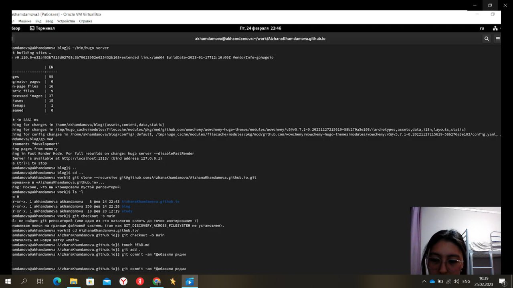
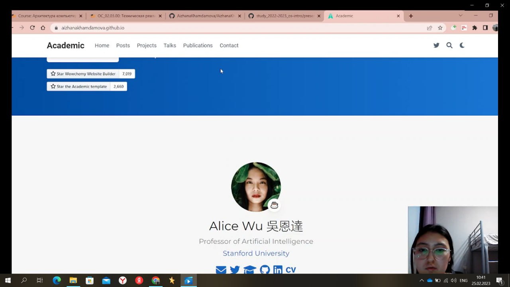

---
## Front matter
lang: ru-RU
title: Первый этап выполнения Проекта
author:
  - Хамдамова А.А.
institute:
  - Российский университет дружбы народов, Москва, Россия

## i18n babel
babel-lang: russian
babel-otherlangs: english

## Formatting pdf
toc: false
toc-title: Содержание
slide_level: 2
aspectratio: 169
section-titles: true
theme: metropolis
header-includes:
 - \metroset{progressbar=frametitle,sectionpage=progressbar,numbering=fraction}
 - '\makeatletter'
 - '\beamer@ignorenonframefalse'
 - '\makeatother'
---

## Докладчик

:::::::::::::: {.columns align=center}
::: {.column width="70%"}

 * Хамдамова Айжана 
 * студент группы НКАбд-05-22
 * направление "Фундаментальная информатика и информационные технологии" 
 * Российский университет дружбы народов
 * [1032225989@pfur.ru](mailto:1032225989@pfur.ru)

:::
::: {.column width="30%"}

:::
::::::::::::::

# Цели и задачи

- Создать собственный сайт
- Клонировать 2 репозитория
- Запуск и работа с hugo

# Содержание исследования

- Предлагаемое решение задач исследования с обоснованием
- Основные этапы работы

## Результаты
- Удалось проделать первый этап по заданному примеру

# Основные этапы работы 
- Скачиваем файл hugo_extended_Linux_64bit.tar.gz 
- Разархивируем данный файл
- Создание папки bin
- Создаем новый репозиторий
- Клонируем его
- Запускаем сервер
- Коммитнем наш репозиторий и нашу папку, создадим файл

# Пример 

# Итоговое значение 
Должен появиться наш сайт, который мы видели ранее

:::

