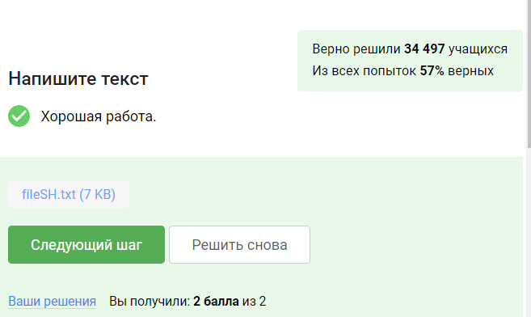

---
## Front matter
title: "Отчёт по внешним курсам. Первая глава. "
author: "Королёв Иван Андреевич"

## Generic otions
lang: ru-RU
toc-title: "Содержание"

## Bibliography
bibliography: bib/cite.bib
csl: pandoc/csl/gost-r-7-0-5-2008-numeric.csl

## Pdf output format
toc: true # Table of contents
toc-depth: 2
lof: true # List of figures
lot: true # List of tables
fontsize: 12pt
linestretch: 1.5
papersize: a4
documentclass: scrreprt
## I18n polyglossia
polyglossia-lang:
  name: russian
  options:
	- spelling=modern
	- babelshorthands=true
polyglossia-otherlangs:
  name: english
## I18n babel
babel-lang: russian
babel-otherlangs: english
## Fonts
mainfont: PT Serif
romanfont: PT Serif
sansfont: PT Sans
monofont: PT Mono
mainfontoptions: Ligatures=TeX
romanfontoptions: Ligatures=TeX
sansfontoptions: Ligatures=TeX,Scale=MatchLowercase
monofontoptions: Scale=MatchLowercase,Scale=0.9
## Biblatex
biblatex: true
biblio-style: "gost-numeric"
biblatexoptions:
  - parentracker=true
  - backend=biber
  - hyperref=auto
  - language=auto
  - autolang=other*
  - citestyle=gost-numeric
## Pandoc-crossref LaTeX customization
figureTitle: "Рис."
tableTitle: "Таблица"
listingTitle: "Листинг"
lofTitle: "Список иллюстраций"
lotTitle: "Список таблиц"
lolTitle: "Листинги"
## Misc options
indent: true
header-includes:
  - \usepackage{indentfirst}
  - \usepackage{float} # keep figures where there are in the text
  - \floatplacement{figure}{H} # keep figures where there are in the text
---

# Цель работы

Введение в систему Linux, работа в терминале, установка Linux, запуск исполняемых файлов с помощью терминала, ввод и вывод, работа с архивами. Необходимо изучить основные вещи Linux.

# Задания

1. как называется этот курс?

2. Какую операционную систему вы обычно используете?

3. Что такое виртуальная машина?

4. Смогли ли вы запустить на своем компьютере Linux?

5. Создать документ и написать строку.

6. Какое расширение имеют установочные пакеты в Linux (Ubuntu)?

7. Поставьте себе в систему плеер VLC (любым способом: через Software Center или скачиванием установочного пакета с сайта VLC).Запустите, откройте Help → About (или Shift+F1) и напишите ниже первую фамилию (без имени!) из вкладки Authors. Обратите внимание, что в англоязычных текстах обычно имя стоит на первом месте (first name), а фамилия на втором (last name).

8. Для чего можно использовать приложение Update Manager?

9. Выберите все синонимы для “командной строки”.

10. Какая команда напечатает в какой директории мы сейчас находимся?

11. Укажите, какие из следующих команд полностью эквивалентны команде ls -A --human-readable -l /some/directory

12. Предположим, что вы находитесь в директории /home/bi/Documents, причем /home/bi — ваша домашняя директория. Какая(ие) команда выведет содержимое /home/bi/Downloads, при этом не показывая содержимое других директорий?

13. Какая команда используется для удаления директорий?

14. Что произойдет, если ввести в терминал команду firefox (для запуска одноименного браузера), а затем ввести туда же команду exit?

15. Чему эквивалентен запуск программы с &?

16. Скачайте файл с программой, сделайте его исполняемым, запустите и скопируйте то, что он выведет на экран, в форму ниже.

17. Куда по умолчанию выводится поток ошибок из программы, запущенной в терминале?

18. Какие (какая) из команд создадут файл file.txt и запишут в него поток ошибок программы program? Считайте, что в момент запуска программы файл file.txt не существует.

19. Куда деваются сообщения об ошибках (т.е. вывод в stderr) от тех программ, которые объединены в конвейер (pipe)?

20. В каком файле на диске окажется картинка, если для её скачивания были выполнены следующие команды?

21. Какую опцию нужно указать команде wget, чтобы она не выводила никаких сообщений на экран (Resolving.., Connecting to.. и т.д.)?

22. Пусть на некоторой web-странице есть ссылки на картинки в форматах png и jpg, а также ссылки на другие страницы сайта (обычные html файлы). Какие файлы будут скачаны на компьютер, если запустить wget -r -l 1 -A jpg и передать в качестве аргумента ссылку на эту web-страницу?

23. Чем отличаются архиваторы gzip и zip?

24. Какие из перечисленных программ-архиваторов могут создать архив из директории с файлами?

25. Какой набор опций нужно указать программе tar, чтобы запаковать файлы в my_archive.tar.bz2?

26. Какая маска команды find НЕ найдет файл Alexey.jpeg?

27. Предположим, что в файле  text.txt записаны строки, показанные среди вариантов ответа. Отметьте только те из них, которые выведет на экран команда  grep "world" text.txt.

28. Cкачайте архив с произведениями Шекспира. Вам нужно сгенерировать файл, в котором будут все строчки из этих произведений, содержащие “love”, и загрузить этот файл в форму.

# 1. Введение

## Общая информация о курсе

1. Вопрос: как называется этот курс? Чтобы ответить, выберите правильный ответ нажмите на зелёную кнопку ниже. (рис. @fig:001).

{#fig:001 width=70%}

2. Выбрать все верные утверждения по прохождению внешнего курса. (рис. @fig:002).

{#fig:002 width=70%}

## Как установить Linux

1. Какую операционную систему вы обычно используете? (рис. @fig:003).

{#fig:003 width=70%}

2. Что такое виртуальная машина? Выберите наиболее подходящий ответ! Исходя из курса я знаю, что такое виртуальная машина (рис. @fig:004).

{#fig:004 width=70%}

3. Смогли ли вы запустить на своем компьютере Linux? Простой вопрос. (рис. @fig:005).

{#fig:005 width=70%}

## Осваиваем Linux

1. Создайте документ в OpenOffice/LibreOffice Writer (аналог Microsoft Word) и напишите в нём шрифтом FreeMono (если такого шрифта у вас нет, то используйте Arial или Times New Roman) одну-единственную строчку: Hello, Linux! Cоздал и отправил файл. (рис. @fig:006).

{#fig:006 width=70%}

2. Какое расширение имеют установочные пакеты в Linux (Ubuntu)? Зашёл в fedora и посмотрел, какое расширение имеют установочные файлы. (рис. @fig:007).

{#fig:007 width=70%}

3. Поставьте себе в систему плеер VLC (любым способом: через Software Center или скачиванием установочного пакета с сайта VLC).Запустите, откройте Help → About (или Shift+F1) и напишите ниже первую фамилию (без имени!) из вкладки Authors. Запустил и посмотрел фамилию. (рис. @fig:008).

{#fig:008 width=70%}

4. Для чего можно использовать приложение Update Manager? Ответ: в видео курса рассказывали для чего можно использовать. (рис. @fig:009).

{#fig:009 width=70%}

## Terminal: основы

1. Выберите все синонимы для “командной строки”. Ответ: синонимами к командной строке являются терминал, консоль. (рис. @fig:0010).

{#fig:0010 width=70%}

2. Какая команда напечатает в какой директории мы сейчас находимся? Ответ: pwd, выбрал данный ответ исходя из знаний нашего университетского курса. (рис. @fig:0011).

{#fig:0011 width=70%}

3. Укажите, какие из следующих команд полностью эквивалентны команде ls -A --human-readable -l /some/directory. Ответ: ls --almost-all --human-readable -l /some/directory - здесь все точно так же, как в исходной команде, только -А написан полностью. ls --human-readable -A  -l /some/directory - здесь все точно так же, только -А написан не в начале. Где писать опцию не зависит в команде, можно как в начале, так и в конце. (рис. @fig:0012).

{#fig:0012 width=70%}

4. Предположим, что вы находитесь в директории /home/bi/Documents, причем /home/bi — ваша домашняя директория. Какая(ие) команда выведет содержимое /home/bi/Downloads, при этом не показывая содержимое других директорий? Ответ: ответ выбрал вводя команды в терминал и проверял, что выводит каждая команда. (рис. @fig:0013).

{#fig:0013 width=70%}

5. Какая команда используется для удаления директорий? Ответ: Команду удаления мы изучали на курсе "операционные системы". (рис. @fig:0014).

{#fig:0014 width=70%}

## Запуск исполняемых файлов

1. Что произойдет, если ввести в терминал команду firefox (для запуска одноименного браузера), а затем ввести туда же команду exit? Ответ: никто не закроется, потому что после ввода команды firefox в терминале он будет исполнятся и он не будет воспринимать другие команды. (рис. @fig:0015).

{#fig:0015 width=70%}

2. Чему эквивалентен запуск программы с &? Ответ: Запуск, Ctrl+Z, bg. (рис. @fig:0016).

{#fig:0016 width=70%}

3. Скачайте файл с программой, сделайте его исполняемым, запустите и скопируйте то, что он выведет на экран, в форму ниже. Ответ: сказал, сделал файл исполняемым c помощью chmod +x и запустил в формате ./файл... (рис. @fig:0017).

{#fig:0017 width=70%}

## Ввод / вывод

1. Куда по умолчанию выводится поток ошибок из программы, запущенной в терминале? Ответ: Выводится на экран, проверено с помощью терминала. (рис. @fig:0018).

{#fig:0018 width=70%}

2. Какие (какая) из команд создадут файл file.txt и запишут в него поток ошибок программы program? Считайте, что в момент запуска программы файл file.txt не существует. Ответ: выбрал данные ответы исходя из изученного перенаправления ввода и вывода и использования внешнего курса. (рис. @fig:0019).

{#fig:0019 width=70%}

3. Куда деваются сообщения об ошибках (т.е. вывод в stderr) от тех программ, которые объединены в конвейер (pipe)? (рис. @fig:0020).

{#fig:0020 width=70%}

## Скачивание файлов из интернета

1. В каком файле на диске окажется картинка, если для её скачивания были выполнены следующие команды?

cd /home/alex/
wget -P /home/alex/Pictures -O 1.jpg http://example.com/example.jpg

(рис. @fig:0021).

{#fig:0021 width=70%}

2. Какую опцию нужно указать команде wget, чтобы она не выводила никаких сообщений на экран (Resolving.., Connecting to.. и т.д.)? (рис. @fig:0022).

{#fig:0022 width=70%}

3. Пусть на некоторой web-странице есть ссылки на картинки в форматах png и jpg, а также ссылки на другие страницы сайта (обычные html файлы). Какие файлы будут скачаны на компьютер, если запустить wget -r -l 1 -A jpg и передать в качестве аргумента ссылку на эту web-страницу? Выберите наиболее полный ответ! (рис. @fig:0023).

{#fig:0023 width=70%}

## Работа с архивами

1. Чем отличаются архиваторы gzip и zip? (рис. @fig:0024).

{#fig:0024 width=70%}

2. Какие из перечисленных программ-архиваторов могут создать архив из директории с файлами? (рис. @fig:0025).

{#fig:0025 width=70%}

3. Какой набор опций нужно указать программе tar, чтобы запаковать файлы в my_archive.tar.bz2? (рис. @fig:0026).

{#fig:0026 width=70%}

## Поиск файлов и слов в файлах

1. Какая маска команды find НЕ найдет файл Alexey.jpeg? (рис. @fig:0027).

{#fig:0027 width=70%}

2. Предположим, что в файле  text.txt записаны строки, показанные среди вариантов ответа. Отметьте только те из них, которые выведет на экран команда  grep "world" text.txt. (рис. @fig:0028).

{#fig:0028 width=70%}

3. Cкачайте архив с произведениями Шекспира. Вам нужно сгенерировать файл, в котором будут все строчки из этих произведений, содержащие “love”, и загрузить этот файл в форму. (рис. @fig:0029).

{#fig:0029 width=70%}

# Вывод 

Изу

