---
## Front matter
title: "Внешние курсы. 2. Работа на сервере"
author: "Королёв Иван Андреевич"

## Generic otions
lang: ru-RU
toc-title: "Содержание"

## Bibliography
bibliography: bib/cite.bib
csl: pandoc/csl/gost-r-7-0-5-2008-numeric.csl

## Pdf output format
toc: true # Table of contents
toc-depth: 2
lof: true # List of figures
lot: true # List of tables
fontsize: 12pt
linestretch: 1.5
papersize: a4
documentclass: scrreprt
## I18n polyglossia
polyglossia-lang:
  name: russian
  options:
	- spelling=modern
	- babelshorthands=true
polyglossia-otherlangs:
  name: english
## I18n babel
babel-lang: russian
babel-otherlangs: english
## Fonts
mainfont: PT Serif
romanfont: PT Serif
sansfont: PT Sans
monofont: PT Mono
mainfontoptions: Ligatures=TeX
romanfontoptions: Ligatures=TeX
sansfontoptions: Ligatures=TeX,Scale=MatchLowercase
monofontoptions: Scale=MatchLowercase,Scale=0.9
## Biblatex
biblatex: true
biblio-style: "gost-numeric"
biblatexoptions:
  - parentracker=true
  - backend=biber
  - hyperref=auto
  - language=auto
  - autolang=other*
  - citestyle=gost-numeric
## Pandoc-crossref LaTeX customization
figureTitle: "Рис."
tableTitle: "Таблица"
listingTitle: "Листинг"
lofTitle: "Список иллюстраций"
lotTitle: "Список таблиц"
lolTitle: "Листинги"
## Misc options
indent: true
header-includes:
  - \usepackage{indentfirst}
  - \usepackage{float} # keep figures where there are in the text
  - \floatplacement{figure}{H} # keep figures where there are in the text
---

# Цель работы

Научиться работать с сервером, обмениваться файлами, запускать программы на сервере, контроллировать запущенные программы, использование многопоточных приложений. Закрепить знания tmux.

# Задание

1. Для каких задач можно использовать удаленный сервер?

2. Предположим программа ssh-keygen создала вам два ключа: id_rsa и id_rsa.pub. Какой из этих ключей можно без опаски пересылать по интернету?

3. Для начала выполнения нажмите кнопку "Open Terminal". Открывшийся в браузере терминал будем называть "локальный". Зайдите с этого терминала по SSH на удаленный сервер server1.stepik-local. Для доступа к серверу используйте логин box и пароль supersecret, а порт указывать не нужно -- используется порт по умолчанию. Прочитайте содержимое файла /srv/files_on_server/secret на удалённом сервере и запишите его в локальный файл /home/box/secret (т.е. вам нужно будет выйти с сервера!).

4. Какая команда скопирует на сервер (в домашнюю директорию) папку stepic вместе с содержимым ее самой и всех ее подпапок?

5. Предположим, что вы устанавливаете программу program на свой компьютер при помощи команды sudo apt-get install program. Терминал сообщает вам, что он не может найти и скачать установочный пакет. Какие действия могут устранить проблему?

6. Для чего можно использовать программу Filezilla?

7. Для начала выполнения нажмите кнопку "Open Terminal". Открывшийся в браузере терминал будем называть "локальный". Скопируйте при помощи SCP с удаленного сервера server1.stepik-local все файлы из директории /srv/files_on_server/ в локальную директорию /home/box/files_on_client/ (её нужно будет еще создать!). Для доступа к серверу используйте логин box и пароль supersecret, а порт указывать не нужно -- используется порт по умолчанию.

8. Что можно сделать, если требуется запустить на сервере программу, для работы которой нужен не терминал, а экран?

9. Как обычно можно вызвать справочную информацию о программе program?

10. Посмотрите справку по программе FastQC (имеется ввиду вариант для запуска в терминале) и определите, какие форматы данных он может принимать на вход.

11. Посмотрите справку по программе (имеется в виду версия для терминала) и впишите в поле ниже команду, которая запускает в терминале Clustal на файле test.fasta и выполняет множественное выравнивание (multiple alignment). Никакие лишние опции указывать не нужно (только необходимые для выполнения этого задания)!

12. Информация о каких программах будет показана при выполнении команды jobs?

13. jobs, top и ps позволяют отслеживать работу запущенных в терминале программ. В каждой из этих трех утилит для каждой запущенной программы указывается число-идентификатор. Одинаковые ли эти идентификаторы в  jobs, top и ps?

14. С помощью какой команды можно мгновенно завершить остановленный процесс?

15. Что произойдет, если использовать kill (без опций) по отношению к процессу, который был приостановлен при помощи Ctrl+Z?

16. Сколько вычислительных ресурсов центрального процессора (% CPU) использует остановленное (по Ctrl+Z) многопоточное приложение?

17. Сколько памяти занимает остановленное (по Ctrl+Z) многопоточное приложение?

18. Как принудительно завершить один из потоков запущенного многопоточного приложения?

19. Для выполнения этого задания вам потребуется программа bowtie2. 

20. Попробуйте теперь запустить второй этап (запуск подпрограммы bowtie2) в несколько потоков. Рекомендуем выставить число потоков равное количеству ядер на вашем компьютере (команда nproc). Сравните скорость выполнения в таком режиме с работой в один поток. Также рекомендуем убедиться, что результаты запусков (т.е. вывод в stderr) полностью совпали в обоих режимах!

21. Вы открыли две вкладки в терминале. В одной из них вы запустили процесс и приостановили его. Переключившись во вторую вкладку и набрав fg, вы добьетесь следующего:

22. Предположим, что в tmux осталась последняя открытая вкладка. Что произойдет, если вы введете в этой вкладке в командную строку команду exit?

23. Предположим, что вы открыли терминал, зашли в нем на сервер, запустили на этом сервере tmux и начали работу в нем. Что произойдет, если вы теперь закроете терминал?

24. Что произойдет, если запустить процесс в фоновом режиме в одной из вкладок tmux, а затем принудительно закрыть эту вкладку (Ctrl+B, X)?

25. Задание на самостоятельное изучение tmux. 

26. Предлагаем вам самостоятельное изучить работу с "вкладками внутри вкладок" и отметить верные утверждения из списка ниже. Вы можете использовать справку по tmux (например, man tmux) или просто попробовать воспроизвести эти утверждениях у себя на компьютере.

# Теоретическое введение

* Linux – абсолютно бесплатная операционная система (за исключением некоторых платных дистрибутивов), в отличие от Windows;

* В Linux практически отсутствуют вирусы;

* Все кто говорит, что «Программы, которые я использую в Windows не устанавливаются на Linux», Вы задумайтесь, а зачем они должны устанавливаться!!! Ведь это совсем другая ОС, там свои программы! Также можно сказать и про Windows, что «программы которые работают в Linux не устанавливаются в Windows», для Linux существуют много своих программ не уступающим Windows-ким, также многие производители программного обеспечения выпускают свои продукты как для Windows, так и для Linux.

* Linux более производительней, тем более серверный вариант операционной системы. Объясняю, серверные операционные системы Linux без интерфейсные, а большую часть ресурсов (больше половины!!!) как раз занимает интерфейс ОС, т.е. визуальная оболочка (на сегодняшний день получили широкое распространение и версии Windows без графического интерфейса).

* ОС Linux практически не зависает, (я имею в виду саму операционную систему). Например, все встречались с ситуацией, когда в Windows у Вас все замирает, Вы не можете не пошевелить мышкой, даже ctrl+alt+del нажать не можете, и Вам приходиться перезагружаться. Linux устроена таким образом что такая ситуация исключена, разве что в одном случае когда Вы сами вызываете такую ситуацию.

* Касаемо серверной ОС Linux она достаточно проста в конфигурирование, в отличие от аналогов Windows, в которых очень много всяких разным прибомбасов, в которых не так легко разобраться. Сама система Linux и все ее службы настраиваются путем редактирования конфигурационных файлов. Это обычные текстовые файлы, зная их расположение и формат, Вы сможете настроить любой дистрибутив, даже если у Вас под рукой нет никаких инструментов, кроме текстового редактора.

# Работа на сервере

## Знакомство с сервером

1. Для каких задач можно использовать удаленный сервер? **Пояснения: ответ на данный вопрос узнал исходя из курса, после просмотра видео.** (рис. @fig:001)

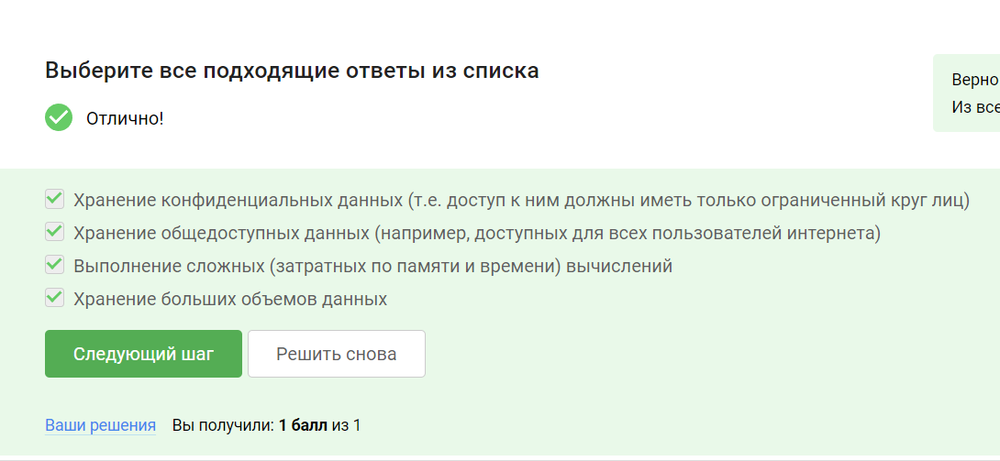{#fig:001 width=70%}

2. Предположим программа ssh-keygen создала вам два ключа: id_rsa и id_rsa.pub. Какой из этих ключей можно без опаски пересылать по интернету? **Пояснения: пересылать можно тот, который имеет .pub, потому что именно он является публичным и его можно отправлять его.** (рис. @fig:002)

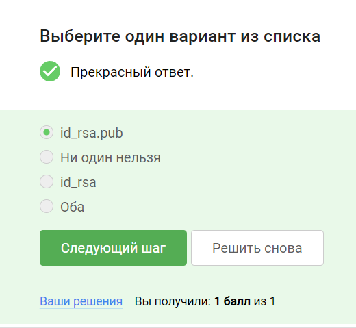{#fig:002 width=70%}

## Обмен файлами

1. Какая команда скопирует на сервер (в домашнюю директорию) папку stepic вместе с содержимым ее самой и всех ее подпапок? **Пояснения: мы знали команду cp. Эта команда похожа на неё, только выглядит scp для копирования файлов с сервера и у неё есть опции.** (рис. @fig:003)

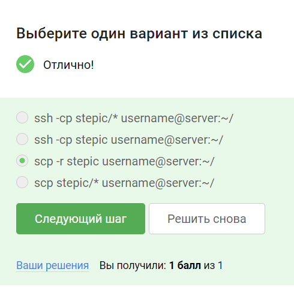{#fig:003 width=70%}

2. Предположим, что вы устанавливаете программу program на свой компьютер при помощи команды sudo apt-get install program. Терминал сообщает вам, что он не может найти и скачать установочный пакет. Какие действия могут устранить проблему? **Пояснения: ответ на данный вопрос узнал исходя из курса, после просмотра видео.** (рис. @fig:004)

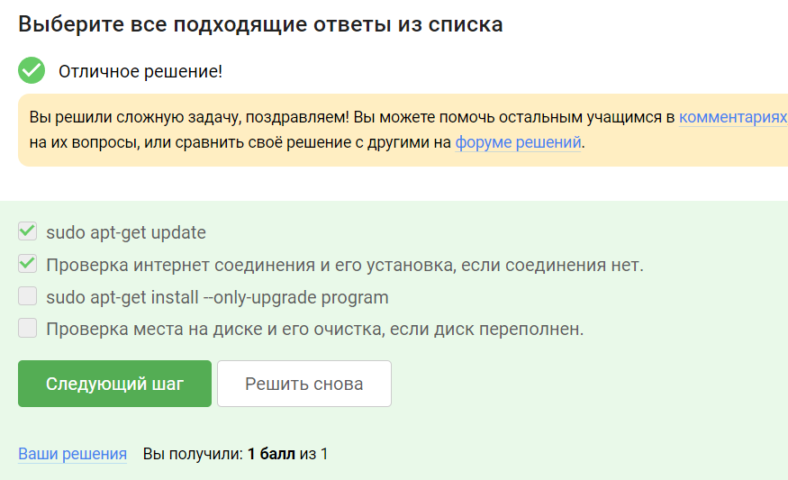{#fig:004 width=70%}

3. Для чего можно использовать программу Filezilla? **Пояснения: ответ на данный вопрос узнал исходя из курса, после просмотра видео.** (рис. @fig:005)

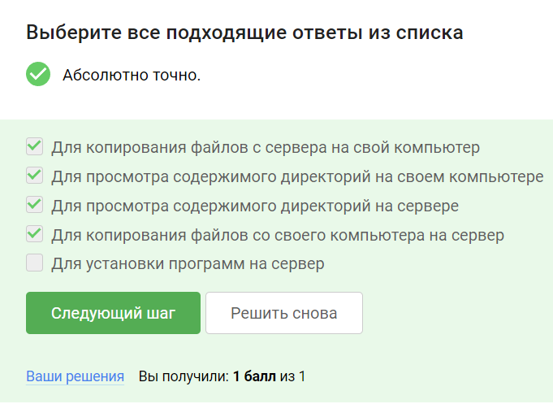{#fig:005 width=70%}

4. Для начала выполнения нажмите кнопку "Open Terminal". Открывшийся в браузере терминал будем называть "локальный". Скопируйте при помощи SCP с удаленного сервера server1.stepik-local все файлы из директории /srv/files_on_server/ в локальную директорию /home/box/files_on_client/ (её нужно будет еще создать!). Для доступа к серверу используйте логин box и пароль supersecret, а порт указывать не нужно -- используется порт по умолчанию. **Пояснения: выполнение в терминале** 
(рис. @fig:006)

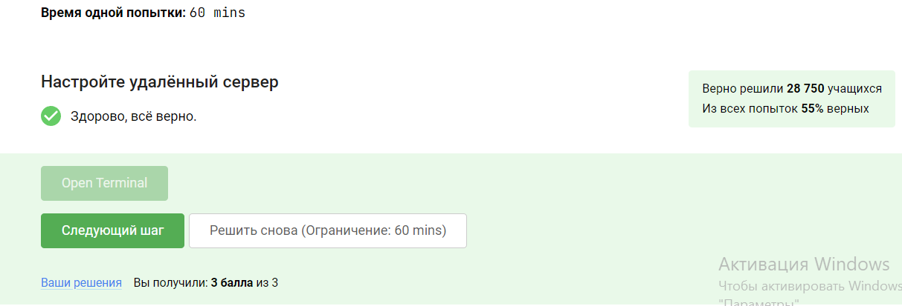{#fig:006 width=70%}

## Запуск приложений

1. Что можно сделать, если требуется запустить на сервере программу, для работы которой нужен не терминал, а экран? **Пояснения: проверить, есть ли версия для терминала. или настроить сервер так, чтобы он поддерживал вывод информации на экран. ответ на данный вопрос узнал исходя из курса, после просмотра видео.** (рис. @fig:007)

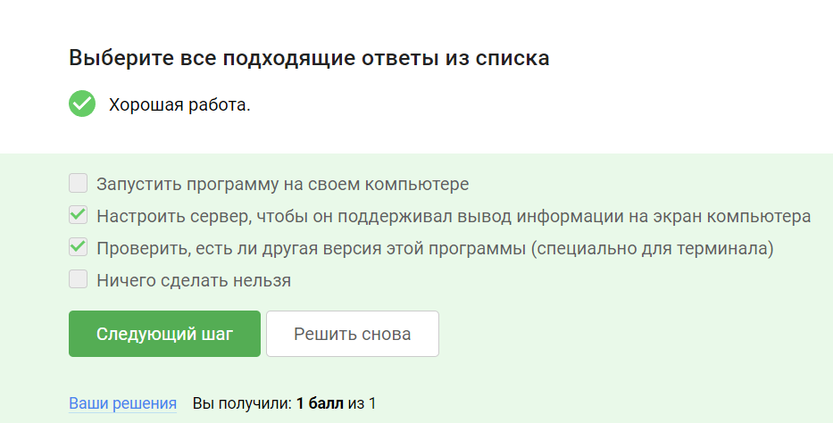{#fig:007 width=70%}

2. Как обычно можно вызвать справочную информацию о программе program? **Пояснения: с помощью man. знаю ответ на вопрос исходя из университетского курса.** (рис. @fig:008)

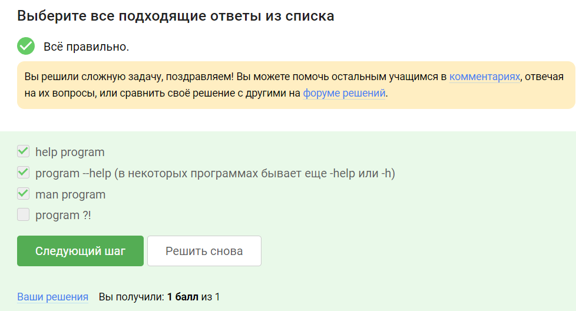{#fig:008 width=70%}

3. Посмотрите справку по программе FastQC (имеется ввиду вариант для запуска в терминале) и определите, какие форматы данных он может принимать на вход. **Пояснения:посмотрел справку** (рис. @fig:009)

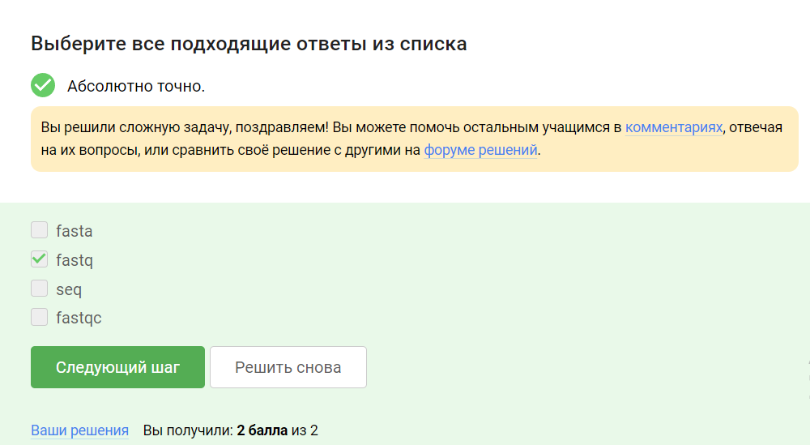{#fig:009 width=70%}

4. Посмотрите справку по программе (имеется в виду версия для терминала) и впишите в поле ниже команду, которая запускает в терминале Clustal на файле test.fasta и выполняет множественное выравнивание (multiple alignment). Никакие лишние опции указывать не нужно (только необходимые для выполнения этого задания)!  **Пояснения: посмотрел справку** (рис. @fig:0010)

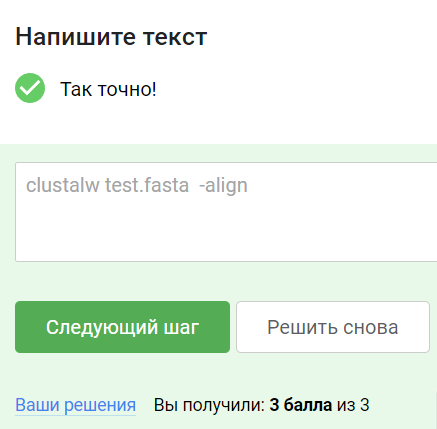{#fig:0010 width=70%}

## Контроль запускаемых программ

1. Информация о каких программах будет показана при выполнении команды jobs?  **Пояснения:знаю ответ на вопрос исходя из университетского курса.** (рис. @fig:0011)

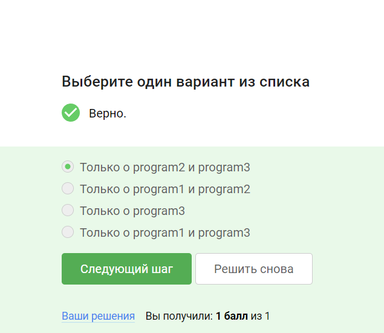{#fig:0011 width=70%}

2. jobs, top и ps позволяют отслеживать работу запущенных в терминале программ. В каждой из этих трех утилит для каждой запущенной программы указывается число-идентификатор. Одинаковые ли эти идентификаторы в  jobs, top и ps? 
**Пояснения:знаю ответ на вопрос исходя из университетского курса.** (рис. @fig:0012)

{#fig:0012 width=70%}

3. С помощью какой команды можно мгновенно завершить остановленный процесс? **Пояснения: знаю ответ на вопрос исходя из университетского курса.** (рис. @fig:0013)

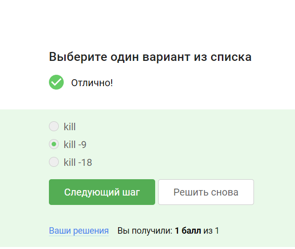{#fig:0013 width=70%}

4. Что произойдет, если использовать kill (без опций) по отношению к процессу, который был приостановлен при помощи Ctrl+Z? **Пояснения: знаю ответ на вопрос исходя из университетского курса.** (рис. @fig:0014)

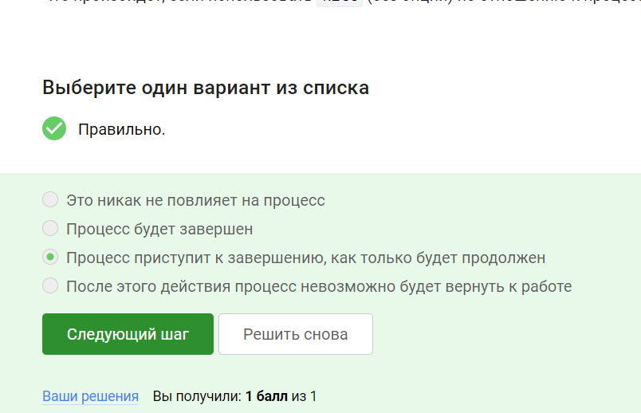{#fig:0014 width=70%}

## Многопоточные приложения

1. Сколько вычислительных ресурсов центрального процессора (% CPU) использует остановленное (по Ctrl+Z) многопоточное приложение? **Пояснения:ответ на данный вопрос узнал исходя из курса, после просмотра видео.** (рис. @fig:0015)

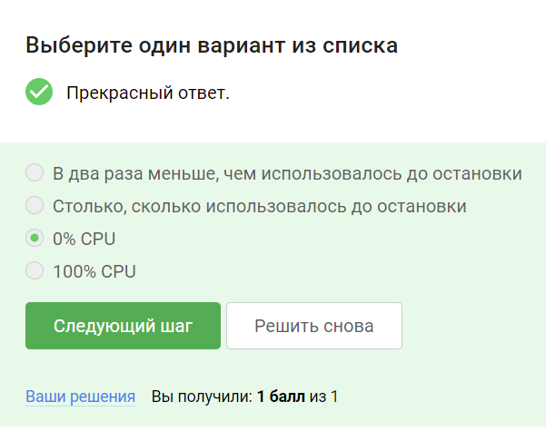{#fig:0015 width=70%}

2. Сколько памяти занимает остановленное (по Ctrl+Z) многопоточное приложение?	**Пояснения:ответ на данный вопрос узнал исходя из курса, после просмотра видео.** (рис. @fig:0016)

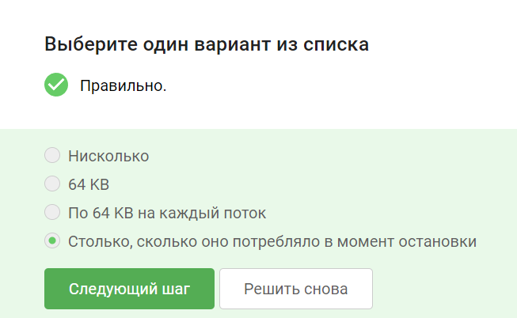{#fig:0016 width=70%}

3. Как принудительно завершить один из потоков запущенного многопоточного приложения? **Пояснения:ответ на данный вопрос узнал исходя из курса, после просмотра видео.** (рис. @fig:0017)

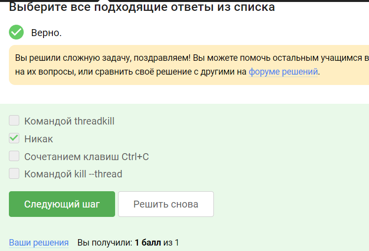{#fig:0017 width=70%}

4. Для выполнения этого задания вам потребуется программа bowtie2. **Пояснения:ответ на данный вопрос узнал исходя из курса, после просмотра видео.** (рис. @fig:0018)

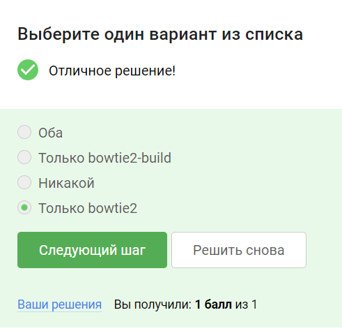{#fig:0018 width=70%}

5. Скачайте файлы, необходимые для запуска bowtie2: референсный геном (reference) и риды (reads). Запустите программу bowtie2 на этих данных (напоминаем, что запуск состоит из двух этапов!). Вывод stderr второго этапа (т.е. запуск подпрограммы bowtie2) запишите в файл (см. занятие про перенаправление ввода/вывода) и загрузите его в форму ниже. Мы также рекомендуем вам перенаправлять вывод stdout в файлы на обоих этапах, чтобы он не засорял экран вашего терминала. **Пояснения: ответ на данный вопрос узнал исходя из курса, после просмотра видео.** (рис. @fig:0019)

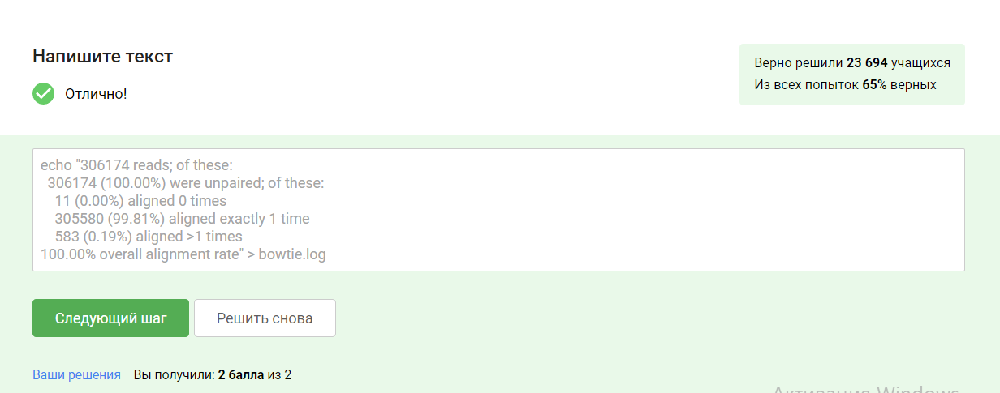{#fig:0019 width=70%}

## Менеджер терминалов tmux

1. Вы открыли две вкладки в терминале. В одной из них вы запустили процесс и приостановили его. Переключившись во вторую вкладку и набрав fg, вы добьетесь следующего:
**Пояснения:знаю ответ на вопрос исходя из университетского курса.** (рис. @fig:0020)

{#fig:0020 width=70%}

2. Предположим, что в tmux осталась последняя открытая вкладка. Что произойдет, если вы введете в этой вкладке в командную строку команду exit? **Пояснения:знаю ответ на вопрос исходя из университетского курса.** (рис. @fig:0021)

{#fig:0021 width=70%}

3. Предположим, что вы открыли терминал, зашли в нем на сервер, запустили на этом сервере tmux и начали работу в нем. Что произойдет, если вы теперь закроете терминал?  **Пояснения:знаю ответ на вопрос исходя из университетского курса.** (рис. @fig:0022)

{#fig:0022 width=70%}

4. Что произойдет, если запустить процесс в фоновом режиме в одной из вкладок tmux, а затем принудительно закрыть эту вкладку (Ctrl+B, X)? **Пояснения:знаю ответ на вопрос исходя из университетского курса.** (рис. @fig:0023)

{#fig:0023 width=70%}

5. Задание на самостоятельное изучение tmux. **Пояснения:знаю ответ на вопрос исходя из университетского курса.** (рис. @fig:0024)

{#fig:0024 width=70%}

6. Кроме создания нескольких вкладок, tmux умеет еще и разделять (split) одну вкладку на несколько, например, горизонтальной чертой на верхнюю и нижнюю или вертикальной чертой на левую и правую. Разделение может быть полезно, например, чтобы запустить процесс в верхней половине вкладки, а продолжить работу в нижней и одновременно следить за тем, что происходит с процессом. Для "горизонтального" разделения используется (Ctrl+B и "), а для "вертикального" -- (Ctrl+B и %). **Пояснения:знаю ответ на вопрос исходя из университетского курса.** (рис. @fig:0025)

{#fig:0025 width=70%}

# Выводы

Научился работать с сервером, заходить на него, обмениваться файлами, запускать приложения, узнавать информацию о сервере. Закрепил умения пользоваться tmux.

