---
## Front matter
title: "Внешние курсы. 3. Продвинутые темы"
author: "Королёв Иван Андреевич"

## Generic otions
lang: ru-RU
toc-title: "Содержание"

## Bibliography
bibliography: bib/cite.bib
csl: pandoc/csl/gost-r-7-0-5-2008-numeric.csl

## Pdf output format
toc: true # Table of contents
toc-depth: 2
lof: true # List of figures
lot: true # List of tables
fontsize: 12pt
linestretch: 1.5
papersize: a4
documentclass: scrreprt
## I18n polyglossia
polyglossia-lang:
  name: russian
  options:
	- spelling=modern
	- babelshorthands=true
polyglossia-otherlangs:
  name: english
## I18n babel
babel-lang: russian
babel-otherlangs: english
## Fonts
mainfont: PT Serif
romanfont: PT Serif
sansfont: PT Sans
monofont: PT Mono
mainfontoptions: Ligatures=TeX
romanfontoptions: Ligatures=TeX
sansfontoptions: Ligatures=TeX,Scale=MatchLowercase
monofontoptions: Scale=MatchLowercase,Scale=0.9
## Biblatex
biblatex: true
biblio-style: "gost-numeric"
biblatexoptions:
  - parentracker=true
  - backend=biber
  - hyperref=auto
  - language=auto
  - autolang=other*
  - citestyle=gost-numeric
## Pandoc-crossref LaTeX customization
figureTitle: "Рис."
tableTitle: "Таблица"
listingTitle: "Листинг"
lofTitle: "Список иллюстраций"
lotTitle: "Список таблиц"
lolTitle: "Листинги"
## Misc options
indent: true
header-includes:
  - \usepackage{indentfirst}
  - \usepackage{float} # keep figures where there are in the text
  - \floatplacement{figure}{H} # keep figures where there are in the text
---

# Цель работы

Научиться писать скрипты на bash, используя переменные, циклы, условия и создавая функции. Улучшить умения использования поиска в командной строке. Научиться строить графики в gnuplot. Закрепить знания и умения использования vim и изменения прав доступа.

# Задание

1. Какую клавишу(и) нужно нажать на клавиатуре, чтобы выйти из редактора vim? Считайте, что вы только что открыли файл и вам сразу понадобилось выйти из редактора.

2. А для того, чтобы убедиться, что вы разобрались, отметьте ниже все верные утверждения про следующую строку: Strange_  TEXT  is_here. 2=2 YES!

3. Какие(ой) из предложенных ниже наборов нажатий клавиш выполнят такое редактирование? В этих наборах нажатие на клавишу Esc обозначается как <Esc> (т.е. знаки "<" и ">" не несут отдельного смысла).

4. Какую команду нужно ввести для этого в vim? Укажите необходимую команду целиком (т.е. включая ввод ":" в самом начале), однако нажатие на Enter после ввода команды обозначать никак не нужно

5. Чтобы убедиться, что вы разобрались с этим режимом работы, отметьте, пожалуйста, все верные утверждения из списка ниже.

6. Предположим, что вы открыли терминал и у вас в нем запущена оболочка bash. Вы набираете в ней команды А1, А2, А3, а затем запускаете оболочку sh. В этой оболочке вы набираете команды B1, В2, В3 и запускаете оболочку bash. И, наконец, в этой последней оболочке вы набираете команды С1, С2, С3. Если теперь вы попробуете при помощи стрелочек вверх/вниз перемещаться по истории набранных команд, то команды из какого набора(ов) будут появляться?

7. Как будет выглядеть абсолютный путь до созданного файла file1.txt по окончанию работы скрипта?

8. Какие из представленных ниже строк могут быть именами переменных в bash? Выберите все подходящие варианты!

9. Напишите скрипт на bash, который принимает на вход два аргумента и выводит на экран строку следующего вида: "Arguments are: $1=первый_аргумент $2=второй_аргумент"

10. Вы можете вписать вместо "..." (внутри [[ ]] и не забудьте про пробелы после [[ и перед ]]!) любое из перечисленных ниже условий. Однако мы просим вас выбрать только те из них, при которых echo напечатает на экран True вне зависимости от того, с какими параметрами был запущен ваш скрипт и какие в нем есть переменные.

11. Какие строки и в какой последовательности он выведет на экран, если сначала этот скрипт запустили задав переменную var=3, а затем запустили еще раз, но уже с var=5.

12. Напишите скрипт на bash, который принимает на вход один аргумент (целое число от 0 до бесконечности), который будет обозначать число студентов в аудитории. В зависимости от значения числа нужно вывести разные сообщения. 

13. Если запустить этот скрипт, то сколько раз на экран будет выведено слово "start", а сколько раз слово "finish"?

14. Напишите скрипт на bash, который будет определять в какую возрастную группу попадают пользователи. При запуске скрипт должен вывести сообщение "enter your name:" и ждать от пользователя ввода имени (используйте read, чтобы прочитать его). Когда имя введено, то скрипт должен написать "enter your age:" и ждать ввода возраста (опять нужен read). Когда возраст введен, скрипт пишет на экран "<Имя>, your group is <группа>", где <группа> определяется на основе возраста

15. Какие(ая) из предложенных ниже инструкций увеличат значение переменной а на значение переменной b? Например, если в а было записано 10, в b было 5, то в а должно записаться 15. 

16. Что в этом случае выведет команда echo на экран?

17. Однако как быть, если хочется всё-таки запустить программу program, которая пишет что-то в stdout и потом выполнить какие-то действия если ее код возврата равен 0? Выберите все верные утверждения или правильно работающие конструкции if.

18. Впишите в форму ниже строку, которую выведет на экран команда echo "counters are $c1 and $c2" если она находится в скрипте после десяти вызовов функции counter с параметрами сначала 1, затем 2, затем 3 и т.д., последний вызов с параметром 10.

19. Напишите скрипт на bash, который будет искать наибольший общий делитель (НОД, greatest common divisor, GCD) двух чисел. При запуске ваш скрипт не должен ничего писать на экран, а просто ждет ввода двух натуральных чисел через пробел (для этого можно использовать read и указать ему две переменные -- см. пример в видеофрагменте). После ввода чисел скрипт считает их НОД и выводит на экран сообщение "GCD is <посчитанное значение>", например, для чисел 15 и 25 это будет "GCD is 5". После этого скрипт опять входит в режим ожидания двух натуральных чисел. Если в какой-то момент работы пользователь ввел вместо этого пустую строку, то нужно написать на экран "bye" и закончить свою работу. 

20. Напишите калькулятор на bash. При запуске ваш скрипт должен ожидать ввода пользователем команды (при этом на экран выводить ничего не нужно)

21. Отметьте все файлы, которые найдет команда find /home/bi -iname "star*", но НЕ найдет команда find /home/bi -name "star*"?

22. Задание на понимание работы опций -path и -name команды find. Отметьте все верные утверждения из перечисленных ниже.

23. Какие(ой) из трех файлов (file1, file2, file3) будут найдены по команде find /home/bi -mindepth 2 -maxdepth 3 -name "file*"?

24. Задание на понимание работы опций -A, -B и -C команды grep.

25. Предположим, что в файле  text.txt записаны строки, показанные среди вариантов ответа. Отметьте только те из них, которые выведет на экран команда  grep -E "[xklXKL]?[uU]buntu$" text.txt.

26. Что произойдет, если в команде sed -n "/[a-z]*/p" text.txt не указывать опцию -n?

27. Запишите в форму ниже инструкцию sed, которая заменит все "аббревиатуры" в файле input.txt на слово "abbreviation" и запишет результат в файл edited.txt (на экран при этом ничего выводить не нужно). Обратите внимание, что в инструкции должны быть указаны и сам sed, и оба файла!

28. Какую опцию нужно указать при запуске gnuplot, чтобы при его закрытии не были автоматически закрыты и все нарисованные в нём графики?

29. Какое в этом случае будет название у построенного ряда данных и сколько будет нарисовано точек на графике?

30. Предположим, что вы пишите gnuplot-скрипт и у вас в нем есть три переменные x1, x2, x3, в которых записаны координаты важных точек по оси ОХ (по возрастанию). Вы хотите, чтобы на этой оси было только три деления (т.е. три черточки) в этих самых координатах, а подписи этих делений были оформлены в виде "point <номер точки>, value <значение соответствующей переменной>".

31. Указанные файлы использовались в последнем видеофрагменте для создания вращающегося графика. Измените инструкции в файле move.rot

32. Какая команда(ы) установят файлу file.txt права доступа rwxrw-r--, если изначально у него были права r--r--r--. Укажите все верные варианты ответа!

33. После выполнения какой команды user из группы group всё-таки сможет создать файл внутри dir? Укажите все верные варианты ответов!

34. Отметьте какие характеристики файла можно посчитать с использованием команды wc.

35. Впишите в форму ниже команду, которая выведет сколько места на диске занимает текущая директория (при этом размер нужно вывести в удобном для чтения формате (например, вместо 2048 байт надо выводить 2.0К) и больше на экран выводить ничего не нужно). В команде указывайте только необходимые для выполнения задания опции и аргументы, лишних опций указывать не нужно!

36. Впишите в форму ниже максимально короткую команду (т.е. в которой минимально возможное число символов), которая позволит создать в текущей директории 3 поддиректории с именами dir1, dir2, dir3. Если вы придумали команду, которая выполняет эту задачу, а система проверки сообщает вам "Incorrect"/"Неверно", то скорее всего вы придумали не самую короткую команду из возможных!

# Продвинутые темы

## Текстовый редактор vim

1. Какую клавишу(и) нужно нажать на клавиатуре, чтобы выйти из редактора vim? Считайте, что вы только что открыли файл и вам сразу понадобилось выйти из редактора. **Пояснения: Необходимо будет нажать двоеточие и потом написать букву q(это будет выход из редактора без сохранения). Также можно выйсти с сохранением, для этого нажимаем двоеточик и пишем wq и нажимаем enter.** (рис. @fig:001)

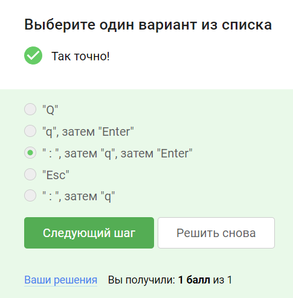{#fig:001 width=70%}

2. А для того, чтобы убедиться, что вы разобрались, отметьте ниже все верные утверждения про следующую строку: Strange_  TEXT  is_here. 2=2 YES! **Пояснения:Выбирал верные утверждения используя в Федоре свой текстовый редактор vim и проверял каждый пункт.** (рис. @fig:002)

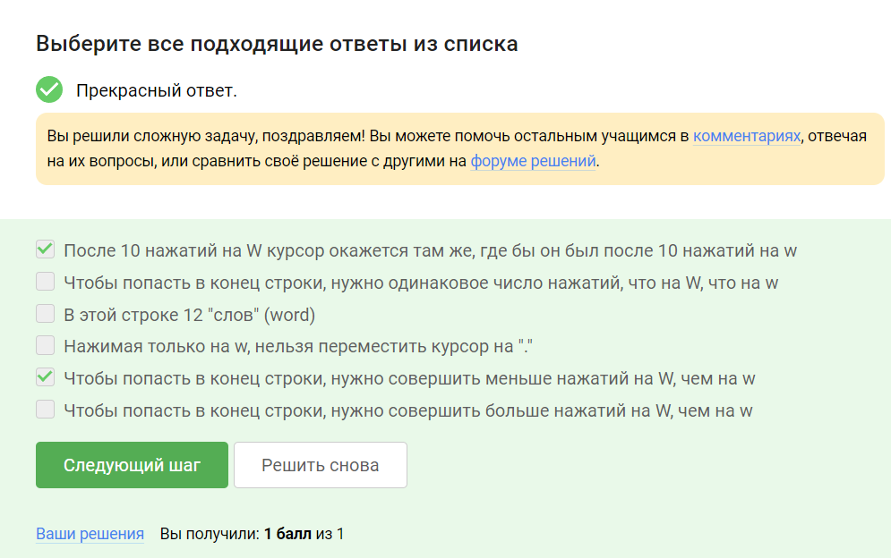{#fig:002 width=70%}

3. Какие(ой) из предложенных ниже наборов нажатий клавиш выполнят такое редактирование? В этих наборах нажатие на клавишу Esc обозначается как <Esc> (т.е. знаки "<" и ">" не несут отдельного смысла). **Пояснения: Наборы клавиш проверял с помощью редактора в Федоре vim.**(рис. @fig:003)

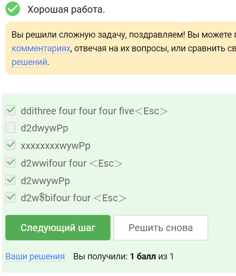{#fig:003 width=70%}

4. Какую команду нужно ввести для этого в vim? Укажите необходимую команду целиком (т.е. включая ввод ":" в самом начале), однако нажатие на Enter после ввода команды обозначать никак не нужно. **Пояснения: Для этого задания также вводил данный текст в vim и проверял каждый пункт.** (рис. @fig:004)

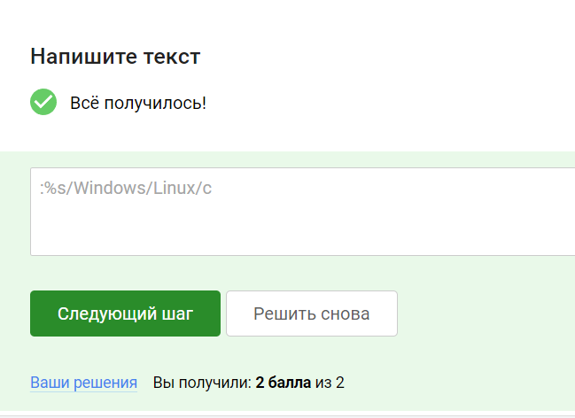{#fig:004 width=70%}

5. Чтобы убедиться, что вы разобрались с этим режимом работы, отметьте, пожалуйста, все верные утверждения из списка ниже. **Пояснения: отвечал исходя из видео, которые были показаны в курсе по vim.** (рис. @fig:005)

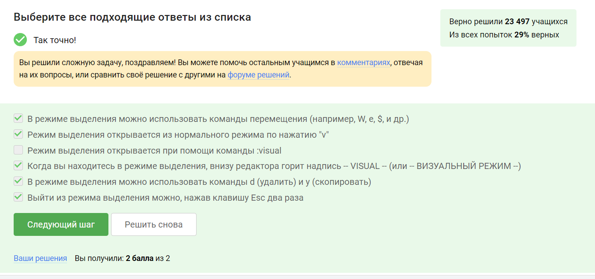{#fig:005 width=70%}

## Скрипты на bash: основы

1. Предположим, что вы открыли терминал и у вас в нем запущена оболочка bash. Вы набираете в ней команды А1, А2, А3, а затем запускаете оболочку sh. В этой оболочке вы набираете команды B1, В2, В3 и запускаете оболочку bash. И, наконец, в этой последней оболочке вы набираете команды С1, С2, С3. Если теперь вы попробуете при помощи стрелочек вверх/вниз перемещаться по истории набранных команд, то команды из какого набора(ов) будут появляться? **Пояснения: из последнего набора, именно такое запоминание истории в Федоре.** (рис. @fig:006)

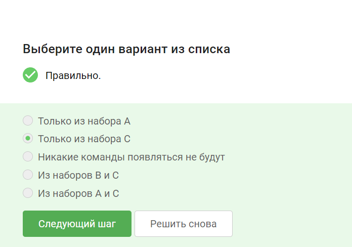{#fig:006 width=70%}

2. Как будет выглядеть абсолютный путь до созданного файла file1.txt по окончанию работы скрипта? **Пояснения: задание не сложное, ответ выбирал исходя из базовых знаний путей до файлов.** (рис. @fig:007)

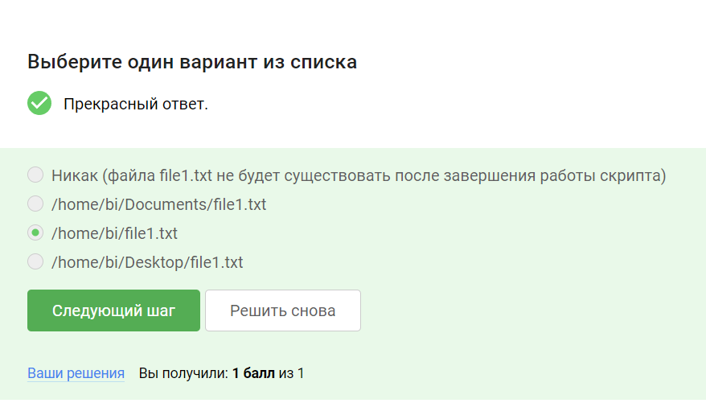{#fig:007 width=70%}

3. Какие из представленных ниже строк могут быть именами переменных в bash? Выберите все подходящие варианты! **Пояснения: выбирал подходящие переменные** (рис. @fig:008)

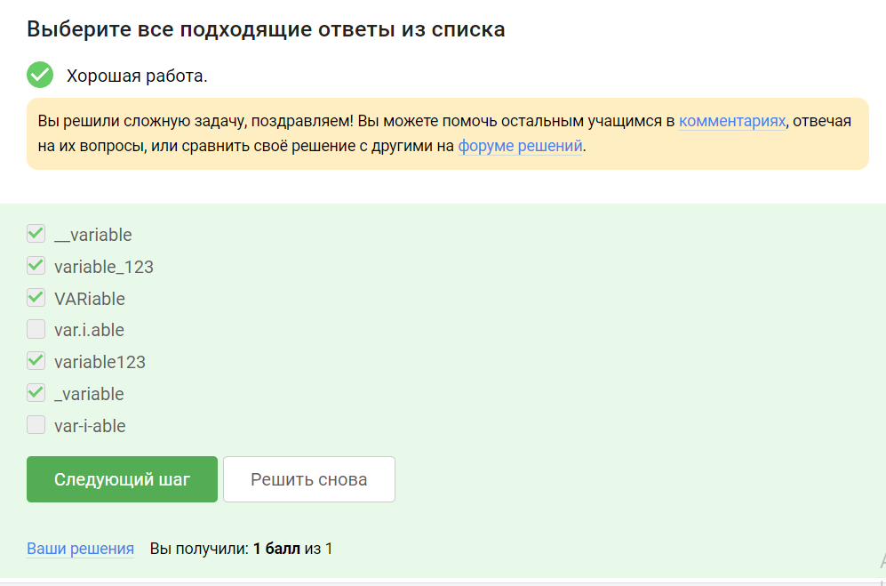{#fig:008 width=70%}

4. Напишите скрипт на bash, который принимает на вход два аргумента и выводит на экран строку следующего вида: Arguments are: $1=первый_аргумент $2=второй_аргумент **Пояснения: на скринкасте видно как я писсал данный скрипт. Для написания скрипта использования знания полученные исходя из университетского курса.** (рис. @fig:009)

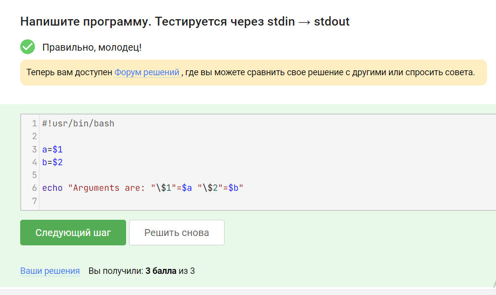{#fig:009 width=70%}

## Скрипты на bash: ветвления и циклы

1. Вы можете вписать вместо "..." (внутри [[ ]] и не забудьте про пробелы после [[ и перед ]]!) любое из перечисленных ниже условий. Однако мы просим вас выбрать только те из них, при которых echo напечатает на экран True вне зависимости от того, с какими параметрами был запущен ваш скрипт и какие в нем есть переменные. **Пояснения: выбирал ответ исходя из обьяснений в видео курса.** (рис. @fig:0010)

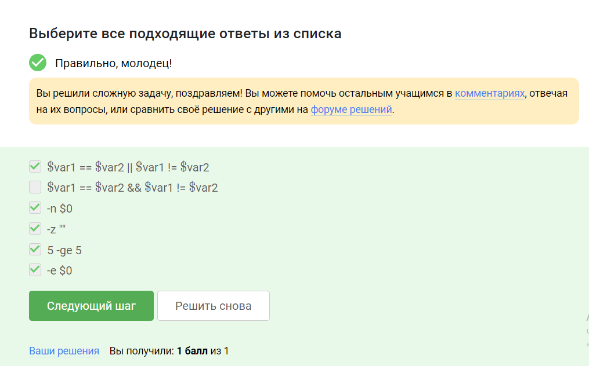{#fig:0010 width=70%}

2. Какие строки и в какой последовательности он выведет на экран, если сначала этот скрипт запустили задав переменную var=3, а затем запустили еще раз, но уже с var=5. **Пояснения:он проверит каждое условие, оно не подойдет для этих чисел и два раза выведет four.** (рис. @fig:0011)

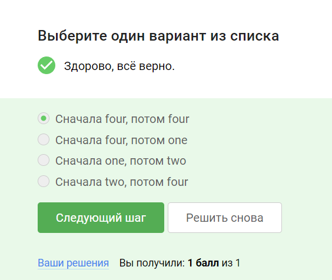{#fig:0011 width=70%}

3. Напишите скрипт на bash, который принимает на вход один аргумент (целое число от 0 до бесконечности), который будет обозначать число студентов в аудитории. В зависимости от значения числа нужно вывести разные сообщения. **Пояснения:Для написания скрипта использования знания полученные исходя из университетского курса. Писал скрипт с помощью кейсов, если мы вводили бы от 1 до 5, то он выводил бы то число студентов, которое мы ввели, а если цифра больше 5, то он выводил, что студентов много.** (рис. @fig:0012)

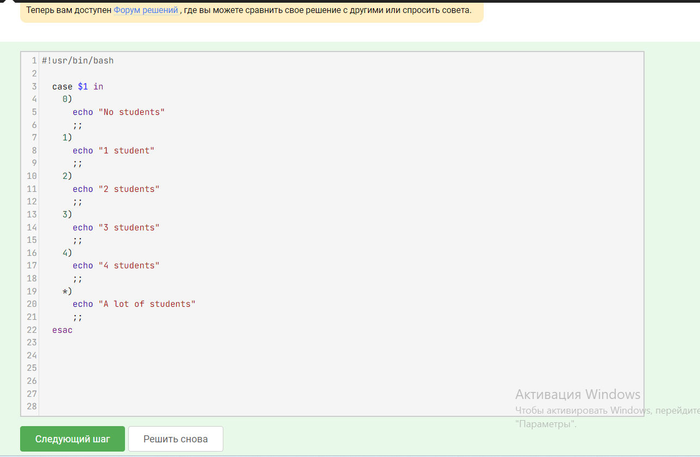{#fig:0012 width=70%}

4. Если запустить этот скрипт, то сколько раз на экран будет выведено слово "start", а сколько раз слово "finish"? **Пояснения:Проверил данный скрипт у себя в Федоре и ответил на вопрос.** (рис. @fig:0013)

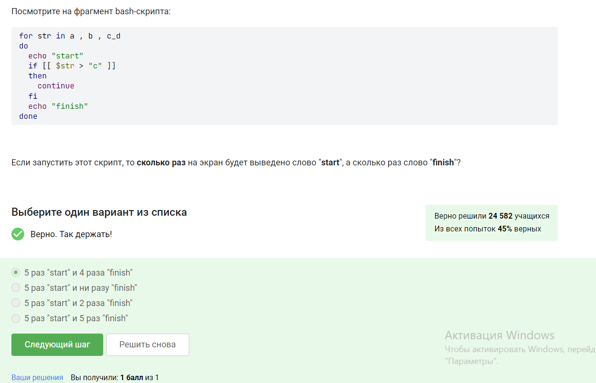{#fig:0013 width=70%}

5. Напишите скрипт на bash, который будет определять в какую возрастную группу попадают пользователи. При запуске скрипт должен вывести сообщение "enter your name:" и ждать от пользователя ввода имени (используйте read, чтобы прочитать его). Когда имя введено, то скрипт должен написать "enter your age:" и ждать ввода возраста (опять нужен read). Когда возраст введен, скрипт пишет на экран "<Имя>, your group is <группа>", где <группа> определяется на основе возраста.  **Пояснения:Для написания скрипта использования знания полученные исходя из университетского курса. Для данного скрипта я использовал цикл while и условие if. Вводим цикл и задаем условие его работы, до какого момента это будет. После вводим имя и возрат. Далее у нас будет три условия. В этих условиях мы указывали в какие группы относили бы человека определенного возраста. И после выводит имя человека и группу, к которой его отнесли по его возрасту. Если ввести ничего или ноль, то цикл завершался и выводилось сообщение bye.** (рис. @fig:0014)

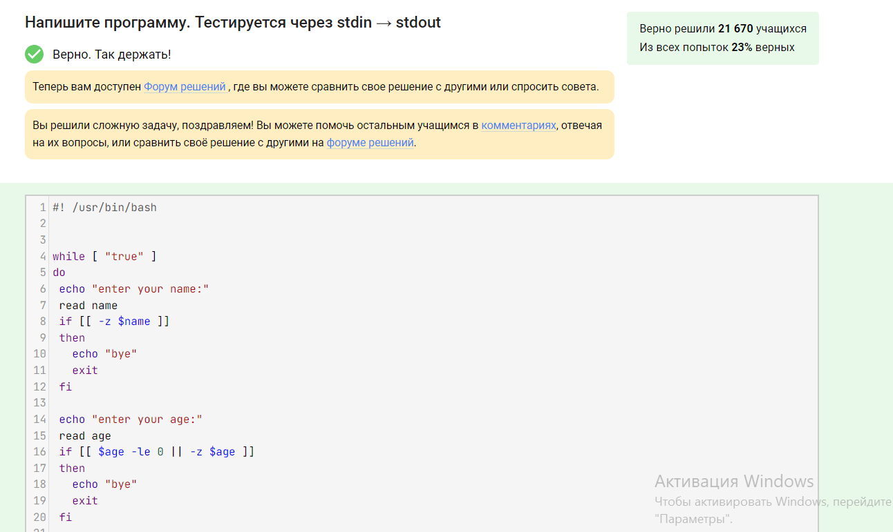{#fig:0014 width=70%}

## Скрипты на bash: разное

1. Какие(ая) из предложенных ниже инструкций увеличат значение переменной а на значение переменной b? Например, если в а было записано 10, в b было 5, то в а должно записаться 15. **Пояснения: Все ответы верные, использовали let.** (рис. @fig:0015)

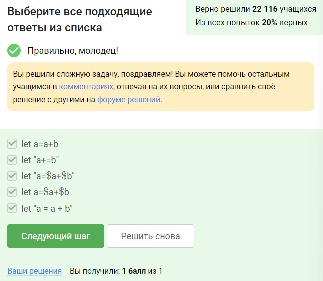{#fig:0015 width=70%}

2. Что в этом случае выведет команда echo на экран? **Пояснения: Путь домашней директории.** (рис. @fig:0016)

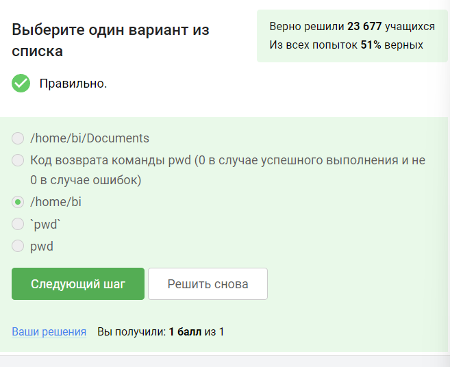{#fig:0016 width=70%}

3. Однако как быть, если хочется всё-таки запустить программу program, которая пишет что-то в stdout и потом выполнить какие-то действия если ее код возврата равен 0? **Пояснения: Ответ выбирал исходя из объяснений в видео курса.** (рис. @fig:0017)

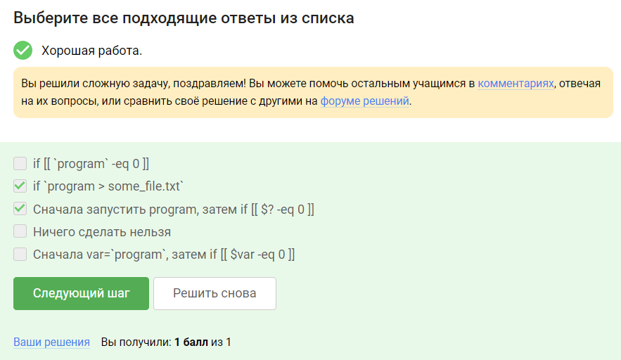{#fig:0017 width=70%}

4. Впишите в форму ниже строку, которую выведет на экран команда echo "counters are $c1 and $c2" если она находится в скрипте после десяти вызовов функции counter с параметрами сначала 1, затем 2, затем 3 и т.д., последний вызов с параметром 10. **Пояснения: В федоре ввел данный скрипт и посмотре, что вывел этот скрипт.** (рис. @fig:0018)

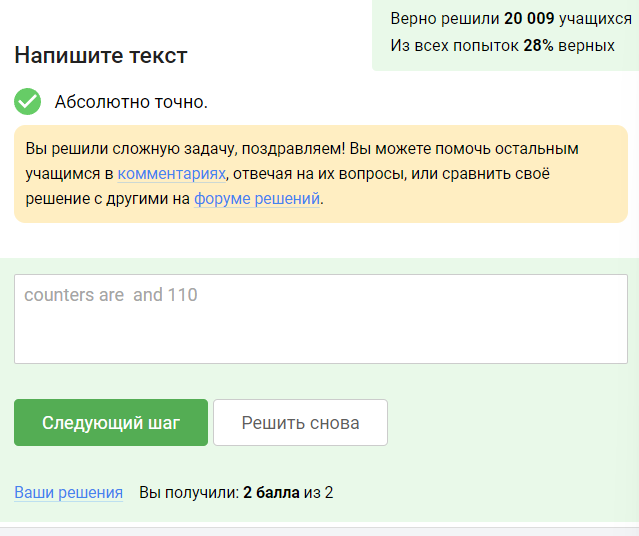{#fig:0018 width=70%}

5. Напишите калькулятор на bash. При запуске ваш скрипт должен ожидать ввода пользователем команды (при этом на экран выводить ничего не нужно). **Пояснения: Написал калькулятор, примерно похожий был в нашем курсе Операционные системы. Использовал сначала цикл while. Далле вводил три переменные. Две переменные для чисел и одна для операции, которую выполнял бы калькулятор. Если вводить слово exit, то происходил бы выход из цикла. Любая другая команда из одного аргумента или из трех аргументов, но с операцией не из списка. В этом случае выводится на экран слово "error" и завершается работа. И последнее, это с помощью кейсов реализовал операции.** (рис. @fig:0020)

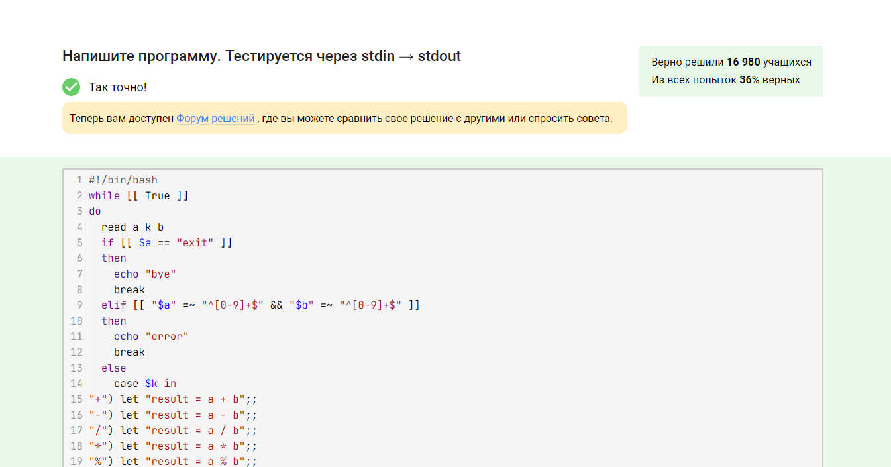{#fig:0020 width=70%}

## Продвинутый поиск и редактирование

1. Отметьте все файлы, которые найдет команда find /home/bi -iname "star*", но НЕ найдет команда find /home/bi -name "star*"? **Пояснения:Создал файлы и проверил.** (рис. @fig:0021)

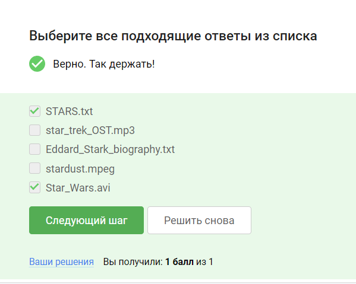{#fig:0021 width=70%}

2. Задание на понимание работы опций -path и -name команды find. Отметьте все верные утверждения из перечисленных ниже. **Пояснения: Проверил задание на практике** (рис. @fig:0022)

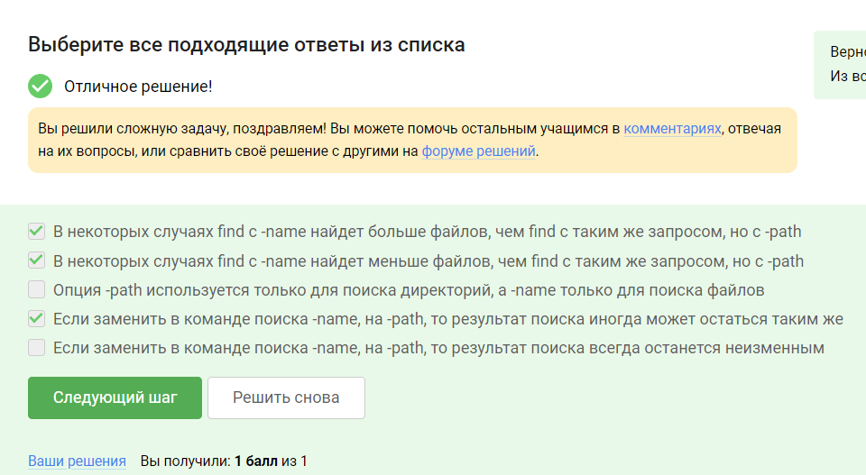{#fig:0022 width=70%}
 
3. Какие(ой) из трех файлов (file1, file2, file3) будут найдены по команде find /home/bi -mindepth 2 -maxdepth 3 -name "file*"? **Пояснения: Проверил задание на практике.** (рис. @fig:0023)

{#fig:0023 width=70%}

4. Какая(ие) из них создаст файл results.txt наибольшего размера? **Пояснения: Ответ дал исходя из объяснений курса.** (рис. @fig:0024)

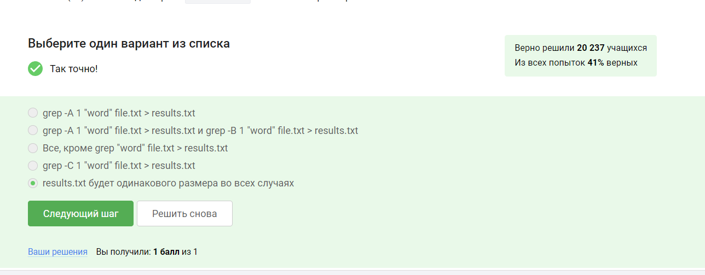{#fig:0024 width=70%}

5. Предположим, что в файле  text.txt записаны строки, показанные среди вариантов ответа. Отметьте только те из них, которые выведет на экран команда  grep -E "[xklXKL]?[uU]buntu$" text.txt. **Пояснения: Проверил на практике.** 
(рис. @fig:0025)

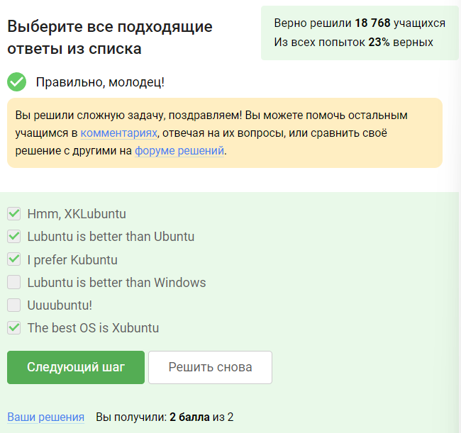{#fig:0025 width=70%}

6. Что произойдет, если в команде sed -n "/[a-z]*/p" text.txt не указывать опцию -n? **Пояснения: Ответ дал с помощью справки.** (рис. @fig:0026)

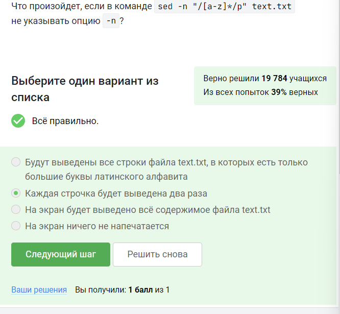{#fig:0026 width=70%}

7. Запишите в форму ниже инструкцию sed, которая заменит все "аббревиатуры" в файле input.txt на слово "abbreviation" и запишет результат в файл edited.txt (на экран при этом ничего выводить не нужно). Обратите внимание, что в инструкции должны быть указаны и сам sed, и оба файла! **Пояснения: Проверил на практике и дал ответ на задание.** (рис. @fig:0027)

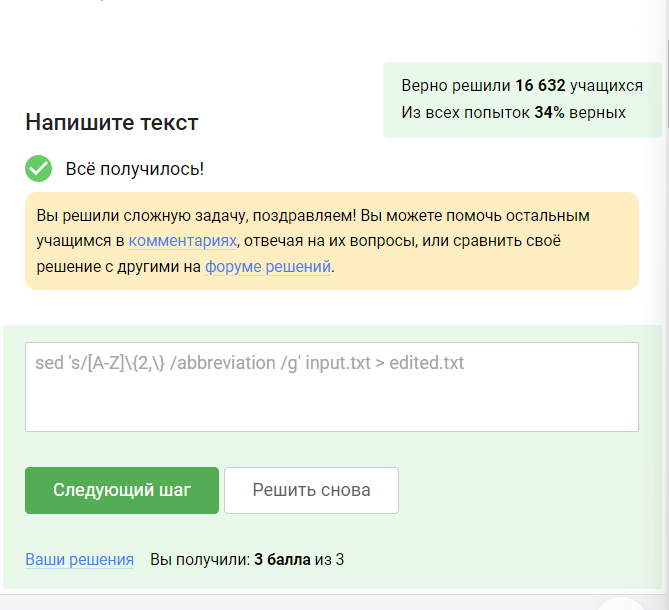{#fig:0027 width=70%}

## Строим графики в gnuplot

1. Какую опцию нужно указать при запуске gnuplot, чтобы при его закрытии не были автоматически закрыты и все нарисованные в нём графики? **Пояснения: Ответ узнал с помощью справки** (рис. @fig:0028)

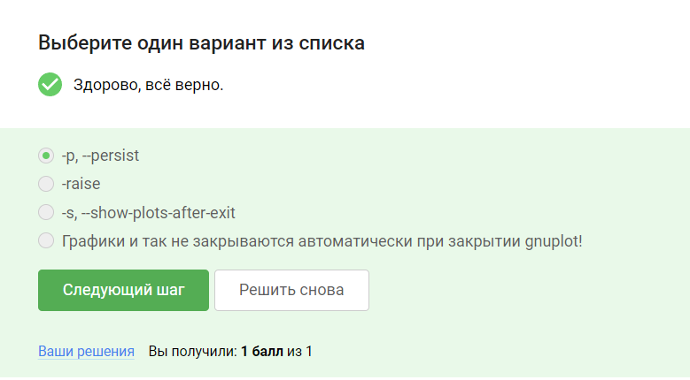{#fig:0028 width=70%}

2. Какое в этом случае будет название у построенного ряда данных и сколько будет нарисовано точек на графике? **Пояснения: Проверил задание на практике** (рис. @fig:0029)

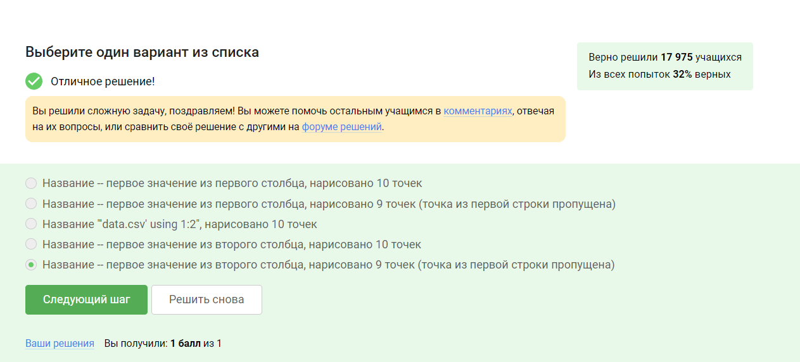{#fig:0029 width=70%} 

3. Впишите в форму ниже одну команду (т.е. одну строку), которую нужно добавить в скрипт, для выполнения этой задачи. **Пояснения:Проверил задание на практике.** (рис. @fig:0030)

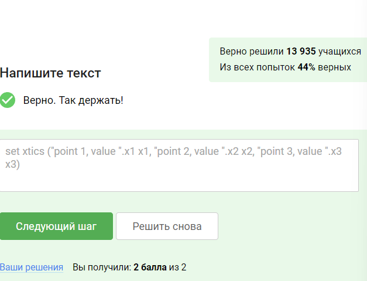{#fig:0030 width=70%}

4. Указанные файлы использовались в последнем видеофрагменте для создания вращающегося графика. Измените инструкции в файле move.rot (т.е. добавлять и удалять инструкции нельзя!) таким образом. **Пояснения: Изменил файл для вращения обратного. Вращение графика сделал в два раза быстрее. И отразил график зеркально.** (рис. @fig:0031)

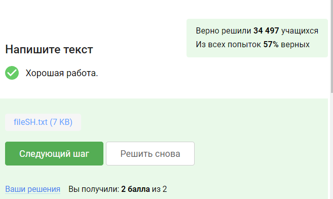{#fig:0031 width=70%}

## Разное

1. Какая команда(ы) установят файлу file.txt права доступа rwxrw-r--, если изначально у него были права r--r--r--. Укажите все верные варианты ответа!  **Пояснения: Проверял на практике, создавал такой файл и менял ему права доступа используя знания университетского курса с помощью команды chmod.** (рис. @fig:0032)

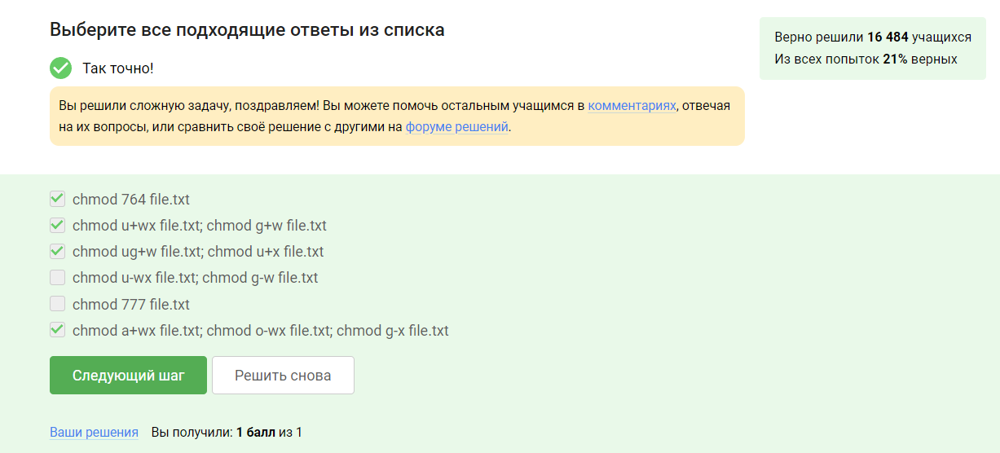{#fig:0032 width=70%}

2. После выполнения какой команды user из группы group всё-таки сможет создать файл внутри dir? Укажите все верные варианты ответов! **Пояснения: Проверял на практике, создавал такой файл и менял ему права доступа используя знания университетского курса с помощью команды chmod.** (рис. @fig:0033)

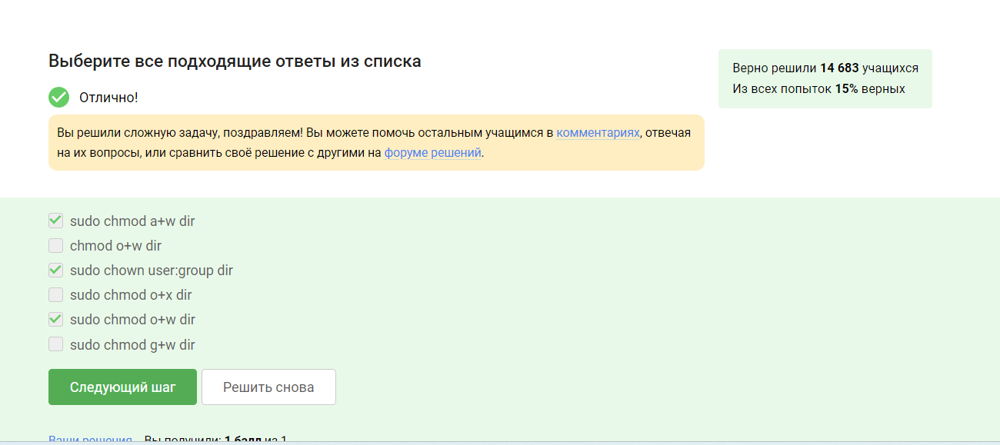{#fig:0033 width=70%}

3. Отметьте какие характеристики файла можно посчитать с использованием команды wc. **Пояснения: Ответ на вопрос дал исходя из знаний, полученных с видео курса.** (рис. @fig:0034)

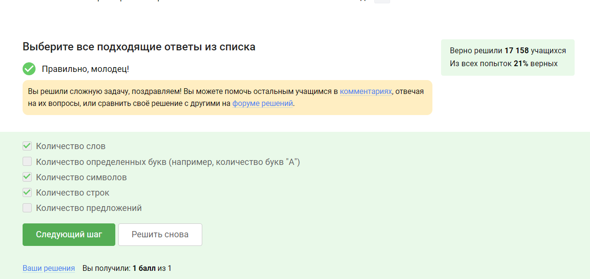{#fig:0034 width=70%}

4. Впишите в форму ниже команду, которая выведет сколько места на диске занимает текущая директория (при этом размер нужно вывести в удобном для чтения формате (например, вместо 2048 байт надо выводить 2.0К) и больше на экран выводить ничего не нужно). В команде указывайте только необходимые для выполнения задания опции и аргументы, лишних опций указывать не нужно! **Пояснения:Проверил задание на практике. И читал информацию в интернете** (рис. @fig:0035)

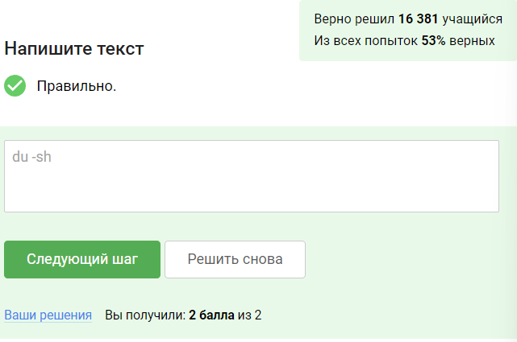{#fig:0035 width=70%}

5. Впишите в форму ниже максимально короткую команду (т.е. в которой минимально возможное число символов), которая позволит создать в текущей директории 3 поддиректории с именами dir1, dir2, dir3. **Пояснения:Проверил задание на практике. И читал информацию в интернете** (рис. @fig:0036)

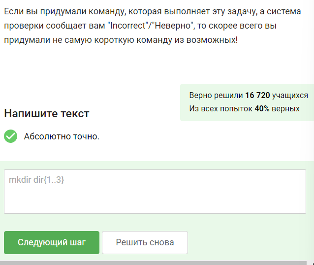{#fig:0036 width=70%}

# Выводы

Исходя из данного этапа курса научился писать разные скрипты на bash, также научился строить графики в gnuplot. Научился использовать поиск в терминале, нахождения файлов по разным характеристикам (например, по названию файла, по типу файла, по тексту, который внутри файлы). Закрепил умения и знания использования vim. Так же закрепил умения изменения прав доступа для файлов, узнал некоторые новые команды дающие информацию о правах доступа для разных пользователей и изменения прав доступа.

