---
## Front matter
lang: ru-RU
title: Презентация проекта. Первый этап.
author:
  - Королёв И.А.
institute:
  - Российский университет дружбы народов, Москва, Россия

## i18n babel
babel-lang: russian
babel-otherlangs: english

## Formatting pdf
toc: false
toc-title: Содержание
slide_level: 2
aspectratio: 169
section-titles: true
theme: metropolis
header-includes:
 - \metroset{progressbar=frametitle,sectionpage=progressbar,numbering=fraction}
 - '\makeatletter'
 - '\beamer@ignorenonframefalse'
 - '\makeatother'
---

## Докладчик

:::::::::::::: {.columns align=center}
::: {.column width="70%"}

  * Королёв Иван АНдреевич
  * Студент
  * Российский университет дружбы народов
  * [1032225751@pfur.ru]

:::
::: {.column width="30%"}

:::
::::::::::::::

# Цель работы

Размещение на Github pages заготовки для персонального сайта.

# Задание

- Установить необходимое программное обеспечение.
- Скачать шаблон темы сайта.
- Разместить его на хостинге git.
- Установить параметр для URLs сайта.
- Разместить заготовку сайта на Github pages.

# Процесс выполнения

# Установка необходимого программного обеспечения.

## Установка Hugo Extended и Go(sudo dnf install go hugo) (рис. @fig:001).

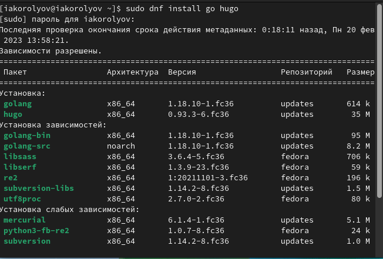{#fig:001 width=70%}

## Установка Hugo Extended в ручную

{#fig:002 width=70%}

## Установка Hugo Extended в ручную

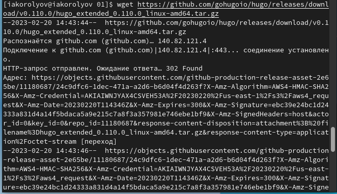{#fig:003 width=70%}

## Установка Hugo Extended в ручную

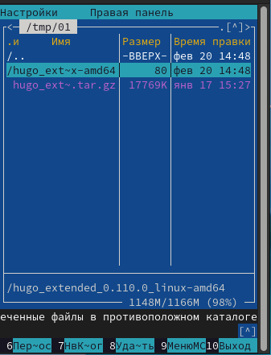{#fig:004 width=70%}

## Установка Hugo Extended в ручную

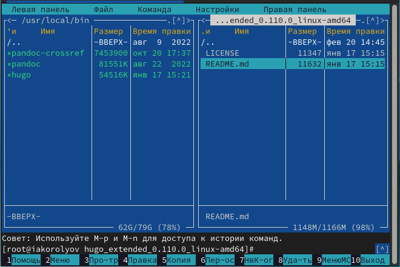{#fig:005 width=70%}

## С помощью команды "hugo version" убедился, какая установлена версия. (рис. @fig:006)

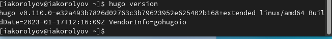{#fig:006 width=70%}

# Скачать шаблон темы сайта.

## Переходим в каталог blog и прописываем команду hugo.

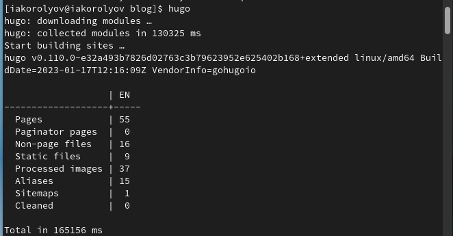{#fig:008 width=70%}

## Видим, что у нас есть папка public, нам необходимо её удалить.

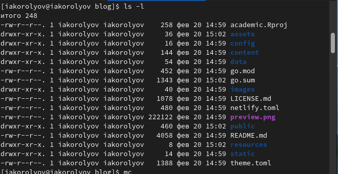{#fig:009 width=70%}

## Hugo server (рис. @fig:0010)

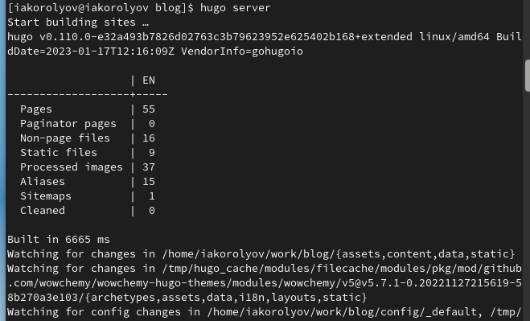{#fig:0010 width=70%}

# Размещение его на хостинге git. Установка параметра для URLs сайта. Размещение заготовки сайта на Github pages. 

## Создаем новый репозиторий на git.(рис. @fig:0011)

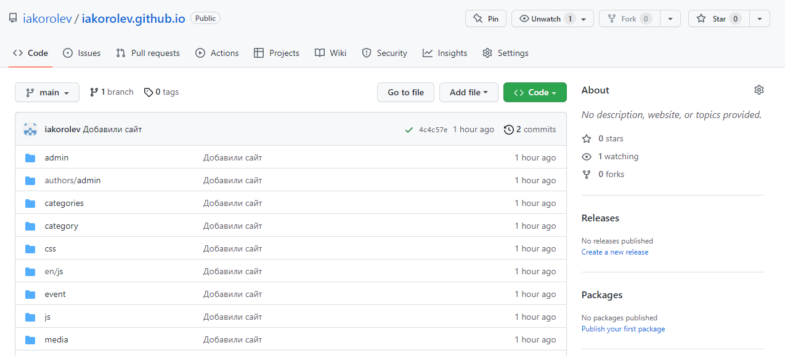{#fig:0011 width=70%}

## Копируем ссылку и клонируем его перейдя в каталог work. (рис. @fig:0012)

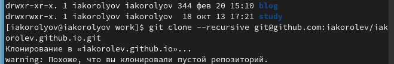{#fig:0012 width=70%}

## ( git checkout -b main ) (рис. @fig:0013)

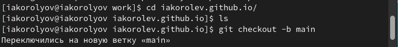{#fig:0013 width=70%}

## ( touch README.md ) (рис. @fig:0014)

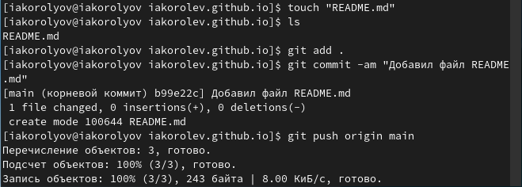{#fig:0014 width=70%}

## Необходимо к папке public подключить наш созданный репозиторий iakorolev.github.io. (рис. @fig:0015)

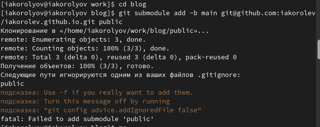{#fig:0015 width=70%}

## Комментируем значение public. (рис. @fig:0016)

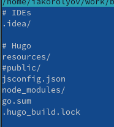{#fig:0016 width=70%}

## Повторяем команду (рис. @fig:0017)

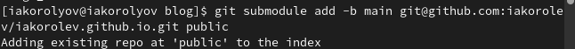{#fig:0017 width=70%}

## Пока наша папка public пуста. (рис. @fig:0018)

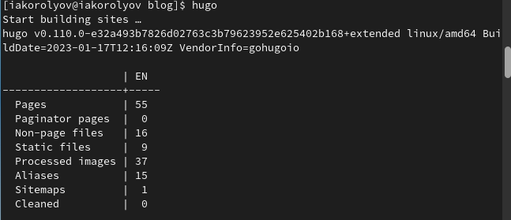{#fig:0018 width=70%}

## git remote -v (рис. @fig:0019)

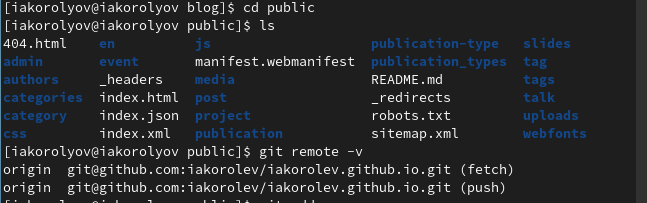{#fig:0019 width=70%}

## Отправляем всё на git. (рис. @fig:0020)

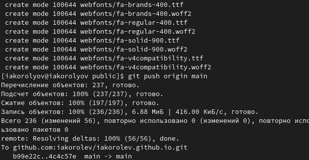{#fig:0020 width=70%}

## Сайт

Сайт работает, демонстрирую на скриншоте. (рис. @fig:0021)

{#fig:0021 width=70%}

# Выводы

Я разместил на Github pages заготовки для персонального сайта.

