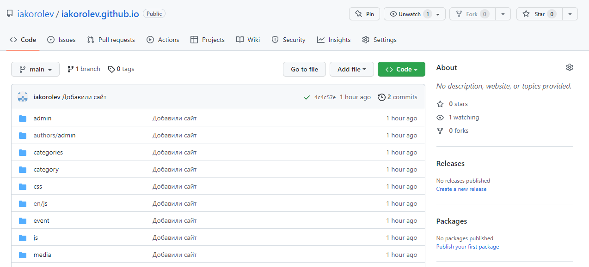
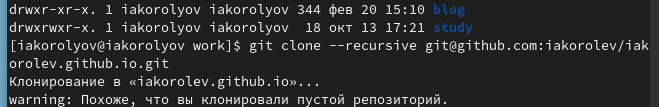

---
## Front matter
title: "Отчёт по проекту. Первый этап"
author: "Королёв Иван Андреевич"

## Generic otions
lang: ru-RU
toc-title: "Содержание"

## Bibliography
bibliography: bib/cite.bib
csl: pandoc/csl/gost-r-7-0-5-2008-numeric.csl

## Pdf output format
toc: true # Table of contents
toc-depth: 2
lof: true # List of figures
lot: true # List of tables
fontsize: 12pt
linestretch: 1.5
papersize: a4
documentclass: scrreprt
## I18n polyglossia
polyglossia-lang:
  name: russian
  options:
	- spelling=modern
	- babelshorthands=true
polyglossia-otherlangs:
  name: english
## I18n babel
babel-lang: russian
babel-otherlangs: english
## Fonts
mainfont: PT Serif
romanfont: PT Serif
sansfont: PT Sans
monofont: PT Mono
mainfontoptions: Ligatures=TeX
romanfontoptions: Ligatures=TeX
sansfontoptions: Ligatures=TeX,Scale=MatchLowercase
monofontoptions: Scale=MatchLowercase,Scale=0.9
## Biblatex
biblatex: true
biblio-style: "gost-numeric"
biblatexoptions:
  - parentracker=true
  - backend=biber
  - hyperref=auto
  - language=auto
  - autolang=other*
  - citestyle=gost-numeric
## Pandoc-crossref LaTeX customization
figureTitle: "Рис."
tableTitle: "Таблица"
listingTitle: "Листинг"
lofTitle: "Список иллюстраций"
lotTitle: "Список таблиц"
lolTitle: "Листинги"
## Misc options
indent: true
header-includes:
  - \usepackage{indentfirst}
  - \usepackage{float} # keep figures where there are in the text
  - \floatplacement{figure}{H} # keep figures where there are in the text
---

# Цель работы

Размещение на Github pages заготовки для персонального сайта.

# Задание

- Установить необходимое программное обеспечение.
- Скачать шаблон темы сайта.
- Разместить его на хостинге git.
- Установить параметр для URLs сайта.
- Разместить заготовку сайта на Github pages.

# Теоретическое введение

Один из самых популярных генераторов статических сайтов с открытым исходным кодом, написан на языке Go. Благодаря своей удивительной скорости и гибкости, Hugo делает создание веб-сайтов увлекательным.

# Выполнение лабораторной работы

## Установка необходимого программного обеспечения.

1. Установка Hugo Extended и Go(sudo dnf install go hugo) (рис. @fig:001).

{#fig:001 width=70%}

2. После установки с помощью команды "sudo dnf install go hugo" - hugo установился версии 0.93.0 и не Extended. Нам же необходима версия 0.95 и выше. Тогда устанавливаем Hugo Extended в ручную. Следует скачать архив с репозитория: https://github.com/gohugoio/hugo/releases. Выбрал самую последнюю версию. Скопировал ссылку на загрузку. (рис. @fig:002) Далее я перешел в каталог tmp, создал новый в tmp и назвал 01. В tmp/01 я скачал данный архив.(рис. @fig:003) Потом я разархивировал скаченную папку и файл Hugo переместил в usr/local/bin. (рис. @fig:004), (рис. @fig:005)

{#fig:002 width=70%}

{#fig:003 width=70%}

{#fig:004 width=70%}

{#fig:005 width=70%}

3. С помощью команды "hugo version" убедился, какая установлена версия. (рис. @fig:006)

{#fig:006 width=70%}

## Скачать шаблон темы сайта.

1. На нашем курсе открывали техническая реализация. Открывали репозиторий Hugo Academic Theme. Создаем новый репозиторий нажимая на use this tempplate. Называем его blog и создаем. (рис. @fig:007)

{#fig:007 width=70%}

2. Переходим в каталог blog и прописываем команду hugo. Видим, что у нас есть папка public, нам необходимо её удалить. (рис. @fig:008), (рис. @fig:009)

{#fig:008 width=70%}

{#fig:009 width=70%}

3. Далее мы пишем команду hugo server и если все скомпилируется правильно, то не будет никаких ошибок. В самом низу будет написано, что ctrl + c - это выход из программы. И чуть выше мы ввидим, что у нас есть ссылка http://localhost:1313/ Перейдя по ней мы увидим, что всё работает, но сайт работает только на одном компьютере, а нам необходимо чтобы он запускался на любом. Нужно, чтобы любой мог получать доступ к моему сайту. Для этого надо разместить его на github (рис. @fig:0010)

{#fig:0010 width=70%}

## Размещение его на хостинге git. Установка параметра для URLs сайта. Размещение заготовки сайта на Github pages. 

1. Создаем новый репозиторий на git. ВАЖНО, чтобы при создании имя совпадало с тем, которое указано в самом git, а после добавляеми github.io ( должно получится вот так: iakorolev.github.io ) (рис. @fig:0011)

{#fig:0011 width=70%}

2. Копируем ссылку и клонируем его перейдя в каталог work. (рис. @fig:0012)

{#fig:0012 width=70%}

3. Т.к. репозиторий у нас пустой необходимо создать ветку. Ветка должна обязательно называться main ( git checkout -b main ) (рис. @fig:0013)

{#fig:0013 width=70%}

4. После этого мы создаем пустой readme.md ( touch README.md ) и отправляем это все на git (рис. @fig:0014)

{#fig:0014 width=70%}

5. Переходим обратно в blog. Необходимо к папке public подключить наш созданный репозиторий iakorolev.github.io. (рис. @fig:0015)

{#fig:0015 width=70%}

6. Public проигнорировался. Исправим это, перейдя в mc, там открываем файл gitignore. И комментируем значение public. (рис. @fig:0016)

{#fig:0016 width=70%}

7. Повторяем команду git submodule add -b main .. public ещё раз (рис. @fig:0017)

{#fig:0017 width=70%}

8. Пока наша папка public пуста. Но если мы пропишем hugo, то она заполнится необходимыми файлами. (рис. @fig:0018)

{#fig:0018 width=70%}

9. Проверяем, перейдя в каталог. Так же, с помощью команды git remote -v ( видим в строке, что наш репозиторий подключен и всё работает ) (рис. @fig:0019)

{#fig:0019 width=70%}

10. Отправляем всё на git. (рис. @fig:0020)

{#fig:0020 width=70%}

## Сайт

Сайт работает, демонстрирую на скриншоте. (рис. @fig:0021)

{#fig:0021 width=70%}

# Выводы

Я разместил на Github pages заготовки для персонального сайта.

