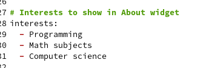

---
## Front matter
lang: ru-RU
title: Презентация по проекту. Второй этап.
author:
  - Королёв И.А.
institute:
  - Российский университет дружбы народов, Москва, Россия

## i18n babel
babel-lang: russian
babel-otherlangs: english

## Formatting pdf
toc: false
toc-title: Содержание
slide_level: 2
aspectratio: 169
section-titles: true
theme: metropolis
header-includes:
 - \metroset{progressbar=frametitle,sectionpage=progressbar,numbering=fraction}
 - '\makeatletter'
 - '\beamer@ignorenonframefalse'
 - '\makeatother'
---

# Информация

## Докладчик

:::::::::::::: {.columns align=center}
::: {.column width="70%"}

  * Королёв Иван Андреевич
  * студент, НКАбд-05-22
  * Российский университет дружбы народов

:::
::::::::::::::

# Цель работы

Научиться создавать и  оформлять сайт на Hugo.

# Задание

1. Разместить фотографию владельца сайта.
2. Разместить краткое описание владельца сайта (Biography).
3. Добавить информацию об интересах (Interests).
4. Добавить информацию от образовании (Education).
5. Сделать пост по прошедшей неделе.
6. Добавить пост на тему по выбору.

# Теоретическое введение

Один из самых популярных генераторов статических сайтов с открытым исходным кодом, написан на языке Go. Благодаря своей удивительной скорости и гибкости, Hugo делает создание веб-сайтов увлекательным.

# Выполнение лабораторной работы

## Разместить фотографию владельца сайта.

Заходим в наш каталог blog/content/authors/admin и там видим, что там уже есть фотография. Мы её удаляемм, добавляем нашу. 

{#fig:001 width=70%}

## В этом же каталоге blog/content/authors/admin есть файл index.md. Открываем его с помощью gedit и редактируем необходимые данные.

{#fig:002 width=70%}

## Размещаю краткое описание владельца сайта (Biography) 

{#fig:003 width=70%}

## Добавить информацию об интересах (Interests).

{#fig:004 width=70%}

## Добавить информацию от образовании (Education). 

{#fig:005 width=70%}

## Создание постов

Необходимо было создать пост о прошедшей неделе и добавить пост на тему по выбору ( Управление версиями. Git. ). Чтобы перейти к папкам, которые отвечают за посты сайт. Нужно blog/content/post и далее создаем папку в неё забрасываем картинки, которые будут использоваться в посте и создаем файл, называя его index.md

{#fig:006 width=70%}

# Выводы

Научился добавлять данные о себе на сайт. Научился создавать посты.

