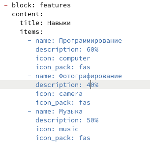
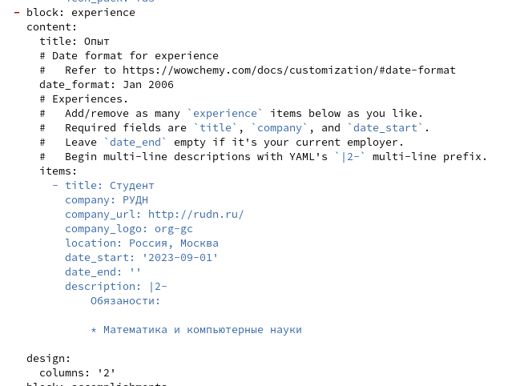
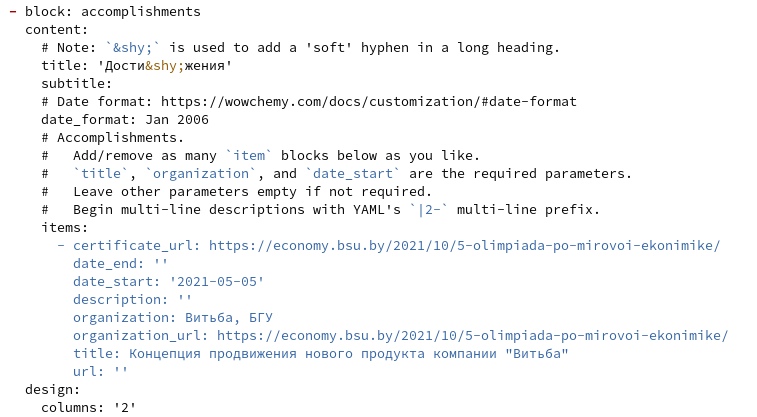
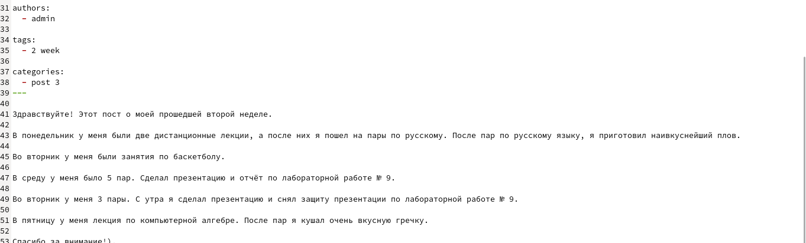
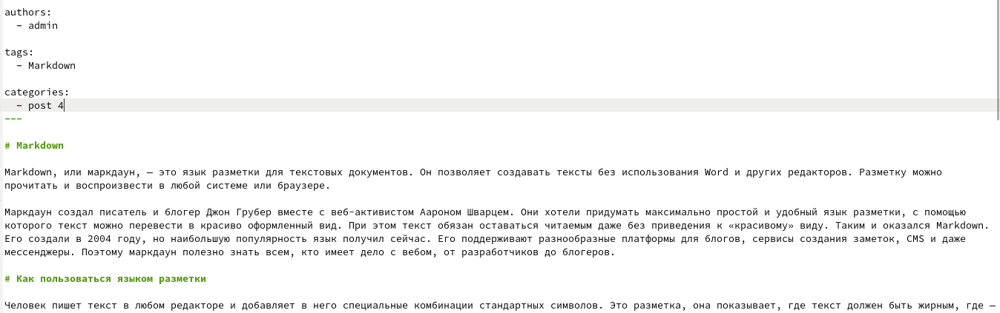

---
## Front matter
lang: ru-RU
title: Презентация по индивидуальному проекту. Третий этап.
author:
  - Королёв И.А.
institute:
  - Российский университет дружбы народов, Москва, Россия

## i18n babel
babel-lang: russian
babel-otherlangs: english

## Formatting pdf
toc: false
toc-title: Содержание
slide_level: 2
aspectratio: 169
section-titles: true
theme: metropolis
header-includes:
 - \metroset{progressbar=frametitle,sectionpage=progressbar,numbering=fraction}
 - '\makeatletter'
 - '\beamer@ignorenonframefalse'
 - '\makeatother'
---

# Информация

## Докладчик

:::::::::::::: {.columns align=center}
::: {.column width="70%"}

  * Королёв Иван Андреевич
  * студент, НКАбд - 05 - 22
  * Российский университет дружбы народов
  
:::
::::::::::::::

# Цель работы

Научиться создавать и  оформлять сайт на Hugo.

# Задание

* Добавить информацию о навыках (Skills).

* Добавить информацию об опыте (Experience).

* Добавить информацию о достижениях (Accomplishments).

* Сделать пост по прошедшей неделе

* Пост. Язык разметки Markdown.

# Теоретическое введение

Один из самых популярных генераторов статических сайтов с открытым исходным кодом, написан на языке Go. Благодаря своей удивительной скорости и гибкости, Hugo делает создание веб-сайтов увлекательным.

# Выполнение лабораторной работы

## Добавить информацию о навыках (Skills).

{#fig:001 width=70%}

## Добавить информацию об опыте (Experience).

{#fig:003 width=70%}

## Добавить информацию о достижениях (Accomplishments).

{#fig:005 width=70%}

## Сделать пост по прошедшей неделе

{#fig:007 width=90%}

## Пост. Язык разметки Markdown.

{#fig:009 width=90%}

# Выводы

Я научился добавлять на сайт hugo информацию о своих навыках, достижениях и опыте. Закрепил умения создавать и добавлять посты на сайт hugo.

