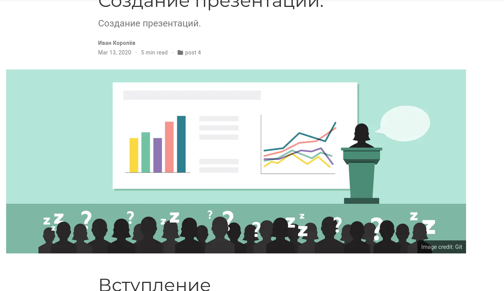

---
## Front matter
title: "Отчёт по проекту. Четвертый этап."
author: "Королёв Иван Андреевич"

## Generic otions
lang: ru-RU
toc-title: "Содержание"

## Bibliography
bibliography: bib/cite.bib
csl: pandoc/csl/gost-r-7-0-5-2008-numeric.csl

## Pdf output format
toc: true # Table of contents
toc-depth: 2
lof: true # List of figures
lot: true # List of tables
fontsize: 12pt
linestretch: 1.5
papersize: a4
documentclass: scrreprt
## I18n polyglossia
polyglossia-lang:
  name: russian
  options:
	- spelling=modern
	- babelshorthands=true
polyglossia-otherlangs:
  name: english
## I18n babel
babel-lang: russian
babel-otherlangs: english
## Fonts
mainfont: PT Serif
romanfont: PT Serif
sansfont: PT Sans
monofont: PT Mono
mainfontoptions: Ligatures=TeX
romanfontoptions: Ligatures=TeX
sansfontoptions: Ligatures=TeX,Scale=MatchLowercase
monofontoptions: Scale=MatchLowercase,Scale=0.9
## Biblatex
biblatex: true
biblio-style: "gost-numeric"
biblatexoptions:
  - parentracker=true
  - backend=biber
  - hyperref=auto
  - language=auto
  - autolang=other*
  - citestyle=gost-numeric
## Pandoc-crossref LaTeX customization
figureTitle: "Рис."
tableTitle: "Таблица"
listingTitle: "Листинг"
lofTitle: "Список иллюстраций"
lotTitle: "Список таблиц"
lolTitle: "Листинги"
## Misc options
indent: true
header-includes:
  - \usepackage{indentfirst}
  - \usepackage{float} # keep figures where there are in the text
  - \floatplacement{figure}{H} # keep figures where there are in the text
---

# Цель работы

Научиться создавать и  оформлять сайт на Hugo.

# Задание

* Зарегистрироваться на соответствующих ресурсах и разместить на них ссылки на сайте.

* Сделать пост по прошедшей неделе.

* Добавить пост на тему создание презентаций.

# Теоретическое введение

Один из самых популярных генераторов статических сайтов с открытым исходным кодом, написан на языке Go. Благодаря своей удивительной скорости и гибкости, Hugo делает создание веб-сайтов увлекательным.

# Выполнение лабораторной работы

## Зарегистрироваться на соответствующих ресурсах и разместить на них ссылки на сайте. 

{#fig:002 width=70%}

## Сделать пост по прошедшей неделе.

{#fig:005 width=70%}

## Добавить пост на тему создание презентаций.

{#fig:005 width=70%}

# Выводы

Я научился добавлять на сайт hugo информацию о своих навыках, достижениях и опыте. Закрепил умения создавать и добавлять посты на сайт hugo.

