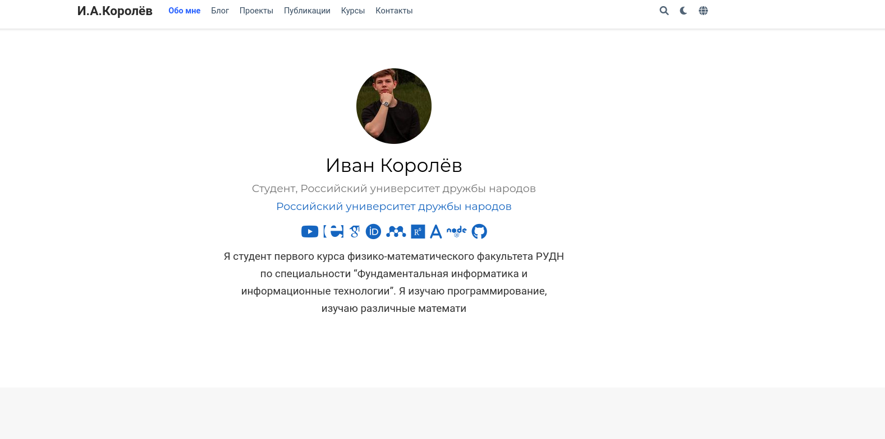
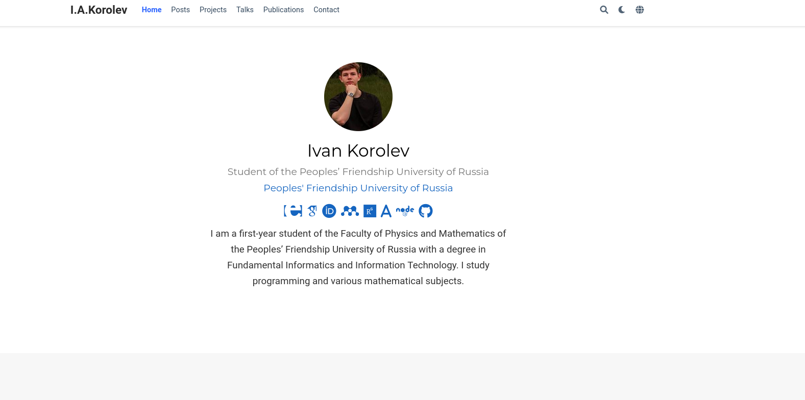
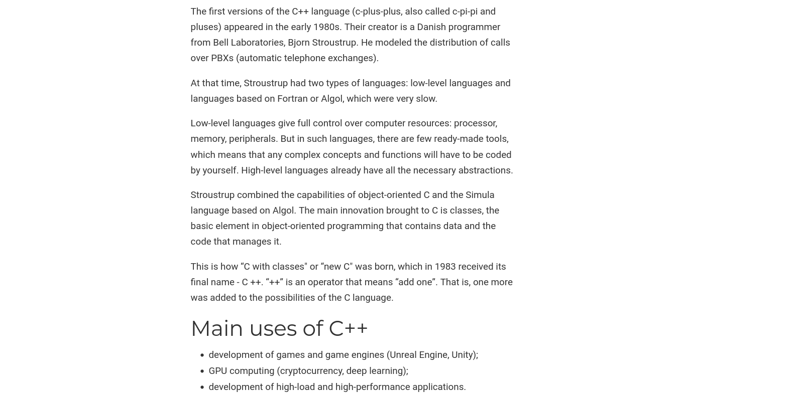
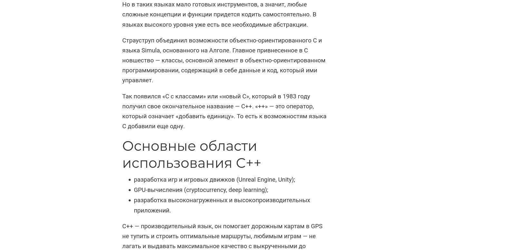
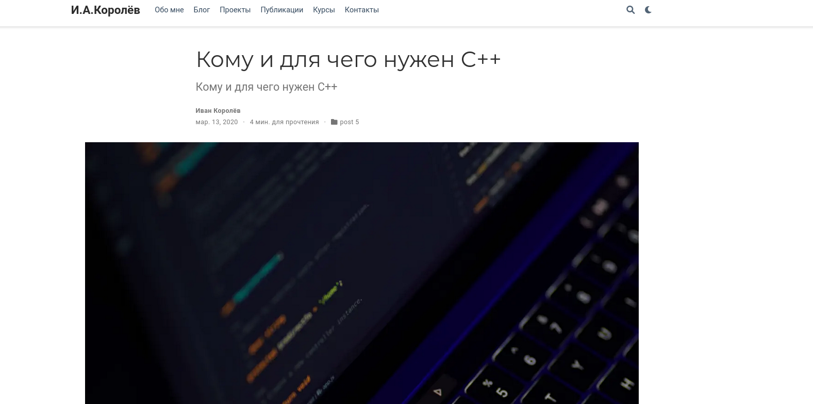
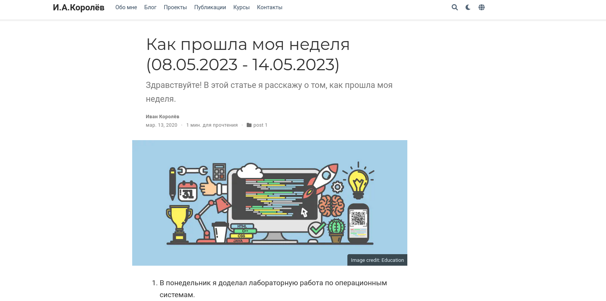

---
## Front matter
lang: ru-RU
title: Презентация по проекту. Шестой этап.
author:
  - Королёв И.А.
institute:
  - Российский университет дружбы народов, Москва, Россия\

## i18n babel
babel-lang: russian
babel-otherlangs: english

## Formatting pdf
toc: false
toc-title: Содержание
slide_level: 2
aspectratio: 169
section-titles: true
theme: metropolis
header-includes:
 - \metroset{progressbar=frametitle,sectionpage=progressbar,numbering=fraction}
 - '\makeatletter'
 - '\beamer@ignorenonframefalse'
 - '\makeatother'
---

# Информация

## Докладчик

:::::::::::::: {.columns align=center}
::: {.column width="70%"}

  * Королёв Иван Андреевич
  
  * студент, НКАбд-05-22
  
  * Российский университет дружбы народов
  
:::
::::::::::::::

# Цель работы

Научиться создавать и  оформлять сайт на Hugo.

# Задание

* Сделать поддержку английского и русского языков.

* Разместить элементы сайта на обоих языках.

* Разместить контент на обоих языках.

* Сделать пост по прошедшей неделе.

* Добавить пост на тему по выбору (на двух языках).

# Теоретическое введение

Один из самых популярных генераторов статических сайтов с открытым исходным кодом, написан на языке Go. Благодаря своей удивительной скорости и гибкости, Hugo делает создание веб-сайтов увлекательным.

# Выполнение лабораторной работы

## Главная страница сайта на двух языках 

{#fig:001 width=70%}

## Главная страница сайта на двух языках 

{#fig:001 width=70%}

## Часть поста на тему по выбору на двух языках 

{#fig:003 width=70%}

## Часть поста на тему по выбору на двух языках 

{#fig:004 width=70%}

## Часть поста на тему по выбору на двух языках 

{#fig:005 width=70%}

## Пост по прошедшей неделе

{#fig:006 width=70%}

# Выводы

Научился создавать и оформлять сайт на Hugo. Перевел сайт на два языка. Закрепил умение создавать посты и отчёты.

